# Methodology Report: Automated 2D Hydrodynamic Reach-Based FIM Libraries for Operational Flood Forecasting

## Executive Summary
This report presents a pilot‑informed methodology for producing nationwide 2D flood inundation map (FIM) libraries using reach‑based hydrodynamic modeling to move beyond the GIS‑based Height Above Nearest Drainage (HAND) approach. The approach preserves the Flows2FIM operational pattern of pre‑generated per‑reach libraries that can be assembled in near real time. Unlike Ripple1D, the reach‑level 2D models are built from scratch through an automated pipeline rather than repurposed from existing studies.

Our work to date has focused on developing a “loose” methodology that can be automated, identifying decisions that materially affect outcomes, and recording evidence for those decisions through a system decision record (SDR) process.

(to do: redo this section after Key Decision section is updated) Key outcomes to date indicate that a reach‑based 2D library approach is feasible and integrates directly with existing Flows2FIM mosaicking workflows. Downstream stage transfer is required at confluences and other backwater‑sensitive settings because normal‑depth‑only boundaries underpredict water‑surface elevations (WSEL). Domain and stage‑transfer geometry must extend beyond hydrofabric divides in wide floodplains, and coarse modeling helps place transfer lines in large rivers. DEM conditioning around culverts and structures is critical to avoid divergent flow paths and impoundment artifacts. Lake and coastal reaches require non‑standard handling, where GIS‑based or waterbody‑stage approaches are more appropriate.

This report documents the conceptual framework, the evidence‑driven methodology evolution, a proposed automation workflow, known limitations, and a unified appendix of test cases. Once approved, the methodology will be refined and implemented in a prototype area before scaling.

## Introduction
OWP currently produces nationwide flood inundation maps using HAND (Height Above Nearest Drainage) method and, where available, HEC‑RAS 1D based libraries from Ripple1D (NGWPC, n.d.-a). These approaches provide broad coverage and operational reliability, but they have known limits in physical accuracy, reproducibility, and the ability to adapt across diverse hydraulic settings. Recent advances in GPU/HPC compute, cloud parallelization, and modern 2D hydrodynamic solvers make it feasible to apply 2D modeling beyond local studies and into a national library‑based system.

Bathtub or level‑pool methods such as HAND treat flooding as a static surface and do not represent flow routing, backwater, or structure‑influenced hydraulics. These methods can produce large biases in inundation area (e.g., >200% error) and recent work calls for avoiding them in decision‑relevant flood‑management practice (Sanders et al., 2024). Recent incorporation of Ripple1D libraries improves physical realism by leveraging 1D hydraulic models and cross‑sectional data from existing studies, but reliance on **prebuilt legacy models** brings their irregularities such as sparse and discontinuous coverage, inconsistent development methodologies, terrain/data mismatches, and outdated inputs (i.e., unknown or superseded data sources) into OWP's operational flood inundation mapping. As a result, Ripple1D can improve local fidelity but adds complexity and coverage gaps.

This report proposes a 2D hydrodynamic reach‑based library approach to address these gaps. The approach builds reach‑level models from scratch through an automated pipeline while preserving the Ripple1D and Flows2FIM operational pattern: pre‑generate per‑reach FIM libraries and mosaic them downstream‑to‑upstream in near real time using nowcast or forecast discharges (NGWPC, n.d.-a, n.d.-b). The key difference is how the libraries are derived—the computational engine is 2D hydrodynamics rather than 1D, and model construction is automated rather than repurposed from legacy studies (See Fig. 1 for visual explanation). Because 2D modeling is computationally intensive, the workflow shifts heavy computation to pre‑processing so forecast‑time assembly is a lightweight selection‑and‑mosaic step rather than a new simulation. 

This report lays out a pilot‑informed, initial, automatable methodology and explains how it was developed, where the most consequential decisions sit, and where uncertainty remains. It documents those decisions and open questions through System Decision Records (SDR), and defines the conceptual framework, automation logic, and operational interfaces needed to implement the approach. Once approved, the methodology will be refined and tested in a prototype area before scaling further.

The intent of the work described in this report is to assess implementation readiness for 2D reach‑based FIM libraries and to sharpen methodological clarity. The work does not deliver a final production automation workflow; instead, it establishes the foundation for that. The scope therefore focuses on describing the workflow, documenting decision evidence, and identifying where specialized handling or additional validation is required before national‑scale production.

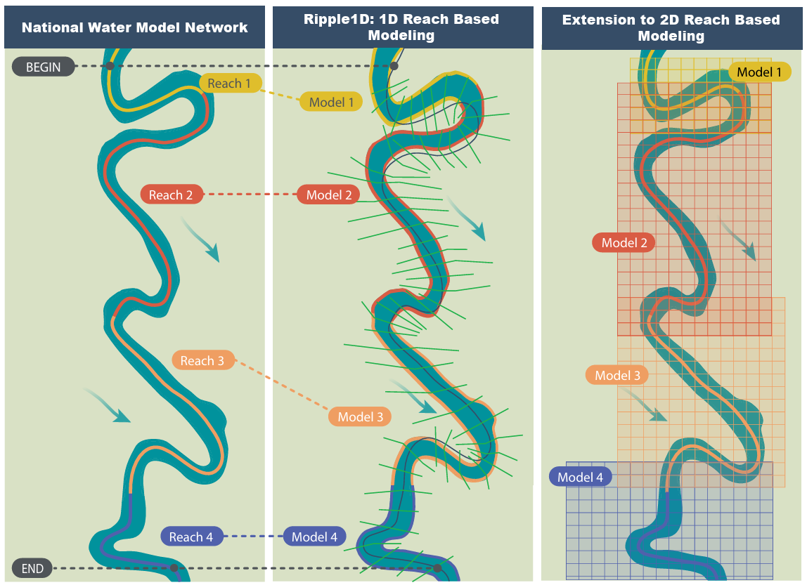
*Figure 1. Reach‑based hydrodynamic modeling for the National Water Model river network using Ripple1D and 2D approaches. Ripple1D relies on existing 1D models and conflates their cross sections onto target reaches to build reach‑based models. The new 2D methodology does not rely on existing models; it creates a new 2D model for each reach domain, illustrated by the different colored grids in the rightmost panel.*

## Related Work and Context
This project sits at the intersection of three mature research threads: **library‑based inundation mapping**, **large‑scale 2D hydrodynamics**, and **automated model setup**. The literature below provides the closest precedents and highlights where our approach diverges.

### Library‑based inundation mapping (operational precedents)
The USGS Flood Inundation Mapping (FIM) program defines a **map library** as a set of inundation maps at discrete stages, linked to gages and used operationally for preparedness and response. The USGS process emphasizes repeatable model construction, calibration, and library publication for real‑time use, which is conceptually aligned with our library‑first paradigm (even though it is local and not reach‑based at national scale). This is a strong institutional precedent for the idea that *precomputed libraries + real‑time lookup* can be operationally reliable (U.S. Geological Survey, n.d.-a, n.d.-b).  

### Continental‑scale 2D forecasting with precomputed libraries (closest analogue)
The Hurricane Harvey study by Wing et al. (2019) is the closest direct analogue. The authors coupled **Fathom‑US** (a continental‑scale 2D model based on LISFLOOD‑FP) to NOAA forecasts of streamflow, rainfall, and coastal surge. For Harvey, **fluvial inundation was extracted from an existing US‑wide simulation library**, while pluvial and coastal components were simulated for the event. The study produced medium‑term (2–15 day) forecasts and hindcasts, with reported skill around CSI ≈ 0.66 for maximum extent and mean water‑surface error on the order of ~1 m against USGS benchmarks. This work demonstrates that a national 2D library can be operationally coupled to forecasts without crippling lead times. Our approach differs by (1) making the library **reach‑based** (outputs are organized and indexed per reach), (2) emphasizing **downstream stage transfer** between connected reaches, (3) treating library construction as a **per‑reach automation workflow** rather than a single continental model build, and (4) indexing libraries by a **discharge × downstream‑WSEL matrix** rather than return‑period flow bins.
### Global and regional return‑period libraries (library at scale, but not reach‑based)
The Copernicus CEMS/GloFAS global river flood hazard maps provide **precomputed inundation depth layers** for multiple return periods (10–500 years). They are derived from LISFLOOD river flows and LISFLOOD‑FP inundation simulations, and are intended for exposure assessment and impact‑based forecasting. These maps are explicitly designed as **global library products** and are used operationally for rapid mapping. However, they are **return‑period‑binned** and network‑linked rather than reach‑specific with downstream stage transfer. This demonstrates feasibility of large‑scale library generation and operational linkage to hydrologic forecasts, while also highlighting the gap our reach‑based approach addresses (Baugh et al., 2024).

### Automated 2D model setup frameworks
HydroMT provides a reproducible, data‑driven framework for building hydrologic and hydrodynamic models at scale. Its ecosystem (including HydroMT‑SFINCS) has been used to automate **globally applicable compound‑flood modeling** from global datasets, with boundary conditions coupled to upstream hydrology and coastal surge/tide models. The NHESS compound‑flood framework demonstrates automated, large‑scale 2D setup and transparent, repeatable preprocessing at global scales (Eilander et al., 2023a, 2023b). These efforts are the closest open‑source automation precedents, though they target event‑based simulations rather than reach‑based library construction with stage transfer between connected reaches.

### Foundational 2D floodplain modeling lineage
The raster‑based formulation in Bates and De Roo (2000) introduced a simplified yet dynamic representation using a 1D kinematic wave for channel flow coupled to a 2D diffusion‑wave floodplain. This formulation underpins many modern large‑scale flood models, including LISFLOOD‑FP. The paper provides the methodological lineage for efficient raster‑based modeling at scale and is the technical foundation behind many of the large‑domain models discussed above.

---

Taken together, prior work demonstrates the feasibility of **precomputed libraries**, **large‑scale 2D simulation**, and **automated model setup**, but the specific synthesis of **reach‑based 2D modeling with downstream stage transfer and Flows2FIM‑compatible libraries** is not yet well represented in the literature and is the central contribution of this methodology.

## Conceptual Modeling Framework
This section describes the conceptual modeling framework for segmented, reach‑based 2D FIM libraries that, when assembled, approximate a continuous network‑scale model. The framework provides the bedrock for the remaining work.

As touched upon in earlier sections, the framework mirrors the Ripple1D library approach but uses 2D hydrodynamic models per reach. At a high level, the workflow is:

1. Build an individual 2D model for each reach using the NWM hydrofabric.
2. Apply boundary conditions for each model run using a discharge range at the upstream boundary and a downstream stage derived from the downstream reach simulation.
3. Simulate combinations of discharge and downstream stage to build a per reach FIM library.
4. Mosaic per reach FIMs downstream to upstream using Flows2FIM to match both at reach discharge and downstream stage within a defined tolerance.

The framework assumes that, for riverine (fluvial) flooding, the response to streamflow is largely confined to the local reach. Under that assumption, a sufficiently dense library spanning range of upstream flows and downstream stage conditions should yield a close enough FIM for most expected NWM forecast scenarios without requiring forecast event specific simulations.

Each library entry is treated as quasi‑steady for a given discharge and downstream stage. In practice, this means the maps represent steady snapshots of inundation rather than the full time evolution of a flood wave, which aligns with the library‑lookup paradigm.

The framework is focused on fluvial flooding, where reach‑scale hydraulics dominate and boundary conditions can be represented by discharge and downstream stage. Lake and coastal settings are only touched in the context of boundary‑condition handling for specific reaches; full treatment of those domains and other non‑fluvial processes is outside the current scope.

Under this framework, each reach model consists of a rectangular domain, an inflow boundary, a stage transfer line (STL), and an outflow boundary. The downstream reach water‑surface elevation (WSEL) provides downstream boundary condition to the upstream reach at the STL, enforcing a water‑surface tie‑in to propagate backwater effects. In the “simple case” this structure covers most reaches. Special cases such as lake/coastal reaches, large floodplains, or hydraulically coupled reaches require modifications described later in this report.

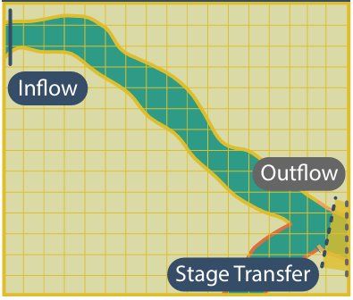
*Figure 2. Example geometry for a single reach-based model showing inflow, outflow, and stage transfer lines.*

Operationally, this library framework relies on a simple architecture that mirrors Flows2FIM: (1) **pre‑computed FIM libraries** of rasters indexed by reach, discharge, and downstream stage; (2) a **rating‑curve database** that relates discharge and downstream WSEL to the library indices; and 

During operations, Flows2FIM assembles these maps by traversing the river network downstream‑to‑upstream and selecting the closest library entry for each reach based on discharge and downstream conditions. This is a lightweight extraction and mosaicking step that runs in seconds without new hydraulic modeling. The separation keeps heavy computation offline and makes operational assembly tractable.

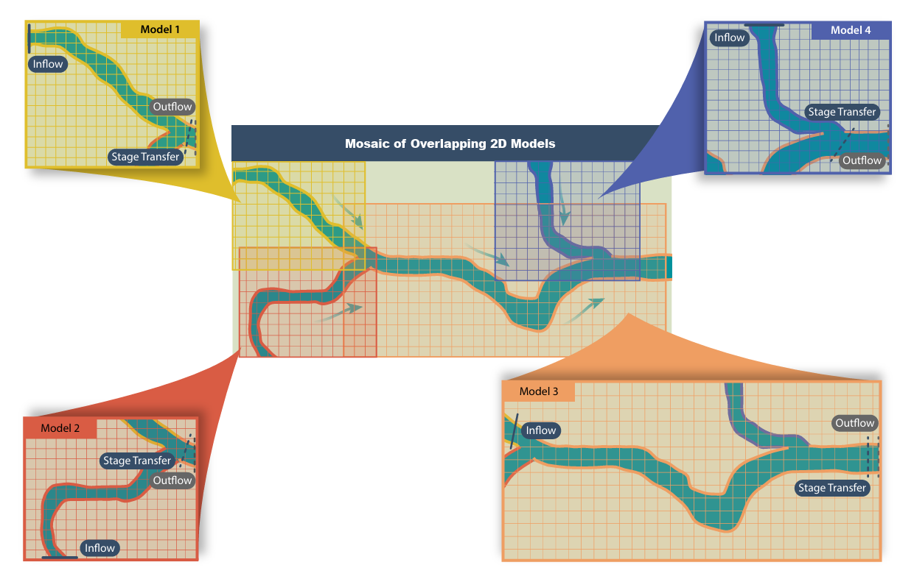
*Figure 3. Overview of discretizing a river system into reach based 2D hydrodynamic models. The outer images show development of individual models and their geometries; the central image depicts how these models come together to form a mosaicked FIM for the full network.*


Figure 4 and 5 show how pre‑generated libraries are used to generate FIMs for diverse flow scenarios.

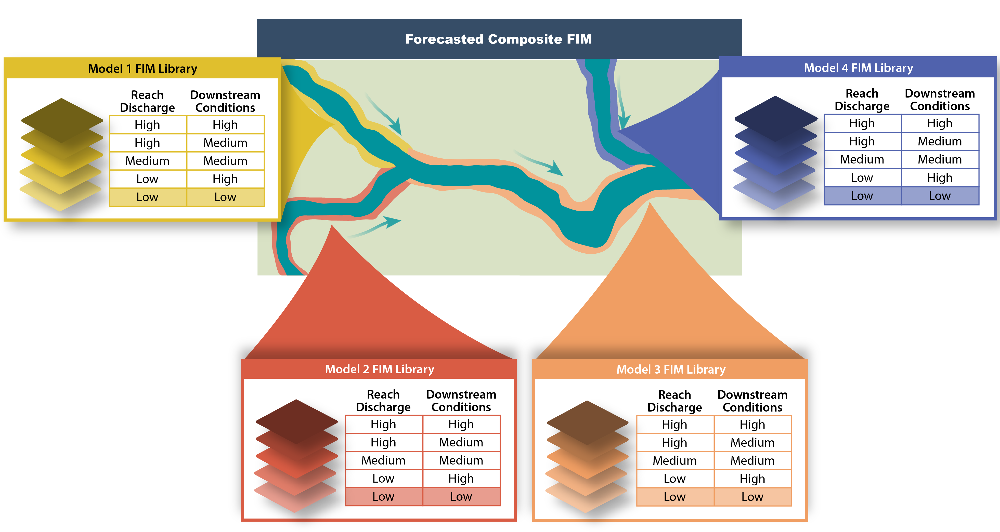
*Figure 4. Example composite FIM for a low‑magnitude flood along all reaches.*

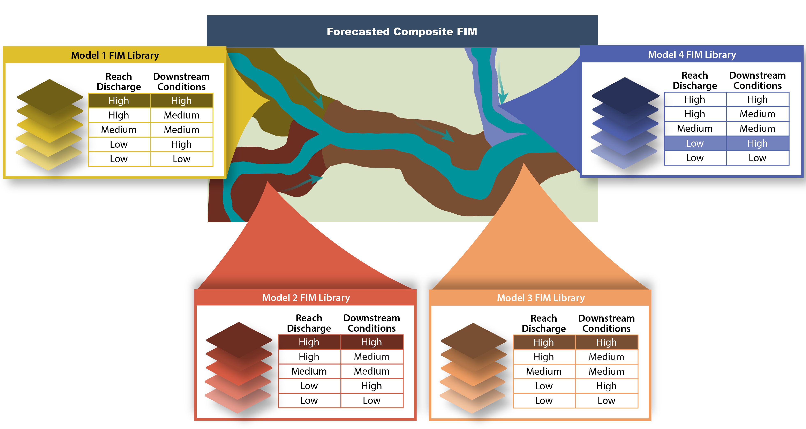
*Figure 5. Example composite FIM for a high‑magnitude event along the mainstem and a low‑magnitude event along a tributary.*

The framework is intentionally implementation agnostic; any hydraulic model or automation tooling can be used to generate individual FIMs as long as the outputs adhere to the library interface described above.

The framework is also flexible about internal model details. For example, DEM conditioning or sub‑grid parameterization can be applied within an individual reach model without changing how the broader system functions. This creates a path for regional experts (e.g., RFCs) to improve reach models in their areas while remaining interoperable with the national library. Realizing this at scale will require governance, QA/QC, and cloud‑infrastructure design, which is beyond the scope of the current work.

## Methodology Development
The primary goal of Phase 1 was to define a defensible, automatable methodology for reach-based 2D FIM library development. This phase was not intended to produce large-scale libraries or automation pipeline. Instead, it was intended to establish a coherent technical foundation that could be implemented, tested, reviewed, and refined before broader deployment.

Methodology development was carried out as an iterative, evidence-driven process. Engineering discussions were used to frame initial options, and early pilot runs were then used to establish a baseline configuration and identify where that baseline failed under different hydraulic settings. To support this work, lightweight internal tools were developed (described later in the Tooling subsection) and used throughout testing to make setup and comparison more repeatable. As testing expanded, cyclic decision patterns emerged, where choices that improved one case degraded another. To manage that, decision tracking was formalized through System Decision Records (SDR), which preserved decision evolution and rationale and made it easier to revisit why specific design choices were made.

The methodology is still evolving and is expected to continue changing as automation advances and additional roadblocks are discovered. At the same time, it has now been tested as far as reasonably possible without full automation. Because the methodology was designed with automation as a central requirement, full automation should also serve as the next major stress test of the approach.

The emphasis in this phase was intentionally weighted toward automation readiness rather than maximum local accuracy. For that reason, calibration of individual models was not included in scope and should be treated as future work (other limitations and challenges are discussed in a later section).This emphasis reflects operational reality. The primary objective of forecast mapping is reliable capture of inundation patterns at large scale, with the understanding that some depth and extent error will remain. In addition, uncertainty from upstream meteorological and hydrological components in the modeling chain limits the practical value of pursuing very high precision in the mapping step alone. The methodology is therefore framed to balance physical realism with automation feasibility.

The subsections below describe the source datasets and derived inputs used to build models, the tooling that supported development, and the candidate 2D hydraulic models considered for the task at hand, followed by the key methodology decisions and the evidence used to support each one.

### Source Data and Derived Inputs
Source data is the first place to start in this methodology because all downstream modeling decisions (domain setup, boundary-condition behavior, and library quality) are constrained by the consistency and resolution of the input datasets. For current pilots, topography is sourced from USGS 3DEP and resampled to 10 m, surface roughness is derived from MRLC NLCD, and reach geometry/connectivity is sourced from the NHF (NextGen HydroFabric). Pilot discharge inputs were pulled from USGS gages and StreamStats to accelerate testing; production implementation is expected to use NWM retrospective analysis AEP (Annual Exceedance Probability) flows.

For roughness conversion, Table 1 lists the selected NLCD-to-Manning's n lookup, derived from USACE HEC-RAS guidance (U.S. Army Corps of Engineers, n.d.).

**Table 1. NLCD land-cover values to Manning's n roughness lookup**

| NLCD Value | NLCD Class | Manning's n |
| --- | --- | --- |
| 11 | Open Water | 0.04 |
| 21 | Developed, Open Space | 0.04 |
| 22 | Developed, Low Intensity | 0.10 |
| 23 | Developed, Medium Intensity | 0.08 |
| 24 | Developed, High Intensity | 0.15 |
| 31 | Barren Land | 0.025 |
| 41 | Deciduous Forest | 0.16 |
| 42 | Evergreen Forest | 0.16 |
| 43 | Mixed Forest | 0.16 |
| 52 | Shrub/Scrub | 0.10 |
| 71 | Grassland/Herbaceous | 0.035 |
| 81 | Pasture/Hay | 0.03 |
| 82 | Cultivated Crops | 0.035 |
| 90 | Woody Wetlands | 0.12 |
| 95 | Emergent Herbaceous Wetlands | 0.07 |

### 2D Model Selection
An automated 2D based FIM library development pipeline will be highly dependent on the underlying 2D hydrodynamic model, so an evaluation of available 2D hydrodynamic models was necessary to gauge if these models satisfy the our practical requirements. As mentioned earlier the abstract conceptual modeling framework is intentionally model agnostic, but any concrete implementation of this framework through an automated pipeline will be dependent on one particular 2D hydrodynamic model.

For this reason, we did a scoping study to establish an evaluation framework and narrow candidates based on criteria that matter for large scale automation: governing equations, grid/mesh paradigm, setup automation burden, CPU/GPU performance, Linux and container support, checkpointing/hot-start support, boundary-condition flexibility, output structure, maturity, documentation quality, and licensing constraints.

Table 2 lists the summary results of the survey of 2D models and the model selection decision basis

**Table 2: 2D models survey summary**

| Model | Equations / Approach | Grid / Automation | Performance | Linux / Container | Boundary Conditions & IO | Status / Rationale |
| --- | --- | --- | --- | --- | --- | --- |
| LISFLOOD-FP | Multiple solvers; some solve shallow-water equations; some use Manning-based formulations | Gridded; automation feasible; broad community patterns | Fast; GPU support for ACC, FV1, DG2 | Linux-friendly; containerizable | Supports hydrograph, fixed inflow, free-flow (valley slope), constant or time-varying WSE; exports WSE and velocity grids; checkpointing | Continue evaluation; strong literature and tooling, good performance |
| TRITON | Full shallow-water equations (ARoe solver) | Gridded; automation feasible; maturity still developing | Very fast on GPU; weaker on CPU | Linux-friendly; containerizable | Supports hydrograph, free flow, constant WSE, normal slope, Froude number; exports depth/velocity; checkpointing | Continue evaluation; strong physics and GPU speed, less mature |
| SFINCS | Shallow-water equations with simplified formulation (convective acceleration ignored) | Gridded; HydroMT provides automated setup | Fast for large domains; performance depends on setup | Linux-friendly; containerizable | Boundary conditions supported via HydroMT workflows; standard raster outputs | Continue evaluation; strong automation, needs validation for reach-based rivers |
| TELEMAC-2D | Shallow-water equations | Mesh-based; may require code-level adjustments | Reported fast; widely used in EU | Linux-capable; containerization possible but non-trivial | Standard hydraulic BCs; IO requires integration work | Not prioritized; higher automation burden |
| HEC-RAS 2D | Shallow-water equations with sub-grid approach | Mesh-based; GUI-centric | Good for engineering studies; automation burden high | Windows-centric; Linux uncertain | Rich BCs, but IO complex | Removed; automation and data handling risks |
| RAS 2025 (alpha) | Shallow-water equations | Mesh-based; API not released | Unknown stability | Linux/API uncertain | Unknown | Removed; timeline risk |
| FastFlood | GIS-hydraulic hybrid | Gridded | Very fast (per literature) | Unknown | Outputs not aligned with hydrodynamic needs | Removed; not a 2D hydrodynamic model |
| PNNL Lagrangian | Novel research method | Unclear | Supposedly fast | Unclear | Unclear | Removed; research-grade |
| MIKE21 / FLO-2D / Delft3D / TUFLOW 3D | Hydrodynamic models | Mixed | Strong but commercial | Licensing constraints | Proprietary tooling | Removed; licensing incompatible |

As the industry standard hydraulic model, HEC-RAS comes out as one of the first choices for 2D modeling, but it faces several challenges when it comes to large-scale cloud-based modeling backed by automation due to:
-   Dependency on Windows-based operations
-   Mesh tooling and instability
-   Mapping related to sub grid computational approach
-   Complicated data structures and storage inefficiencies

One of the primary limitations of HEC-RAS for use in the cloud is its reliance on a Windows-based graphical user interface (GUI) for model development. This dependency requires the use of Windows OS components in any automation system, which complicates cloud environments predominantly using (containerized) Linux systems. Although solutions like Wine exist to emulate Windows applications on Linux, attempts to port HEC-RAS using Wine have had very limited success, marked by instability and unreliable performance, making it a poor choice. Likewise, mapping operations in HEC-RAS must be conducted within a Windows environment, extending the Windows OS dependency to include post processing.

Another significant hurdle is a lack of automated mesh tools available outside the HEC-RAS GUI. Mesh generation and refinement are crucial steps in hydraulic modeling, and the computations are highly sensitive to mesh-related issues. Mesh instability is a commonly known issue with HEC-RAS models, requiring manual debugging, which can be time-consuming and labor-intensive. The degree to which manual intervention would be required adds significant risk to project delivery.

Computationally, HEC-RAS utilizes a sub grid approach, which involves subdividing computational cells into smaller elements to capture detailed hydraulic information and reduce simulation time through caching of complex cell properties. This computational approach creates challenges from traditional finite volume methods in map production, as volume accounting is more complex. As a result, there are a handful of known issues with flood rasters created using HEC-RAS software, including cupping and disconnected hydraulic reaches, which would require an additional post-processing step prior to delivery.

With respect to data, the complexity of HEC-RAS' data structures poses significant challenges for automation. The software uses a variety of file formats, including text files, binary files, HDF files, and DSS files. This dependency complicates data management and automation, as different tools and processes are required to handle each file type. A result of this approach is data duplication across files: resulting in unnecessary redundancy that increases the storage requirements for simulations, inflating data size and complicating data handling in the cloud.

In September of 2024, USACE released the alpha version of a major update to HEC-RAS (RAS 2025). According to release notes and the HEC newsletter, the new version of software has been designed to incorporate an API and offer a Linux build for headless and containerized operations. At the time of the writing of this narrative, these features have not been published, and the Beta version has likewise not been released. While this version promises to overcome some of the cloud deployment issues noted above, it does not address the mesh, sub grid, and data issues identified as areas of risk for use in this project.

Collectively, these issues highlight the challenges HEC-RAS faces in transitioning to large-scale cloud-based modeling backed by automation.

Based on this survey, LISFLOOD-FP, TRITON, and SFINCS remain active candidates. All three models offer adequate boundary condition control, GPU acceleration, linux execution, and straightforward automation. No reasons were identified that would disqualify any of these three models. As such, final model selection will depend on a benchmarked testing of speed and stability at a larger spatial scale. Other factors that will be considered include feature maturity, body of scientific literature and user community size, and accessability of model developers.

While final model selection has not been completed, a model was needed for pilot modeling.  In our initial model review, it appeared that only LISFLOOD-FP would have sufficient boundary condition control for our method to work, and we pursued pilot modeling in LISFLOOD-FP. Since then, we have learned more about SFINCS and TRITON, and we determined that they would meet our needs. Furthermore, we learned of the active development that is going on in the SFINCS ecosystem. This makes SFINCS a promising candidate, and in the future we plan to explore SFINCS further. TRITON, as of now, is the least preferred option due to its more limited feature set than the other two models.

### Model Development WebApp
To move from the conceptual framework to a testable methodology, this phase required some lose tooling that could fast track building many reach models for testing and provide somewhat consistency in model development. For this purpose, a draft Streamlit Python App was created to automate model development. This app was used throughout the testing and iteration process.

![[Pasted image 20260218122954.png]]
*Figure 6. Pilot WebApp developed to automate model construction and review.*

During methodology development, design assumptions were still moving; a thin, modular toolchain allowed fast iteration without spending too much time early on coding solutions. Getting this tool out of a scripting environment also allowed the team to engage hydraulic engineers to assist in model development and validation. It also made comparisons across test cases more defensible because geometry and preprocessing logic were applied consistently.

The WebApp had several core features
 - Import hydrofabric data for a specific reach (centerline, divide, adjacent reaches, etc)
 - Create a grid-aligned model domain
 - Download USGS 3DEP data
 - Download MRLC LULC data and convert to Manning's roughness
 - Write LISFLOOD-FP model files
 - Track all model and run metadata
 - Transfer water surface elevations between models
 - Generate stage transfer lines
 - Execute LISFLOOD-FP models in a lightweight, containerized environment

While code was kept intentionally lightweight and flexible during this pilot study, this work give the project team a headstart in automation. Many core functions, such as hydrofabric subsetting, data downloads, grid development, and model post-processing can be directly copied to the next stage of this project and may only require modest revisions to optimize performance. The model metadata schema has a few lessons learned, but will only require minor modifications for the next stage. A Docker container for LISFLOOD-FP is ready for use when running models asynchronously in the cloud.

While the intention of this WebApp was to aid in methodology development, we see it having continued value for the rest of this project. Two tooling gaps identified during the Ripple1d project were the ability to review models and rerun models after making modifications. In Ripple1D, QGIS map templates were used to aid in model review. However, syncing the large datasets supporting these maps between the cloud and a client machine was cumbersome. Furthermore, QGIS is unable to view data from certain file formats (e.g., text, json, etc). By developing this WebApp, we layed the groundwork for a model review platform that can display all relevant model data without large downloads from a convenient, web-based portal. Beyond model review, the WebApp allows the forecasting community a channel to modify models, update run parameters, and request new map generation.  If model issues are detected after the bulk of production occurs, erroneous models can be corrected in the app, re-run, and have their FIM libraries updated.

### System Decision Records (SDR)
During initial pilot development, the WebApp made it possible to run many more cases quickly, and the main bottleneck shifted from model setup to decision governance: avoiding cycles on repeated questions and keeping rationale tied to evidence as edge cases accumulated.

To address that bottleneck and systemize many smaller decisions that together form the overall methodology, we adopted System Decision Records (SDR), a structured decision-management framework adapted from Architecture Decision Records (ADR) that captures decision evolution, alternatives, and evidence rather than only the final choice (Siddiqui, n.d.). In this project, SDR is used as the governance mechanism for methodology development.

In practice, the SDR system is organized around a small set of linked objects:
- Cases - concrete scenarios encountered during pilot development.
- Experiments: controlled tests run on cases, including any experiment-specific method deviations.
- Issues: observed failures or roadblocks.
- Decisions: scoped questions with explicit alternatives and a current selection.
- Decision Register: the current methodology snapshot at a given time.

Once SDR was implemented, it was used in a consistent operational loop for methodology development.
1. Each new pilot location or edge scenario was first added as a case (for example, the stream-order-mismatch confluence case).
2. Separately and independently potential design choices were added as decisions with explicit alternatives (for example, what should be geometry and location of input boundary conditions).
3. Targeted experiments were developed and ran on those cases
4. Issues that were observed during experiments were documented as evidence (for example, underpredicted WSEL near tie-ins)
5. Based on the issues observed decision choices were updated accordingly.
6. When evidence changed a decision, the Decision Register was updated to represent the current methodology baseline.

This workflow reduced repeated loops, made edge-case handling systematic, and kept methodology changes traceable.

SDR is implemented in a dedicated repository and is actively used by engineers as the primary method-refinement workspace (`https://github.com/NGWPC/twod-fim-knowledge-base/tree/main/system-decision-record`). Beyond immediate decision support, this is expected to materially improve onboarding and external technical review because the reasoning trail is explicit and auditable.

The next subsections, **Pilot Cases** and **Key Decisions for Automation**, is a narrative summary of the current Test Cases and Decision Register state and the evidence patterns that led to these decisions.

### Glossary
Terminology used in this report follows definitions provided in 'Appendix B - Glossary' to keep methods, documentation, and figures aligned. In the main report, controlled glossary terms are shown in backticks (for example, `Reach Outlet`, `Headwater Reach`, `Stage Transfer Line`) to indicate they use the appendix definitions.

### Symbology
The figures in this report use a consistent symbology. This is defined once here to avoid repeating legends in every figure.

![[Pasted image 20260218123042.png]]
Figure 7. All figures in this report follow this symbology unless noted otherwise.

### Pilot Cases
Pilot locations were selected to stress the methodology and different design decisions across contrasting hydraulic and physiographic conditions rather than to maximize geographic count. The set includes small rural systems, steep headwaters, urban/structure-influenced corridors, very wide floodplains, arid channels, different shape confluences or river networks, and lake/coastal terminal settings. The baseline methodology as well targeted deviation experiments were then executed against these cases to discover and isolate failures modes such as WSEL mismatch at tie-ins, edge leakage, inflow artifacts, etc. This is inline with SDR workflow described above.

Figure 8 depicts location of all cases. Table 3 provides case number, location, and title for these cases. Appendix C provides full details for each case.

*![[Pasted image 20260216133325.png]]Figure 8. Locations of pilot study cases. For full detail about each case refer to Appendix C.

**Table 3. Case Index**

| Case Number | Location | Title |
| --- | --- | --- |
| Case #1 | Haddam, CT | Y Shape Confluence with 2 Level Stream Order Difference |
| Case #2 | Burlington, VT | Lake Reach |
| Case #3 | Winooski, VT | Small Culverts |
| Case #4 | Burlington, VT | Model Domain Example |
| Case #5 | Richmond, VT | Model Domain Example 2 |
| Case #6 | Springfield, MA | Inflow Boundary Conditions |
| Case #7 | Binghamton, NY | Complex Semi-urban Confluence Along Low-Gradient River |
| Case #8 | Rosedale, MS | Very Wide Floodplain |
| Case #9 | Brinson, GA | Rural Unconfined Farm Fields |
| Case #10 | Quartz, CO | Steep confined Mountainous Terrain |
| Case #11 | Trenton, NJ | Large Urban River |
| Case #12 | Hiko, NV | Desert Wash |
| Case #13 | Lake Murray, SC | Large Inland Waterbody |
| Case #14 | Plum Island, MA | Coastal Area |
| Case #15 | Evansville, IN | Large River |

### Core Method Decisions and Evidence
This subsection explains the decision logic behind the current methodology baseline. It follows the same implementation sequence used during model development. For each decision, it summarizes the design question, the alternatives considered, how evidence from testing changed the decision over time, and which alternative is currently selected. Here, an alternative means one candidate option within a decision.

This methodology development process was managed through System Decision Records (SDR), and both decisions and alternatives are expected to continue evolving as additional pilot evidence is collected. Appendix D is derived directly from the current SDR state and provides the individual decision pages, including the complete alternative sets for each decision.

At the end of this subsection Table TBD summarizes key design decisions and their current valid solution as a decision register. This decision register form our baseline methodology for automation work that will follow.

#### Inflow and Outflow Geometries Decisions
To create a methodology of automated model development a set of decisions is needed to define geometry and boundary placement: where water enters, where stage is transferred, and where water is allowed to leave the domain. These choices had strong first-order impact on stability and map artifacts.

For inflow placement in non-headwater reaches, the central question is **What should be geometry and location of input BC?** (see Appendix D, Decision #13 for full details). In practice, this decision compared line-based inflow placement on upstream reaches against point-based placements at or near the reach start. Testing on Case #6 (Appendix C) showed that point-focused alternatives produced stronger local WSEL artifacts, while line-based placement reduced those effects. The selected solution here is *ALT-A - At Perpendicular Line Some Distance Away on Highest Drainage Area Upstream Reach*.

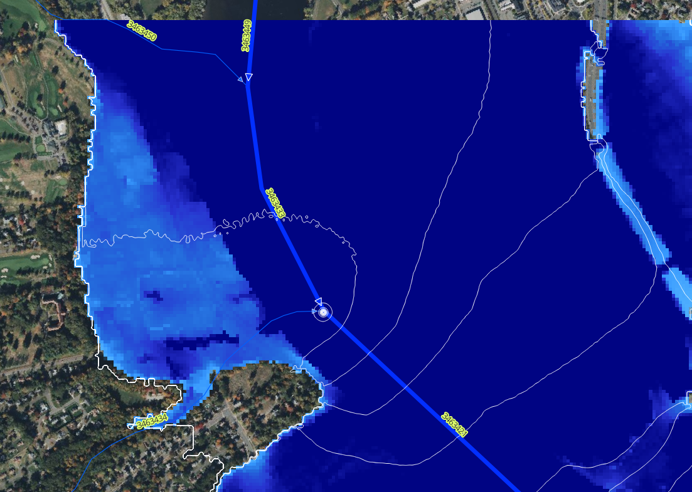
*Figure TBD. WSEL artifacts if we introduce inflow at a point  in Case #6. White lines in this picture are WSEL Contours.*

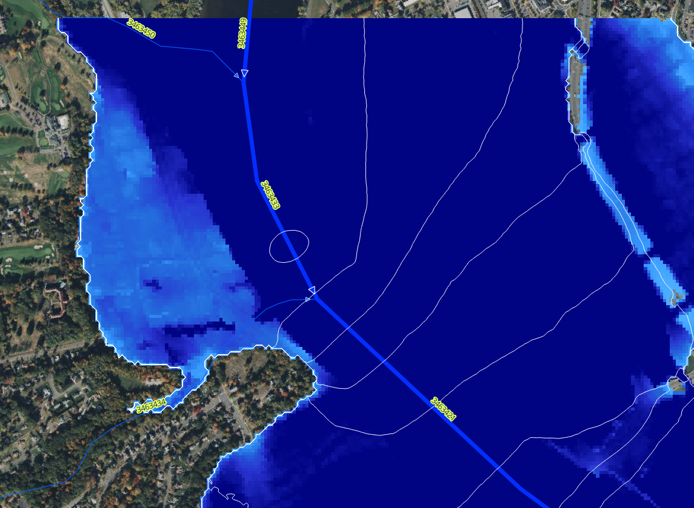
*Figure TBD. Reduced inflow artifacts when inflow geometry was a line in Case #6.*

`Headwater Reaches` required separate handling from regular reaches, this decision was tracked through **What should be geometry and location of input BC for `Headwater Reaches`?** (Appendix D, Decision #14). This was mainly a choice between line-at-start and point-based options, with distributed points retained as the current practical compromise. The selected baseline is *ALT-B - At Points Distributed Along the Reach*.

Two parameter decisions then stabilize the selected geometry: **What line width should be used for inflow BC line?** (Appendix D, Decision #15), selected as *ALT-A - 100m Wide*, and **What upstream offset distance should be used for inflow BC line placement?** (Appendix D, Decision #16), selected as *ALT-A - 0.25 of Upstream Reach Length*.

Downstream coupling introduced a second decision cluster. **Where to apply stage transfer condition?** (Appendix D, Decision #9) considered three placement patterns: at downstream-informed edge cells, at the `Reach Outlet`, or across a larger intersection region. The selected baseline is *ALT-B - At Reach Outlet*. Given that placement, **What should be the geometry of STL?** (Appendix D, Decision #25) evaluated divide-derived, contour-derived, and synthetic line approaches. The selected baseline is *ALT-B - WSEL Contour From D/S FIM*. To keep automation simple across library generation, **Should there be 1 STL per reach or 1 STL per reach per run?** (Appendix D, Decision #26) was resolved to *ALT-A - 1 STL Per Reach From Largest Model Run*.

Edge and outlet behavior is evaluated separately for regular versus terminal settings. For standard reaches, **Where and what boundary conditions to apply along the edge cells?** (Appendix D, Decision #3) moved from broad all-edge openings toward selective downstream-informed edge opening. Case #1 showed that permissive edge handling could produce non-outlet water loss, which drove selection to *ALT-D - D/S Model FIM Informed Edge Cells get Freefall*.


![[DR-003 - FIG-001.png]]
*Figure TBD. ALT-C and ALT-D in Decision #3 suggests only edge cells that intersects with downstream FIM should get open boundary, shown in neon green in this image.


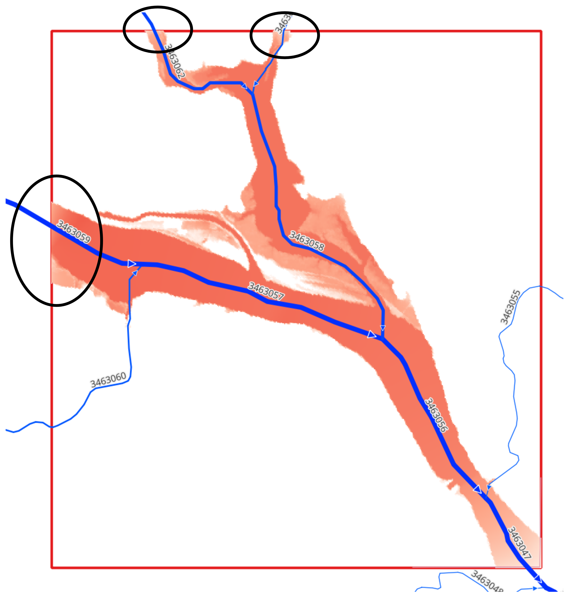
*Figure TBD. Decision #3, ALT-A which suggests freefall boundary condition at all edges, caused water to escape model domain at upstream reaches in Case #1, which is undesired.*

For lake and coastal reaches, the related decisions are **What should be an STL for lake and coastal reaches?** (Appendix D, Decision #8), selected alternative is *ALT-B - Intersection of Model Domain and Water Body Polygon Boundary* and **For lake and coastal reaches, where and what boundary conditions to apply along edge cells?** (Appendix D, Decision #6), selected alternative is *ALT-E - D/S Water Body Informed Edge Cells get Steep Slope*. Here, the alternatives ranged from broad all-edge open to selective downstream water body informed open boundary determination.

![[DR-008-FIG-001.png]]
*Figure TBD. ALT-B of Decision #8 suggests a Stage Tranfer Line (STL) for a reach draining into a water body should be the edge of water body polygon. The WSEL values at this transfer line then can come from water body stage.*
#### Initial Domain Development Decision
After geometry and boundary frameworks are established, the next question is **What should be the initial model domain?** (Appendix D, Decision #11). The alternatives represented divide-based, centerline-based, and coarse-model-informed domain generation patterns. In early iterations, divide based setups were attractive for automation simplicity, but repeated testing (notably Case #4, Case #8, and Case #15) exposed floodplain truncation when domains remained too close to hydrofabric divides. The selected alternative now is *ALT-D - Bounding Box of Inflow BC, d/s STL, and Buffered Centerline*, chosen as the most practical and robust operational default.

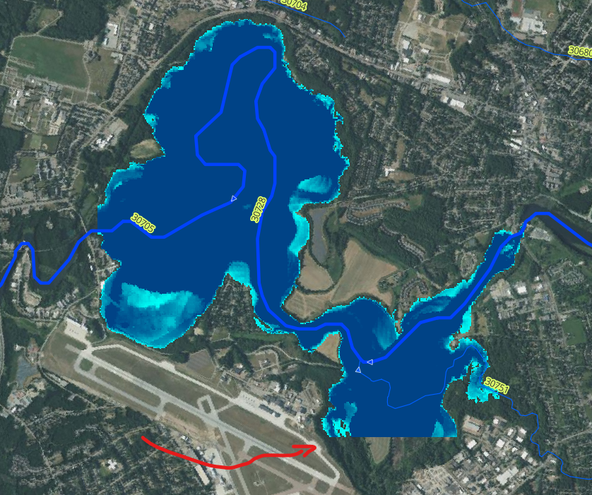
*Figure TBD. Model domain developed using ALT-A of Decision #11 for Case #4 exposed floodplain truncation when using reach divides for model development. The circle here highlights that domain is not capturing the full extent of floodplain as shown here by NFHL floodplain*

#### Source and Derived Data Decisions
Once geometry and initial domain are fixed, the design process moved to input data and its transformation for modeling purposes. The initial data sources and transformations steps were standardized through four decisions: **What horizontal resolution DEM should be used for modeling?** (Appendix D, Decision #17), selected as *ALT-A - 10 meters*; **What source DEM should be used for modeling?** (Appendix D, Decision #18), selected as *ALT-A - USGS 3DEP*; **What source surface roughness data should be used for modeling?** (Appendix D, Decision #19), selected as *ALT-A - National Land Cover Dataset converted to Manning's n*; and **What lookup table should be used for land-cover classes to Manning's n relationship?** (Appendix D, Decision #20), selected as *ALT-A - USACE Dictionary*.

Terrain conditioning related uncertainties are still unresolved but they are being tracked through a couple of decisions.

**How should DEM data be modified to enforce drainage through culverts?** (Appendix D, Decision #10) compared no-conditioning and multiple conditioning workflows (AGREEDEM, stream burning, breaching, and custom methods), but the current recorded baseline remains *ALT-A - Do nothing*. Case #3 and Case #11 nevertheless showed flow divergence around culvert and water pooling behind  culvert when culvert crossings were unresolved in the DEM, so this remains an explicit quality limitation in our workflow.

![[Pasted image 20260218122432.png]]
*Figure TBD. Flow diverged around culvert midway at Reach 30704 due to unburden culverts in DEM in Case #3.*

Similarly, **How should below water topobathy be accounted for?** (Appendix D, Decision #21) currently remains at *ALT-A - No handling*, despite testing that clearly showed sensitivity of FIM to topobathy in Case #15. This is another known limitation carried forward into prototype planning.

#### Domain Expansion Decision
A model is not fully developed until the domain bbox is been tested to be wide enough for all flood scenarios, hence a method is required determines whether the domain should expand, this is tracked through **What strategy to be used for determining if domain should be expanded?** (Appendix D, Decision #12). This decision has the clearest evolution path (ALT-A -> ALT-B -> ALT-F -> ALT-G). Case #7 and Case #8 were pivotal in this evolution because they exposed opposite failure modes: uncontrolled expansion versus  undesired truncation in very wide floodplains. The selected baseline is *ALT-G - Informed by Water-Surface Elevation with Regression Expansion Limit*.
#### Model Execution Related Decisions
Once the model is developed it need to be executed/run for different flow and stage scenarios. This will lead to decisions like **How to determine model quasi-steady state?** (Appendix D, Decision #22). This decision moved from flow balance checks to raster stabilization checks after KWSE boundary introduced flow of its own that made flow balance closure checks less reliable as a stopping criterion. The selected baseline now is *ALT-B - Check WSEL Raster has Stabilized Between Different Time Steps*.

#### Scenario Combinations Development Decisions
Executing KWSE scenario runs for a model is compute intensive and lead to large data storage requirements as well, hence it must be thought through that in which reaches KWSE runs are actually valuable. The core question is **Should KWSE scenario be modeled or not?** (Appendix D, Decision #1) for a reach. Case #1  showed under prediction of depths and extents when downstream stage transfer was excluded, which is why the selected baseline is *ALT-A - For All Reaches*. As a future work an alternative can be proposed that smartly manages selective execution of KWSE runs.

![[FIG-002.png]]
*Figure TBD. Under prediction of depth near tie-in when downstream stage transfer is not enforced for the selected reach in yellow in Case #1. The profile graph is for the selected yellow reach comparing depth rasters (meters) of kwse and nd (normal depth) runs.*

For lake/coastal scenarios specifically, decision **For lake and coastal reaches, what downstream boundary conditions should be applied?** (Appendix D, Decision #5) compared single-slope-only approaches against a mixed KWSE + slope strategy. Case #2 rejected the low-slope-only approach due to downstream pooling behavior, leading to the selected baseline *ALT-C - Both KWSE and Reach Normal Depth Slope* which is same as what we have for an standard reach.
#### Evaluation Decisions
The testing of the quality of produced FIMs and inter connectivity framework required some decisions around evaluation and compositing logic. **What is the definition of benchmark FIM for model connectivity testing?** (Appendix D, Decision #2) sets the reference benchmark FIM source as *ALT-A - Composite 2D Model with Same Input Data*. Then **What is the strategy of pixel value calculation for composite maps?** (Appendix D, Decision #4) resolves overlap behavior for mosaicing individual reach FIMs . Here, alternatives ranged from network order based compositing to clipping maps and then pixel-wise aggregation. The selected baseline is *ALT-D - Pixel-wise Max* for deterministic overlap handling in FIM transition/overlap zones.

#### Network Preparation Decisions
Before any reach-level model development, the river network must be made hydraulically meaningful. The current hydrofabric is designed for hydrologic accounting and routing, with divide structure that works well for rainfall-runoff representation. Flood hydraulics at larger magnitudes do not always follow those same divides. In wide floodplains and low-gradient systems, overbank flowpaths, backwater propagation, and multi-source inundation can span across divides. Similarly, very short and flat reaches that carry nearly unchanged flow from one segment to the next are often inefficient to model separately and can create avoidable automation complexity. For these reasons, methodology development required a set of network-preparation decisions specifically aimed at making the reach network suitable for hydraulic modeling.

The first network decision is **How to deal with short reaches?** (Appendix D, Decision #23). Alternatives ranged from leaving hydrofabric unchanged (ALT-A), to merge rules based on negligible drainage-area differences (ALT-B), to coarse-model-informed merging (ALT-C). As evidence accumulated, especially from larger-river contexts, retaining every short reach added complexity without proportional hydraulic benefit. The selected baseline is 'ALT-B - Merge Continuous Reaches that have Negligible Drainage Area Difference Up to Some River Mile Length'.

The second network decision is **What should be thresholds for merging short reaches?** (Appendix D, Decision #24). This decision operationalize Decision #23 by defining concrete merge limits. The selected baseline is 'ALT-A - 5% Drainage Area Difference, Upto 3 miles, Stream Order 3 or up'.

The third network decision is **How do deal with flat reaches?** (Appendix D, Decision #27). Alternatives were to keep default behavior (ALT-A) or add slope criteria to merging logic (ALT-B). This remains provisional while additional evidence is gathered, with the current baseline at 'ALT-A - Do Nothing'.

The fourth network decision is **How to mark reaches as lake and coastal reaches?** (Appendix D, Decision #7). This decision is still open, and it remains a key dependency for fully automated pipeline.
#### Decisions Summary

During the middle phase of methodology development, the team recognized that the methodology should be treated as a dynamic set of decisions and therefore be version-controlled. To enable version control of the methodology itself, a decision register was implemented to capture the methodology state at any point in time. As decisions evolve, the register is updated and version-controlled in the SDR implementation repository, and experiments and tests records the methodology version adopted. This creates a traceable chain from decision state to test evidence, improving reproducibility, auditability, and cross iteration comparison. The decision register state at the time of writing is presented in Table TBD below.

**Table TBD. Decision Register (Current Methods)**

| Title | Number | Current Alternative |
| --- | --- | --- |
| What Should be Geometry and Location of Input BC | Decision #13 | ALT-A - At Perpendicular Line Some Distance Away on Highest Drainage Area `Upstream Reach` |
| What Should be Geometry and Location of Input BC for `Headwater Reaches` | Decision #14 | ALT-B - At Points Distributed Along the Reach |
| What Line Width Should be Used for Inflow BC Line | Decision #15 | ALT-A - 100m Wide |
| What Upstream Offset Distance Should be Used for Inflow BC Line Placement | Decision #16 | ALT-A - 0.25 of Upstream Reach Length |
| Where to Apply Stage Transfer Condition | Decision #9 | ALT-B - At `Reach Outlet` |
| What Should be the Geometry of STL | Decision #25 | ALT-B - WSEL Contour From D/S FIM |
| Should There be 1 STL per Reach or 1 STL per Reach per RUN | Decision #26 | ALT-A - 1 STL Per Reach From Largest Model Run |
| Where and What Boundary Conditions to Apply Along the Edge Cells | Decision #3 | ALT-D - D/S Model FIM Informed Edge Cells get Freefall |
| What Should be an STL for Lake and Coastal Reaches | Decision #8 | ALT-B - Intersection of Model Domain and Water Body Polygon Boundary |
| For Lake and Coastal Reaches Where and What Boundary Conditions to Apply Along the Edge Cells | Decision #6 | ALT-E - D/S Water Body Informed Edge Cells get Steep Slope |
| How to Determine Initial Model Domain | Decision #11 | ALT-D - Bounding Box of Inflow BC, d/s `STL`, and Buffered Centerline |
| What Horizontal Resolution DEM Should be Used for Modeling | Decision #17 | ALT-A - 10 meters |
| What Source DEM Should be Used for Modeling | Decision #18 | ALT-A - USGS 3DEP |
| What Source Surface Roughness Data Should be Used for Modeling | Decision #19 | ALT-A - National Land Cover Dataset converted to Manning's n |
| What Lookup Table Should be Used for Land Cover Classes to Manning's n Relationship | Decision #20 | ALT-A - USACE Dictionary |
| How should DEM data be modified to enforce drainage through culverts | Decision #10 | ALT-A - Do nothing |
| How Should Below Water Topobathy be Accounted for | Decision #21 | ALT-A - No handling |
| What Strategy to be used for Determining if Domain Should be Expanded | Decision #12 | ALT-G - Informed by Water-Surface Elevation with Regression Expansion Limit |
| How to Determine Model Quasi-Steady State | Decision #22 | ALT-B Check WSEL Raster has Stabilized Between Different Time Steps |
| Should KWSE Scenario be Modeled or Not | Decision #1 | ALT-A - For All Reaches |
| For Lake and Coastal Reaches What Downstream Boundary Conditions Should be Applied | Decision #5 | ALT-C - Both KWSE and Reach Normal Depth Slope |
| What is the Definition of Benchmark FIM for Model Connectivity Testing | Decision #2 | ALT-A - Composite 2D Model with Same Input Data |
| Strategy of Pixel Value Calculation For Composite Maps | Decision #4 | ALT-D - Pixelwise Max |
| How to Deal with Short Reaches | Decision #23 | ALT-B - Merge Continuous Reaches that have Negligible Drainage Area Difference Up to Some River Mile Length |
| What Should be Thresholds for Merging Short Reaches | Decision #24 | ALT-A - 5% Drainage Area Difference, Upto 3 miles, Stream Order 3 or up |
| How do Deal with Flat Reaches | Decision #27 | ALT-A - Do Nothing |
| How to Mark Reaches as Lake and Coastal Reaches | Decision #7 | — |

## Proposed Automation Workflow
This workflow is under development and will be refined as decisions are finalized. It is designed to translate the methodology into a repeatable national-scale pipeline.

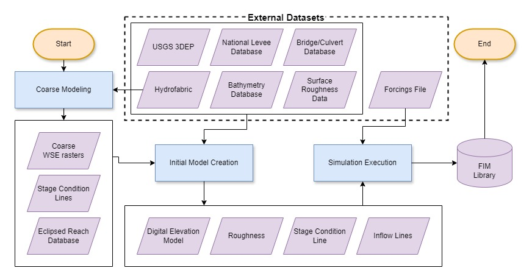
*Figure TBD. Proposed production framework for automated 2D FIM libraries.*

### Coarse Modeling
Coarse simulations are used to estimate maximum flood extents and to derive a hydraulic reach network that reflects actual inundation sources. Coarse outputs also seed initial stage surfaces for lake/coastal reaches and help identify areas where the simple reach-based framework is likely to fail.

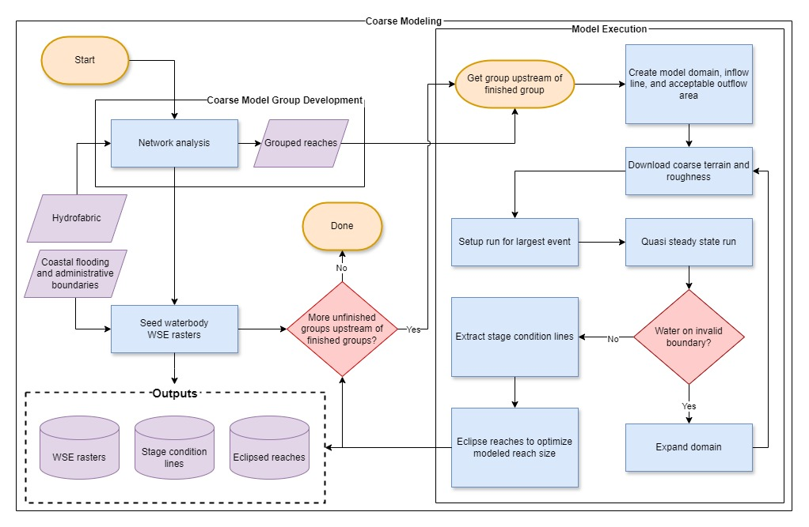
*Figure TBD. Coarse modeling workflow used to inform reach network and STL placement.*

### Initial Model Creation
For each reach, the pipeline generates inflow geometry, a model domain, a stage transfer line, and initial raster inputs. DEM and roughness rasters are prepared at 10 m resolution, and conditioning rules are applied where culverts or obstructions are likely. Domain expansion rules ensure that flood extents are not truncated at model edges.

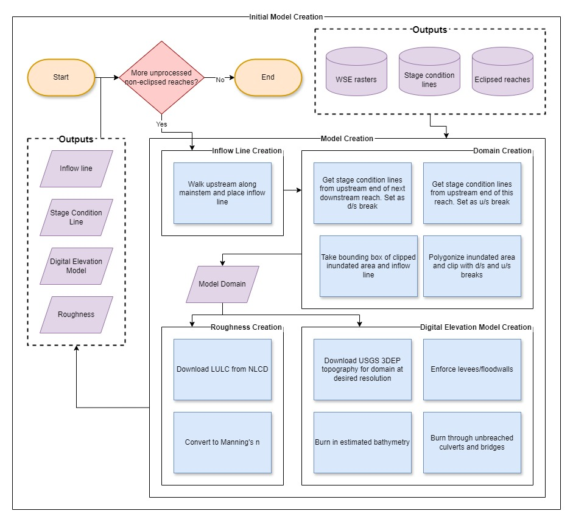
*Figure TBD. Initial model creation workflow.*

### Simulation Execution
Simulation files are generated automatically for each discharge and downstream stage combination. Runs proceed downstream-to-upstream to propagate stage transfer. Quasi-steady state is evaluated using a consistent criterion. Outputs are converted into FIM rasters and stored as per-reach libraries for later mosaicking.


### Data Model
From an operational standpoint, the library structure should remain consistent with Flows2FIM conventions: a directory per reach, subdirectories per downstream stage (WSE) level, and discharge‑indexed rasters (plus a domain mask). Maintaining this structure ensures libraries remain composable in near real time and simplifies cloud storage and retrieval.

[talk about data model]

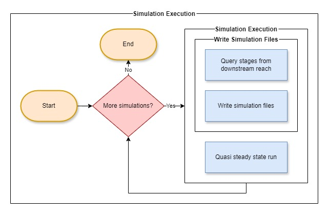
*Figure TBD. Simulation execution workflow.*

## Step-by-Step Example
[Placeholder: worked example with embedded QGIS maps and model inputs/outputs.]

### Comparison with 2D Map for the Area
[Placeholder: side-by-side comparison and discussion of differences.]

## Limitations and Challenges
Even with the current decisions, several issues remain recurring or require special handling. These limitations inform both the current methodology and the open decisions to be resolved during the prototype phase.

### Lack of Bathymetric Data
Effects of bathymetric data absence/presence on 2D model results.

Here, we looked at the Ohio River near Evansville, IN. Bathymetric data came from USACE eHydro. We ran a series of discharges through the 2D models for this reach and measured the resulting water surface elevations at the USGS gage here.

Results show that the “with bathymetry” model tracks closer to the observed USGS data, especially in lower‑magnitude floods. Notably, the “without bathymetry” model is above the minor flood stage for almost all discharges whereas the “with bathymetry” model only gets to minor flood stage at a ~2‑year event.

In large‑scale implementations, a common workaround is to omit explicit bathymetry and represent river channels as **sub‑grid features** within each 2D cell. In practice, this means the grid cell stores an idealized 1D channel geometry (width, depth, roughness) so flow and storage can be approximated without resolving the channel in the terrain. This can reduce data requirements and improve runtime, but it also shifts accuracy to the quality of the sub‑grid parameterization. For our workflow, this highlights a tradeoff: either invest in bathymetric data where available, or adopt sub‑grid channel representations and quantify the resulting bias, especially for lower‑magnitude flows.

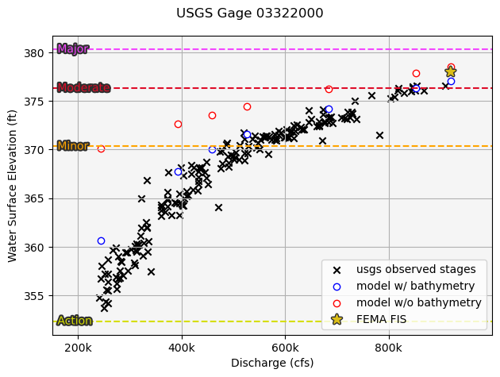
*Figure TBD. Ohio River (Evansville) comparison of WSEL with and without bathymetry.*

### Boundary Condition Artifacts
Water‑surface elevation anomalies can occur near inflow boundaries in certain geometries, and non‑physical outflows can occur when edge boundary conditions are too permissive. These artifacts can propagate into composite maps if not controlled by boundary placement, domain sizing, and STL geometry.

### Domain Truncation and Edge Effects
Domains derived strictly from reach divides can truncate flood extents and cause edge pooling. Expansion rules mitigate this, but automation remains sensitive to local topography and floodplain width.

### Confluence Sensitivity
Backwater effects and confluence geometry can produce narrower‑than‑expected FIM extents if downstream stage transfer is not enforced or if STL coverage is incomplete across the floodplain.

### Flat and Hydraulically Coupled Reaches
Flat reaches and hydraulically coupled reaches challenge the reach‑based assumption, particularly where stage changes propagate across multiple reaches or where level‑pool behavior dominates.

### Compute and Cost
Large rivers and wide floodplains can require large domains or reach eclipsing, which affects compute time, storage, and cost. This will need explicit optimization in the prototype phase.

### Volume‑Driven Areas
Some areas respond more to flood volume than peak discharge (e.g., lakes, reservoirs, and extensive floodplains). These settings require alternative handling beyond discharge‑only library selection.

Taken together, these limitations do not negate the approach. They clarify where automation needs guardrails and targeted exceptions so the system remains fit for rapid, decision‑support mapping.

## Discussion and Next Steps
This report proposes a defensible, automatable methodology grounded in pilot evidence and a structured decision process. The next phase will refine open decisions, select a production model, and implement a prototype pipeline for a HUC6-scale area. The SDR system will continue to capture decision evolution, ensuring that methodology changes are traceable and evidence-based.

The approach described here represents a significant compute effort relative to existing GIS or 1D workflows. As a result, near‑term work should prioritize optimization of methodology and cost over expanding library coverage. In practice, this means focusing on the performance envelope of the system before scaling further. Key optimization areas include model choice and solver configuration, CPU vs GPU execution trade‑offs, domain sizing and reach merging rules, use of sub‑grid or multi‑resolution techniques where appropriate, and I/O strategies that avoid writing or storing data outside the flood‑relevant extent. Decisions in these areas have outsized impacts on cost, throughput, and the feasibility of national‑scale production.

We therefore recommend a dedicated optimization and benchmarking effort in the next phase, using a prototype HUC6 to compare candidate models and configurations on representative hardware. The goal is to establish cost‑per‑reach and cost‑per‑library targets, identify bottlenecks, and refine automation rules (domain trimming, reach eclipsing, data reduction) before committing to large‑scale library generation.

Recommended next steps are best framed as a short‑term roadmap tied to time, with an emphasis on optimization before scale. A suggested sequencing is below; durations are placeholders to be adjusted based on staffing and compute availability.

**Suggested Roadmap (Time‑Phased)**

| Phase | Timing (Placeholder) | Primary Focus | Key Outputs |
| --- | --- | --- | --- |
| Phase 1 | 0–2 months | Benchmarking and cost modeling | Model speed/cost comparison (CPU vs GPU); solver configuration sensitivity; cost‑per‑reach and cost‑per‑library targets |
| Phase 2 | 2–4 months | Methodology closure | Decisions finalized for quasi‑steady state, inflow geometry, STL placement, lake/coastal classification; QA/QC acceptance metrics defined |
| Phase 3 | 4–6 months | Automation hardening | Domain expansion rules validated; reach‑merging/eclipsing criteria refined; terrain‑conditioning workflows integrated |
| Phase 4 | 6–9 months | Prototype production | End‑to‑end HUC6 pipeline run; data‑reduction strategies tested; comparison to HAND/Ripple1D baselines |

SDR updates should accompany each phase to keep decision rationale traceable.

## References
Banasiak, R. (2024), Large-scale two-dimensional cascade modeling of the Odra River for flood hazard management, *Water*, 16(1), 39, https://doi.org/10.3390/w16010039.

Bates, P. D., and A. P. J. De Roo (2000), A simple raster‑based model for flood inundation simulation, *Journal of Hydrology*, 236, 54–77, https://doi.org/10.1016/S0022-1694(00)00278-X.

Baugh, C., J. Colonese, C. D'Angelo, F. Dottori, J. Neal, C. Prudhomme, and P. Salamon (2024), Global river flood hazard maps, European Commission, Joint Research Centre (JRC) [Dataset], http://data.europa.eu/89h/jrc-floods-floodmapgl_rp50y-tif (accessed 12 Feb 2026).

Eilander, D., et al. (2023a), HydroMT: Automated and reproducible model building and analysis, *Journal of Open Source Software*, 8(83), 4897, https://doi.org/10.21105/joss.04897.

Eilander, D., et al. (2023b), A globally applicable framework for compound flood hazard modeling, *Natural Hazards and Earth System Sciences*, 23, 823–, https://doi.org/10.5194/nhess-23-823-2023.

Johnson, M. (2024), Current Hydrofabric Data Model, NOAA Office of Water Prediction documentation, https://noaa-owp.github.io/hydrofabric/articles/hf_dm.html (accessed 18 Feb 2026).

Johnson, M. (n.d.), The NextGen Hydrofabric Data Model (data-model deep dive), NOAA Office of Water Prediction documentation, https://noaa-owp.github.io/hydrofabric/articles/v2.2/04-data-model-deep-dive.html (accessed 18 Feb 2026).

Moore, R. B., A. M. Long, L. D. McKay, M. P. Wieczorek, D. R. Dewald, T. L. Soller, and T. R. Loveland (2025), NHDPlus high resolution (NHDPlus HR) user guide, U.S. Geological Survey Scientific Investigations Report 2025-5037, https://doi.org/10.3133/sir20255037.

NextGen Water Prediction Capabilities (NGWPC) (n.d.-a), Ripple1D (software), GitHub repository, https://github.com/NGWPC/ripple1d (accessed 12 Feb 2026).

NextGen Water Prediction Capabilities (NGWPC) (n.d.-b), flows2fim (software), GitHub repository, https://github.com/NGWPC/flows2fim (accessed 12 Feb 2026).

Phillips, J. D. (2024), Sequential changes in coastal plain rivers influenced by rising sea level, *Hydrology*, 11(8), 124, https://doi.org/10.3390/hydrology11080124.

Sanders, B. F., O. E. J. Wing, and P. D. Bates (2024), Flooding is not like filling a bath, *Earth’s Future*, 12(12), e2024EF005164, https://doi.org/10.1029/2024EF005164.

Scott, D. T., T. A. Kurz, M. A. C. Coulibaly, and R. M. Twilley (2019), Floodplain inundation spectrum across the United States, *Nature Communications*, 10, 5194, https://doi.org/10.1038/s41467-019-12999-5.

Siddiqui, A. R. (n.d.), System Decision Records (SDR), https://ar-siddiqui.github.io/sdr/ (accessed 16 Feb 2026).

U.S. Army Corps of Engineers (USACE) (n.d.), HEC-RAS 2D User’s Manual: Creating land cover, Manning’s n values, and impervious layers, https://www.hec.usace.army.mil/confluence/rasdocs/r2dum/6.6/developing-a-terrain-model-and-geospatial-layers/creating-land-cover-mannings-n-values-and-impervious-layers (accessed 15 Feb 2026).

U.S. Geological Survey (n.d.-a), Flood Inundation Mapping (FIM) Program, https://www.usgs.gov/mission-areas/water-resources/science/flood-inundation-mapping-fim-program (accessed 12 Feb 2026).

U.S. Geological Survey (n.d.-b), Flood Inundation Mapping Science, https://www.usgs.gov/mission-areas/water-resources/science/flood-inundation-mapping-science (accessed 12 Feb 2026).

Wing, O. E. J., et al. (2019), A flood inundation forecast of Hurricane Harvey using a continental‑scale 2D hydrodynamic model, *Journal of Hydrology X*, 4, 100039, https://doi.org/10.1016/j.hydroa.2019.100039.

Zhao, T., Q. Shao, and Y. Zhang (2017), Deriving flood-mediated connectivity between river channels and floodplains: Data-driven approaches, *Scientific Reports*, 7, 43239, https://doi.org/10.1038/srep43239.

## Appendices

### Appendix A.


### Appendix B. Glossary
#### Adjacent Reaches
`connected reaches` and reaches draining into the same `reach outlet` for the reach of interest.

All blue reaches are `adjacent reaches` for green reach.
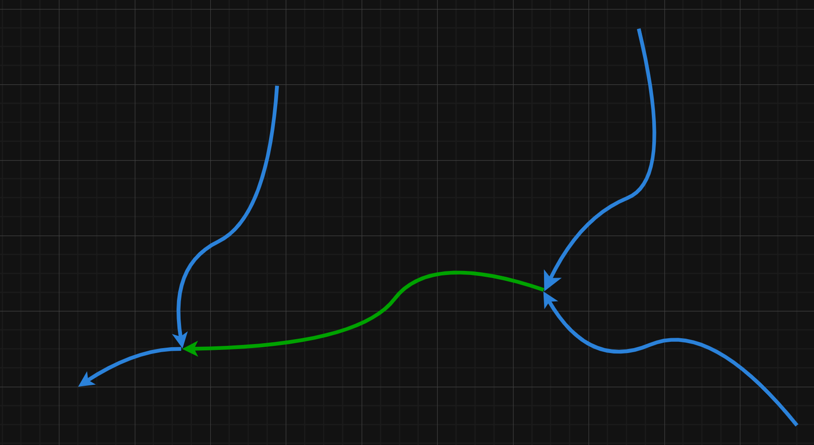
*Figure B1. `Adjacent Reaches` example.*

#### Common Outlet Reaches
Reaches sharing common `reach outlet`.

Two green reaches here are common outlet reaches because they share same `reach outlet`.
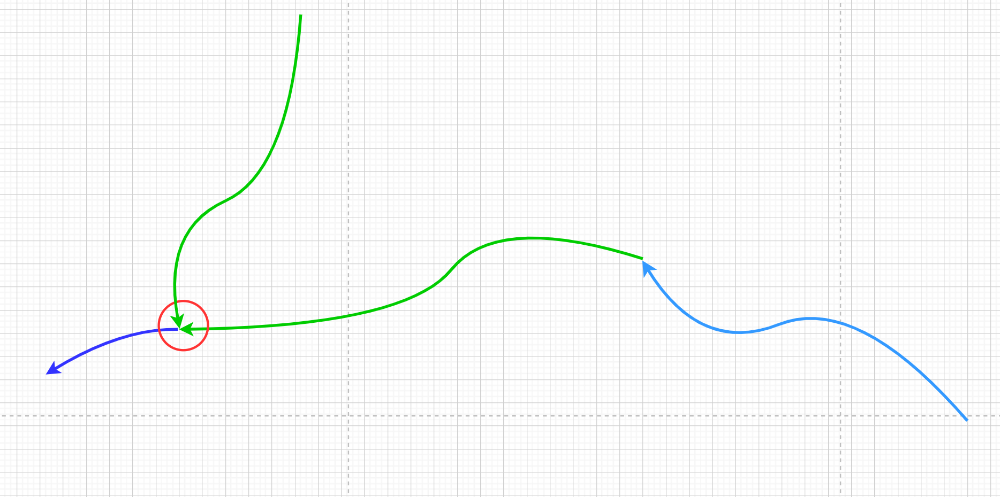
*Figure B2. `Common Outlet Reaches` example.*

#### Connected Reaches
Reaches connected to a reach through upstream or downstream relationship.

All blue reaches are `connected reaches` for green reach. Note that red reach is not.
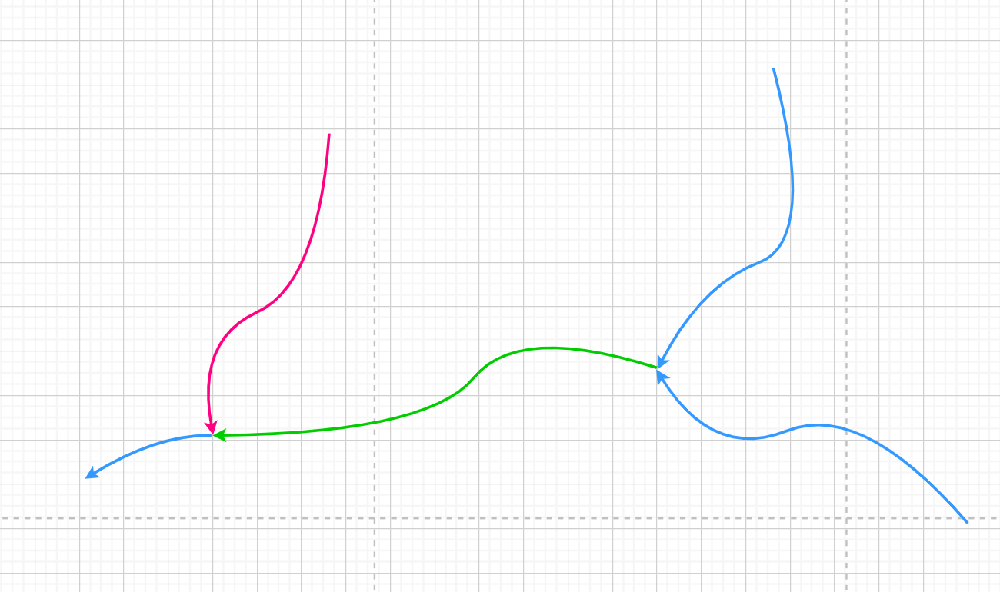
*Figure B3. `Connected Reaches` example.*

#### FIM Transition Zone
The `Transition Zone` for a reach is the area between the `Stage Transfer Line` and the outflow line.

The yellow area in the image below shows the `Transition Zone` for this reach.

*Figure B4. `FIM Transition Zone` (yellow area).*

#### Headwater Reaches
Reaches that have no reaches upstream of them in the reach network.

`headwater reaches` shown in green
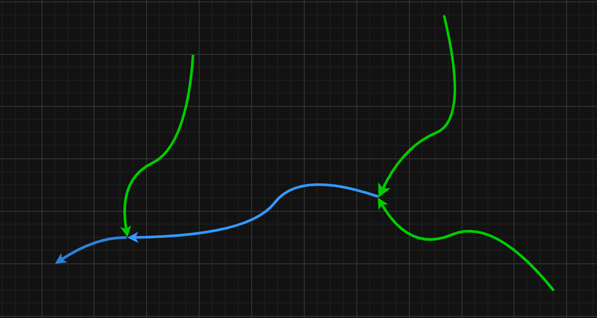
*Figure B5. `Headwater Reaches` shown in green.*

#### Lake and Coastal Reaches
Subset of `Terminal Reaches` that discharge to
- coasts
- large waterbodies

#### Reach Outlet
End point of the reach.

Reach outlet for green reach shown in red circle.
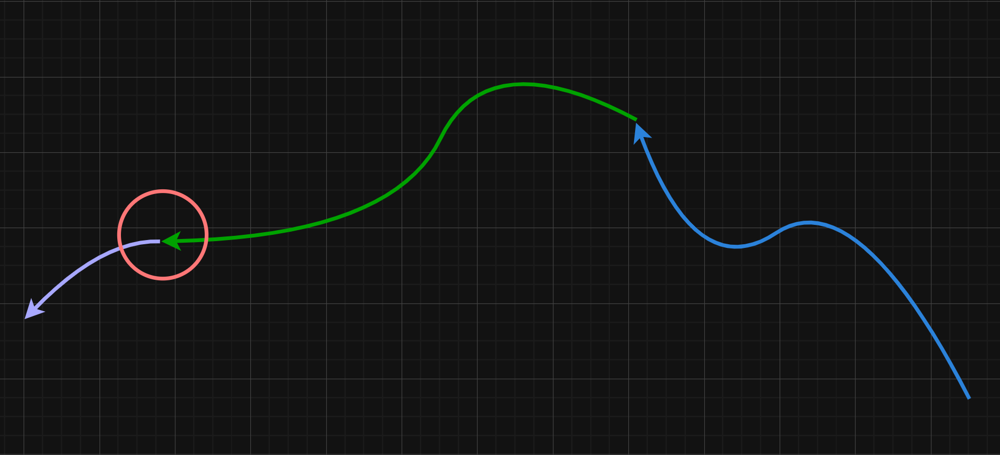
*Figure B6. `Reach Outlet` shown for green reach (red circle).*

#### Reach Start
Start point of the reach.

Reach start for green reach shown in red circle.
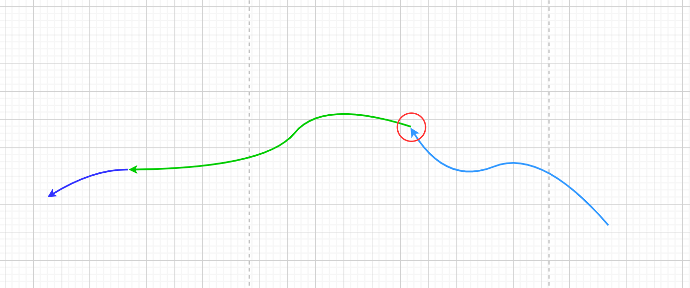
*Figure B7. `Reach Start` shown for green reach (red circle).*

#### Stage Transfer Line (STL)
A line that is within the domain of both upstream and downstream reach models and which is used to transfer WSEL from the downstream model to an upstream model.

#### Terminal Reaches
Terminal reaches include reaches that discharge to
- coasts
- areas outside the US
- large waterbodies

#### Upstream Mainstem Reach
The reach with the largest drainage area of all `upstream reaches` for a reach of interest.

#### Upstream Reach
A reach that drain to a reach of interest.

### Appendix C. Pilot Cases
All figures in this appendix follow the same symbology convention described in Figure 7, unless overridden by Figure caption.

#### Case #1 - Y Shape Confluence with 2 Level Stream Order Difference

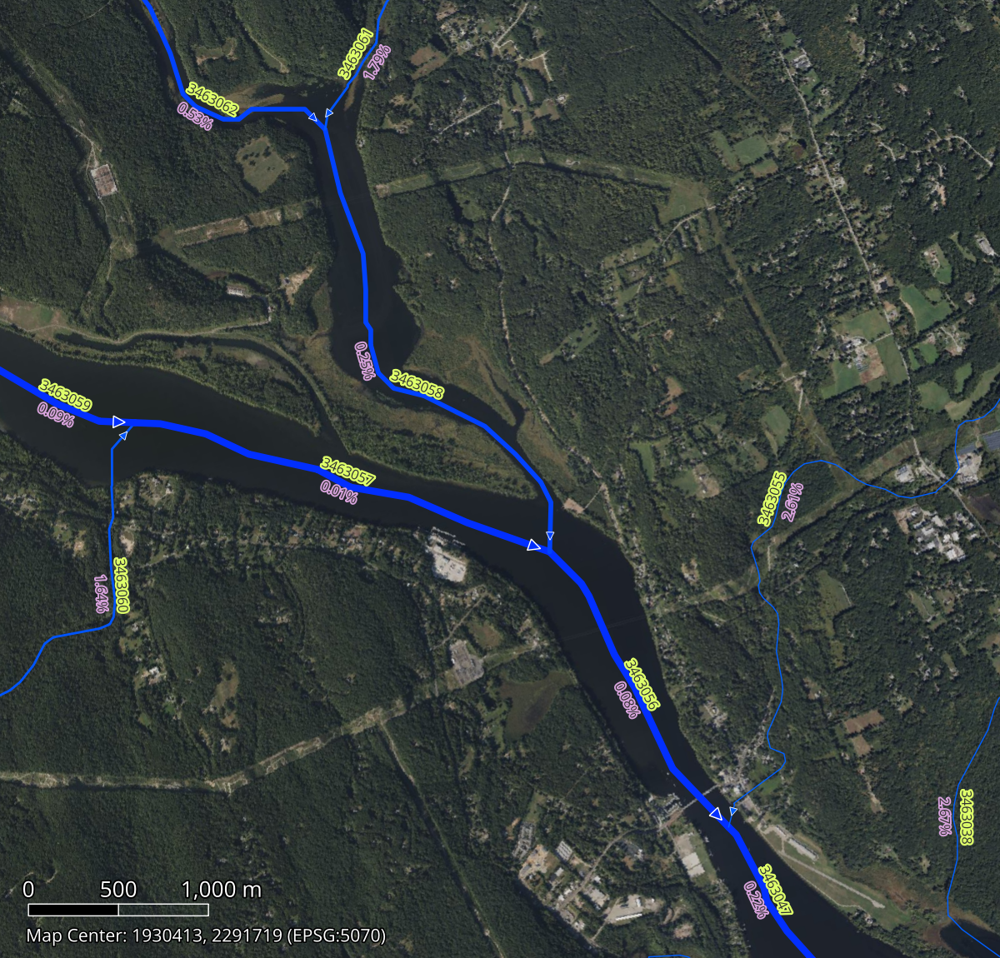
*Figure C1. Representative view for Case #1.*

| Fact | Value |
| --- | --- |
| Case Number | Case #1 |
| Location | Haddam, CT |
| Date Observed | 2026-01-22 |
| Coordinates (EPSG:5070) | 1930357, 2289467 |
| Coordinates (EPSG:4326) | 41.466439,-72.470839 |
| Flows (cms) | 500, 6000 |
| Stream Orders | 4, 6 |

**Description**
This case was selected to evaluate confluence behavior where stream-order mismatch and low-gradient backwater make downstream stage handling sensitive.

#### Case #2 - Lake Reach

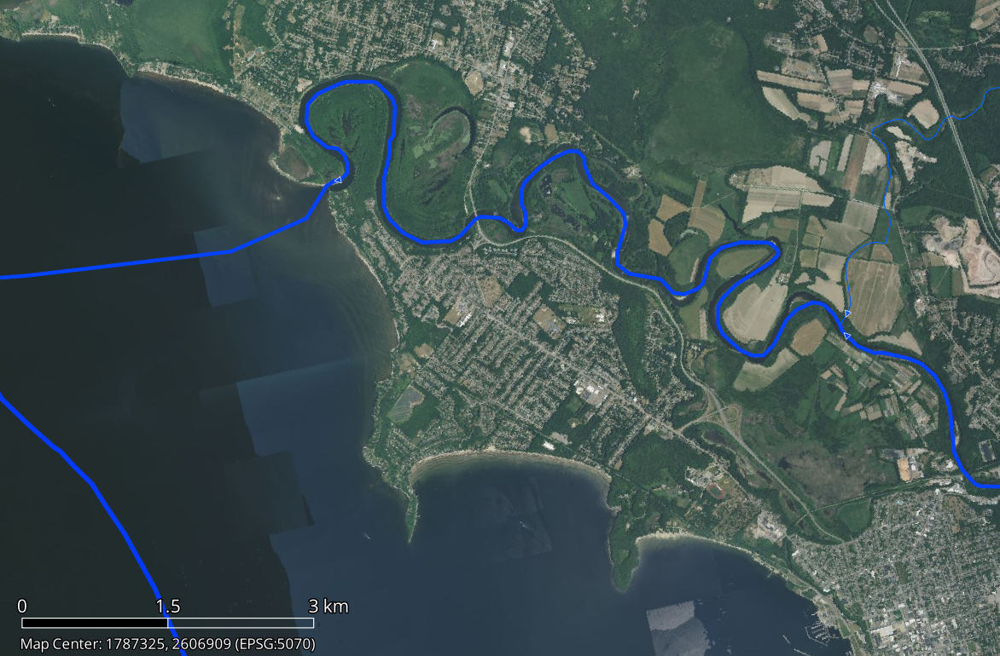
*Figure C2. Representative view for Case #2.*

| Fact | Value |
| --- | --- |
| Case Number | Case #2 |
| Location | Burlington, VT |
| Date Observed | 2026-01-27 |
| Coordinates (EPSG:5070) | 1786548, 2606475 |
| Coordinates (EPSG:4326) | 44.522842,-73.251503 |
| Flows (cms) | 2680 |
| Stream Orders | 4 |

**Description**
This case represents a terminal reach discharging into Lake Champlain and was selected to evaluate boundary-condition behavior in lake-connected settings.

#### Case #3 - Small Culverts

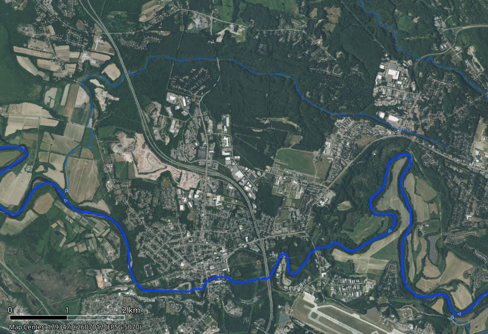
*Figure C3. Representative view for Case #3.*

| Fact | Value |
| --- | --- |
| Case Number | Case #3 |
| Location | Winooski, VT |
| Date Observed | 2026-01-27 |
| Coordinates (EPSG:5070) | 1796329.9, 2607407.4 |
| Coordinates (EPSG:4326) | 44.505228,-73.140441 |
| Flows (cms) | 36.75 |
| Stream Orders | 1 |

**Description**
This case was selected to evaluate terrain-conditioning needs where unresolved small culverts can cause divergent flow paths and upstream impoundment.

#### Case #4 - Model Domain Example

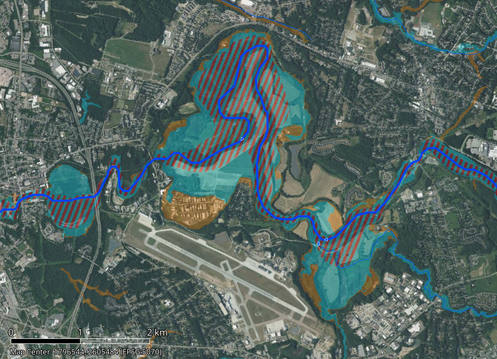
*Figure C4. Representative view for Case #4.*

| Fact | Value |
| --- | --- |
| Case Number | Case #4 |
| Location | Burlington, VT |
| Date Observed | 2026-01-27 |
| Coordinates (EPSG:5070) | 1798555, 2602987 |
| Coordinates (EPSG:4326) | 44.48438,-73.14014 |
| Flows (cms) | 2344 |
| Stream Orders | 4 |

**Description**
This case was selected to test model-domain construction where overbank floodplain extent lies far from the channel and can be clipped by narrow domain rules.

#### Case #5 - Model Domain Example 2

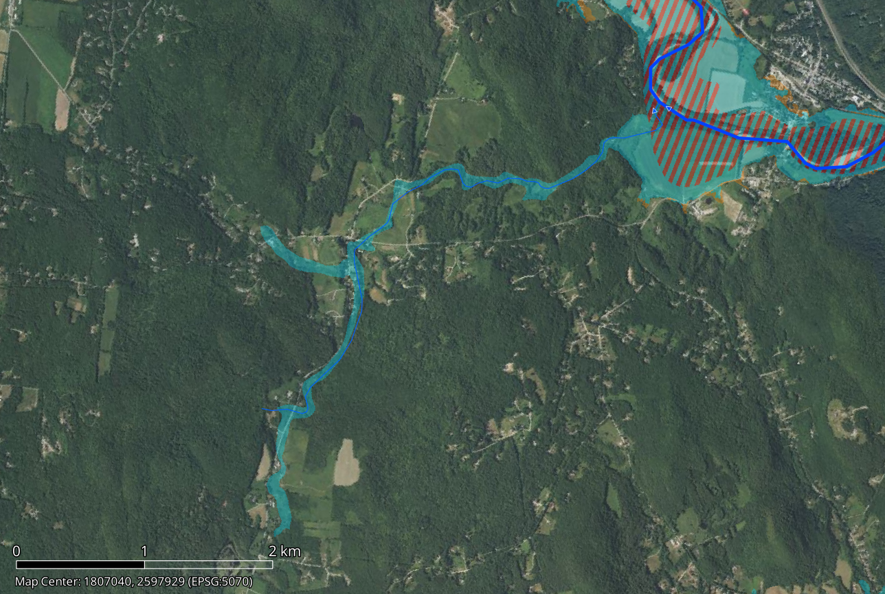
*Figure C5. Representative view for Case #5.*

| Fact | Value |
| --- | --- |
| Case Number | Case #5 |
| Location | Richmond, VT |
| Date Observed | 2026-01-27 |
| Coordinates (EPSG:5070) | 1811265, 2594919 |
| Coordinates (EPSG:4326) | 44.402896,-73.035427 |
| Flows (cms) | 52.8 |
| Stream Orders | 1 |

**Description**
This case was selected to examine headwater tributary confluence behavior where water can pool near a common outlet, affecting automated domain-expansion logic.

#### Case #6 - Inflow Boundary Conditions

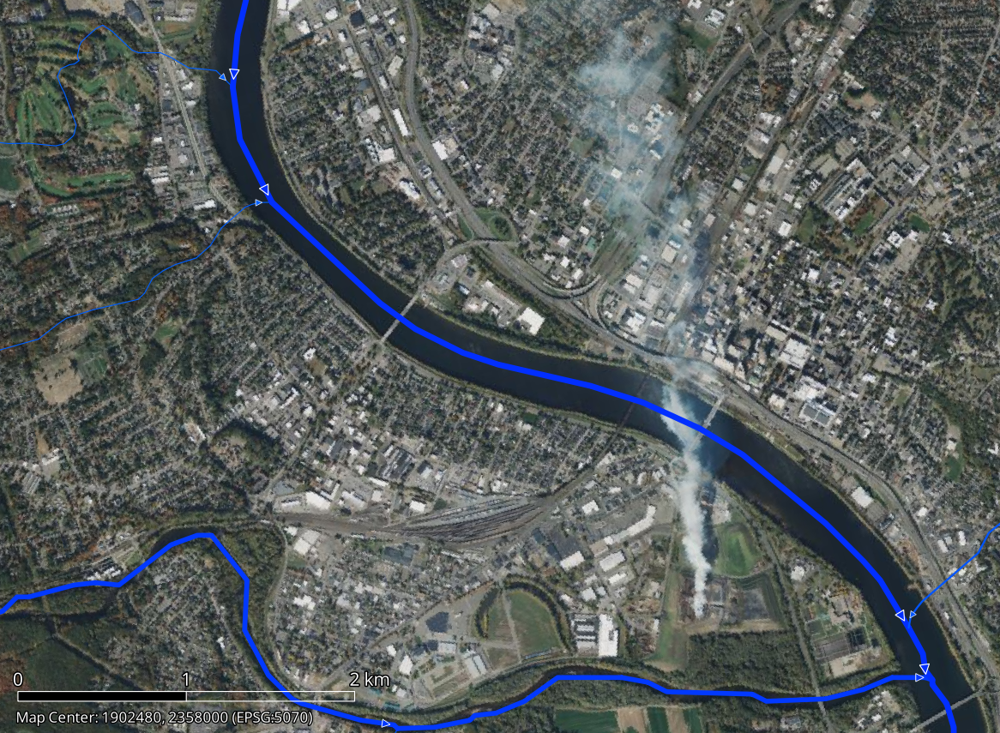
*Figure C6. Representative view for Case #6.*

| Fact | Value |
| --- | --- |
| Case Number | Case #6 |
| Location | Springfield, MA |
| Date Observed | 2026-02-04 |
| Coordinates (EPSG:5070) | 1903629, 2354784 |
| Coordinates (EPSG:4326) | 42.105287,-72.608837 |
| Flows (cms) | 13500 |
| Stream Orders | 6 |

**Description**
This mid-sized river case was selected to test upstream inflow-boundary geometry and placement effects on WSEL artifacts; discharges were based on USGS 01172000.

#### Case #7 - Complex Semi-urban Confluence Along Low-Gradient River

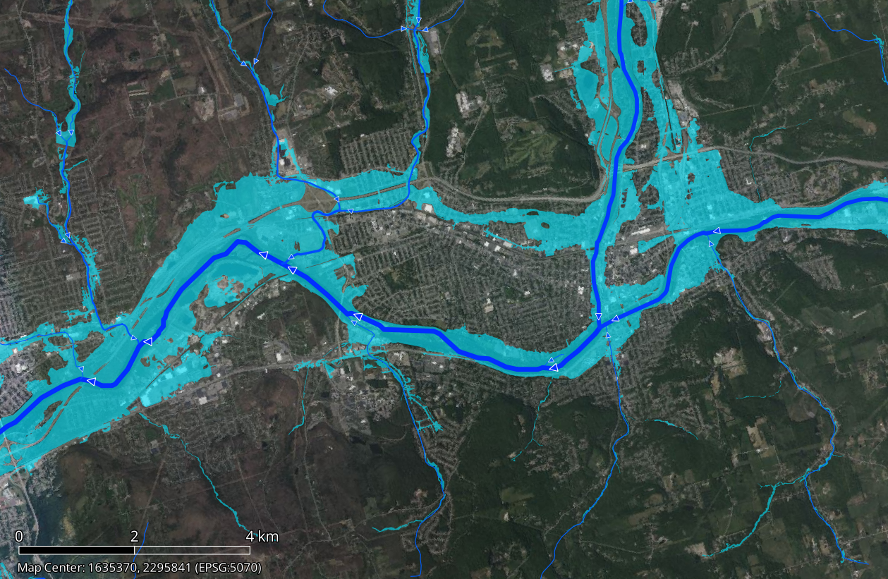
*Figure C7. Representative view for Case #7.*

| Fact | Value |
| --- | --- |
| Case Number | Case #7 |
| Location | Binghamton, NY |
| Date Observed | 2026-02-05 |
| Coordinates (EPSG:5070) | 1633164, 2293585 |
| Coordinates (EPSG:4326) | 42.10646,-75.95026 |
| Flows (cms) | 4240 |
| Stream Orders | 6 |

**Description**
This case was selected to stress methodology in a complex low-gradient semi-urban confluence with multiple tributaries and levee influences.

#### Case #8 - Very Wide Floodplain

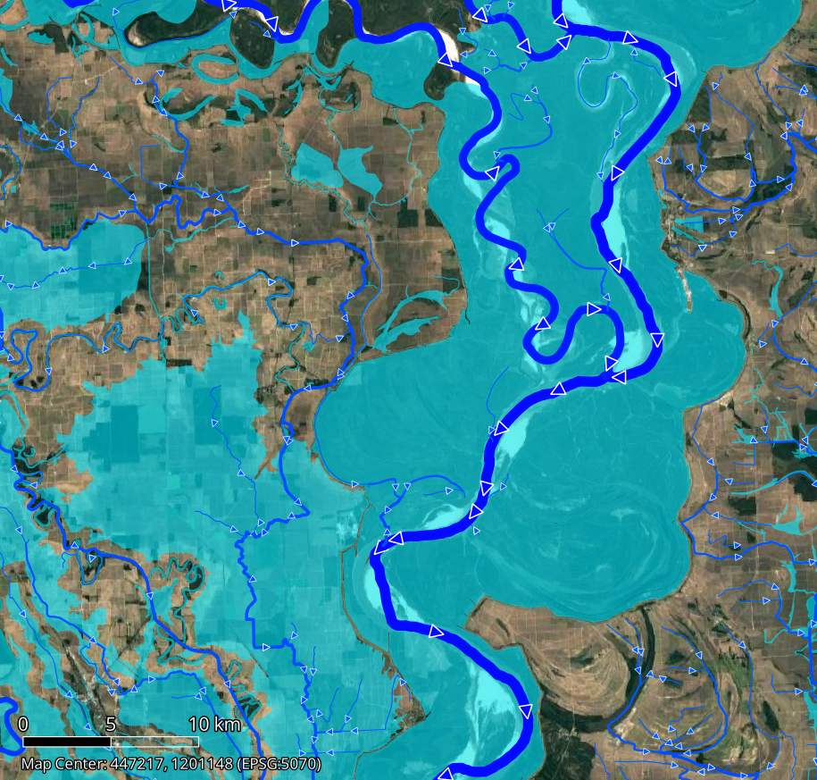
*Figure C8. Representative view for Case #8.*

| Fact | Value |
| --- | --- |
| Case Number | Case #8 |
| Location | Rosedale, MS |
| Date Observed | 2026-02-09 |
| Coordinates (EPSG:5070) | 449756,1201331 |
| Coordinates (EPSG:4326) | 33.74552,-91.13034 |
| Flows (cms) | N/A |
| Stream Orders | 10 |

**Description**
This case was selected to test very wide-floodplain behavior along the Mississippi River, where floodplain widths of roughly 12–22 km challenge domain and boundary rules.

#### Case #9 - Rural Unconfined Farm Fields

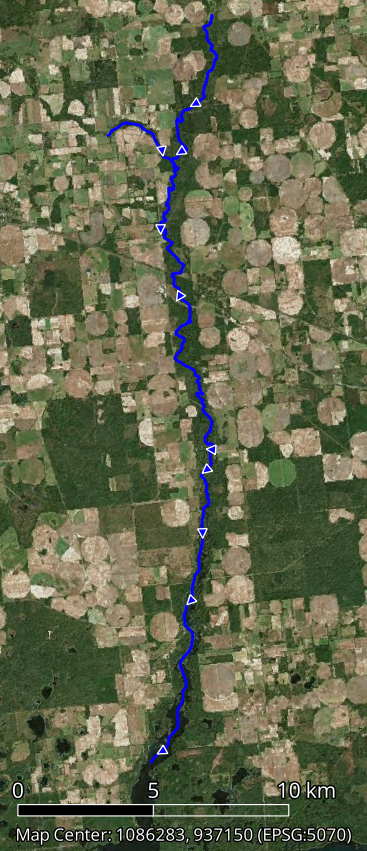
*Figure C9. Representative view for Case #9.*

| Fact | Value |
| --- | --- |
| Case Number | Case #9 |
| Location | Brinson, GA |
| Date Observed | 2026-02-11 |
| Coordinates (EPSG:5070) | 1070234,936890 |
| Coordinates (EPSG:4326) | 30.93866,-84.74584 |
| Flows (cms) | N/A |
| Stream Orders | 3, 1 |

**Description**
This case was selected to evaluate methodology performance in small, rural, unconfined agricultural channels.

#### Case #10 - Steep confined Mountainous Terrain

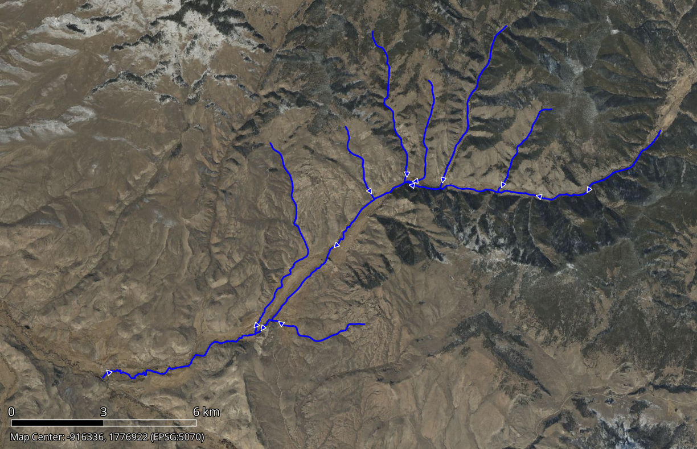
*Figure C10. Representative view for Case #10.*

| Fact | Value |
| --- | --- |
| Case Number | Case #10 |
| Location | Quartz, CO |
| Date Observed | 2026-02-11 |
| Coordinates (EPSG:5070) | -915338,1776607 |
| Coordinates (EPSG:4326) | 38.56847,-106.61573 |
| Flows (cms) | N/A |
| Stream Orders | 4, 1 |

**Description**
This case was selected to evaluate steep, confined mountainous terrain with multiple tributary inflows.

#### Case #11 - Large Urban River

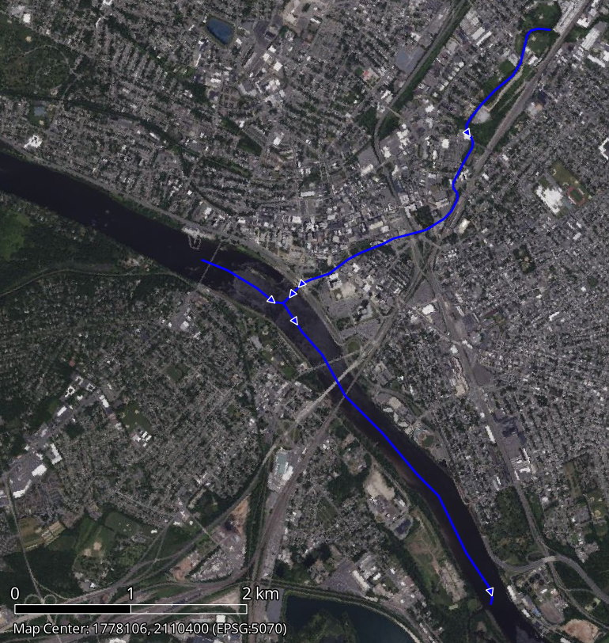
*Figure C11. Representative view for Case #11.*

| Fact | Value |
| --- | --- |
| Case Number | Case #11 |
| Location | Trenton, NJ |
| Date Observed | 2026-02-11 |
| Coordinates (EPSG:5070) | 1776154.1,2110466.2 |
| Coordinates (EPSG:4326) | 40.215714,-74.770855 |
| Flows (cms) | N/A |
| Stream Orders | 6, 3 |

**Description**
This case was selected as a large urban-river testbed to assess structure-influenced hydraulics and culvert/bridge handling strategies.

#### Case #12 - Desert Wash

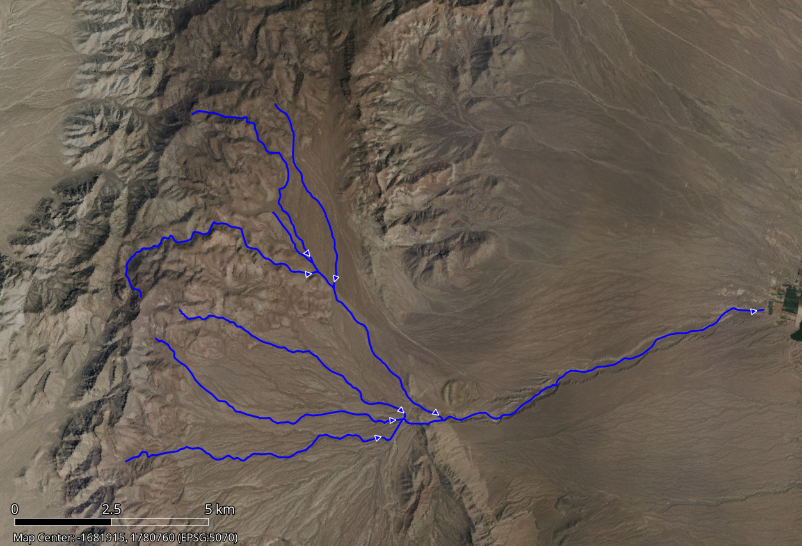
*Figure C12. Representative view for Case #12.*

| Fact | Value |
| --- | --- |
| Case Number | Case #12 |
| Location | Hiko, NV |
| Date Observed | 2026-02-12 |
| Coordinates (EPSG:5070) | -1681776,1777038 |
| Coordinates (EPSG:4326) | 37.49279,-115.34133 |
| Flows (cms) | N/A |
| Stream Orders | 3, 2, 1 |

**Description**
This case was selected to evaluate desert-wash behavior, where nonstandard morphology and adjacent-reach interactions can challenge hydrofabric-based domain logic.

#### Case #13 - Large Inland Waterbody

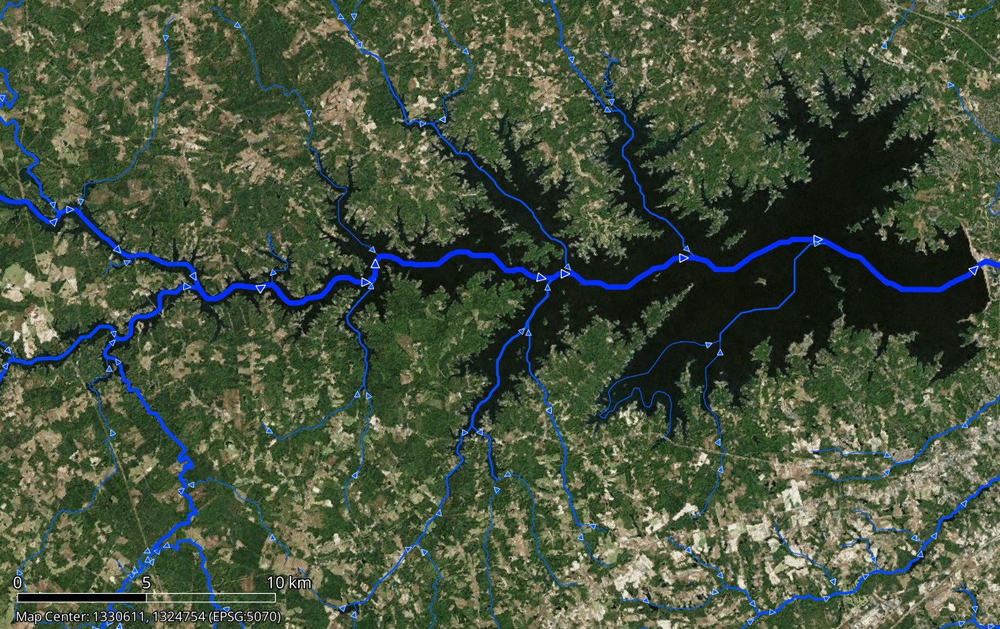
*Figure C13. Representative view for Case #13.*

| Fact | Value |
| --- | --- |
| Case Number | Case #13 |
| Location | Lake Murray, SC |
| Date Observed | 2026-02-12 |
| Coordinates (EPSG:5070) | 1334048,1325182 |
| Coordinates (EPSG:4326) | 34.06732,-81.37340 |
| Flows (cms) | N/A |
| Stream Orders | 1, 2, 5, 6 |

**Description**
This case was selected to develop and test methodology for large inland waterbody settings such as lakes and reservoirs.

#### Case #14 - Coastal Area

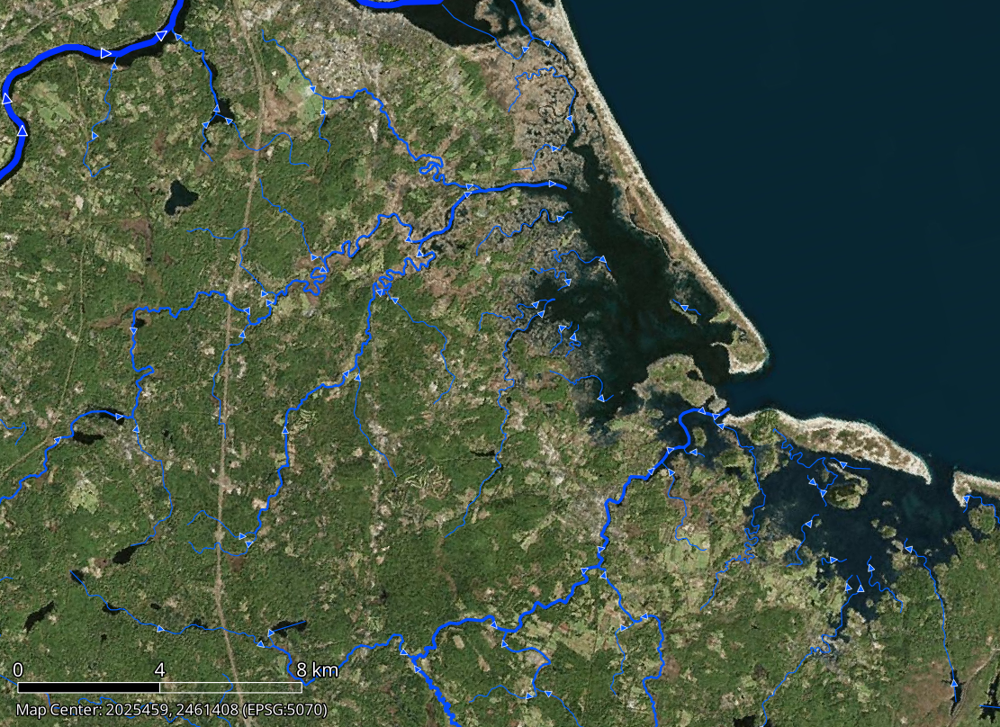
*Figure C14. Representative view for Case #14.*

| Fact | Value |
| --- | --- |
| Case Number | Case #14 |
| Location | Plum Island, MA |
| Date Observed | 2026-02-12 |
| Coordinates (EPSG:5070) | 2025825,2462203 |
| Coordinates (EPSG:4326) | 42.72671,-70.81783 |
| Flows (cms) | N/A |
| Stream Orders | 1, 2, 3 |

**Description**
This case was selected to develop and test methodology for coastal boundary settings.

#### Case #15 - Large River

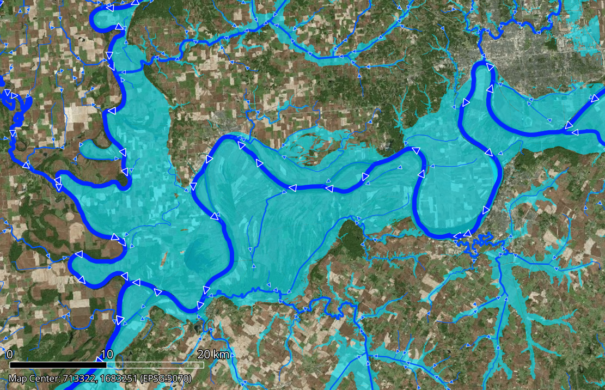
*Figure C15. Representative view for Case #15.*

| Fact | Value |
| --- | --- |
| Case Number | Case #15 |
| Location | Evansville, IN |
| Date Observed | 2026-02-12 |
| Coordinates (EPSG:5070) | 716490,1679388 |
| Coordinates (EPSG:4326) | 37.87805,-87.75769 |
| Flows (cms) | N/A |
| Stream Orders | 7 |

**Description**
This case was selected as a large-river testbed with a wide floodplain and available surveyed bathymetry to evaluate domain rules and stage behavior.

### Appendix D. Decision Pages

#### Decision #1 - Should KWSE Scenario be Modeled or Not

**Description**
Define whether KWSE scenarios should be modeled for all reaches or only selected reaches.

This decision establishes whether downstream stage aware scenarios are always represented in the library rather than treated as optional special cases.

**Alternatives**
**ALT-A - For All Reaches** `current`
Model KWSE scenarios for all reaches so downstream-stage sensitivity is represented consistently across the national library.

**ALT-B - For No Reach**
This option reduces library size and modeling effort significantly, but it assumes downstream-stage variability can be ignored in all reaches.

#### Decision #2 - What is the Definition of Benchmark FIM for Model Connectivity Testing

**Description**
A benchmark FIM is needed to evaluate the model connectivity framework. This decision set benchmark for what quality a composite FIM from different reach models should strive to achieve.

**Alternatives**
**ALT-A - Composite 2D Model with Same Input Data** `current`
Use a composite 2D model configured for the test area that is developed using same source input data and forcing. The model should also be developed using same 2D hydraulic software

#### Decision #3 - Where and What Boundary Conditions to Apply Along the Edge Cells

**Description**
Define which boundary condition should be applied along model edge cells (the domain bounding box).

Boundary Condition Choices Available:
1. Close / No Boundary Condition - Water pools at the edges
2. Normal Depth - Water escapes the domain at provided slope
3. Freefall - Water falling off of a cliff with no resistance

**Alternatives**
**ALT-A - Freefall at all Edges**
Water exits the domain at no resistance.

**ALT-B - Normal Depth at all Edges with Tailored Slope**
This alternative applies normal-depth behavior to all edges but computes local slope values per edge cell, aiming to better model physical reality.

**ALT-C - D/S Model FIM Informed Edge Cells get Reach Centerline Slope**
Apply reach centerline slope normal depth boundary condition only along edge cells identified as part of downstream reach FIM, leaving other edge segments closed.

**ALT-D - D/S Model FIM Informed Edge Cells get Freefall** `current`
This is similar to ALT-A but only the edge cells that are intersecting with D/S reach FIM gets a freefall boundary condition. A freefall is needed because we want water to escape without resistance and not elevate WSEL in the `transition zone`. ALT-C suggestion of centerline slope with normal depth is a crude approximation of flow conditions, and is often based on a slope value with limited accuracy.  If the slope is flatter, it can lead to water being pooled in the transition zone.

#### Decision #4 - Strategy of Pixel Value Calculation For Composite Maps

**Description**
What should be the strategy to create composite map from individual reaches. What pixel value should a composite map pixel adopt in overlap zones.

**Alternatives**
**ALT-A - Downstream Map at Bottom, Upstreams at Top (Higher Stream Orders at Top )**
Place downstream rasters beneath upstream rasters so overlap precedence favors upstream maps.

**ALT-B - Upstream Maps at Bottom, Downstream at Top**
This alternative prioritizes downstream rasters in overlap areas by layering them above upstream rasters

**ALT-C - Maps Clipped. `Common Outlet Reaches` Maps at No Particular Order**
This option clips maps prior to compositing so each reach contributes only within constrained extents and overlap conflicts are reduced.

**ALT-D - Pixelwise Max** `current`
Resolve overlaps by assigning the maximum depth value per pixel so compositing is deterministic and independent of draw order.

#### Decision #5 - For Lake and Coastal Reaches What Downstream Boundary Conditions Should be Applied

**Description**
For these reaches, the standard WSE transfer approach might not apply.  These reaches will, however, need some area to discharge floodwaters.

**Alternatives**
**ALT-A - Only Reach Normal Depth Slope**
Set the boundary condition along that line to the reach slope. This is non-ideal because reach slopes are often very different from level pools at waterbodies and coasts.

**ALT-B - Only Low Normal Depth Slope**
Same as ALT-A, but uses a very low normal depth slope (ex. 10e-6). As slope approaches 0, Qout will approach 0.  Therefore this boundary condition will often behave similarly to a closed boundary.

**ALT-C - Both KWSE and Reach Normal Depth Slope** `current`
This alternative suggest to use a range of reasonable depths from downstream waterbody. This has advantage that a lake or coastal reach doesn't get any special treatment in code development.

#### Decision #6 - For Lake and Coastal Reaches Where and What Boundary Conditions to Apply Along the Edge Cells

**Description**
Determine whether `lake and coastal reaches` require different edge-cell boundary handling from standard reaches.

**Alternatives**
**ALT-A - Freefall at all Edges**
Apply uniform steep-slope normal-depth condition at all edge cells in terminal reaches model domain. Water would leave the domain at normal depth slope whenever it hit the edges.

**ALT-B - Normal Depth at all Edges with Tailored Slope**
This alternative applies normal-depth behavior to all edges but computes local slope values per edge cell, aiming to better model physical reality.

**ALT-C - D/S Water Body Informed Edge Cells get Reach Centerline Slope**
Apply reach centerline slope normal depth boundary condition only along edge cells identified as part of downstream water body, leaving other edge segments closed.

**ALT-D - Closed at all Edges**
All edge cells get closed boundary and water has no place to escape. This alternate works in combination with DR-008 - What Should be an STL for Lake and Coastal Reaches.

**ALT-E - D/S Water Body Informed Edge Cells get Steep Slope** `current`
This is similar to ALT-A but only at edge cells that are intersecting with D/S Water Body get freefall boundary condition. A freefall is needed because we want water to escape without resistance and not elevate WSEL in the `transition zone`. ALT-C suggestion of centerline slope with normal depth is a crude approximation of flow conditions, and is often based on a slope value with limited accuracy. If the slope is flatter, it can lead to water being pooled in the transition zone..

#### Decision #7 - How to Mark Reaches as Lake and Coastal Reaches

**Description**
Define the criteria or workflow for classifying reaches as lake or coastal reaches in the network analysis phase.

**Alternatives**

#### Decision #8 - What Should be an STL for Lake and Coastal Reaches

**Description**
Define how to derive the stage transfer line (STL) for lake and coastal reaches.

**Alternatives**
**ALT-A - Line Intersection of Model Domain and Water Body Polygon**
Use model domain bbox and water body polygon intersection directly as STL geometry

**ALT-B - Intersection of Model Domain and Water Body Polygon Boundary** `current`
This alternative converts the water body polygon into a polyline and then perform intersection with domain bbox. This will give a line geometry similar to WSEL contours in standard reaches.


- ALT-B selected based on judgement

#### Decision #9 - Where to Apply Stage Transfer Condition

**Description**
This decision decide if Stage transfer should take place at model domain bbox, at `Reach Outlet` or as a region where domain intersect with D/S FIM. Placement of this condition strongly affects transition-zone WSEL behavior and FIM alignment between reaches.

**Alternatives**
**ALT-A - At Model Domain Edge Cells that Inetersects D/S Reach FIM**
At the intersection of model domain bbox and D/S Reach FIM. This has benefit that there will be no transition zone.
This would cause sudden floodplain width increase if there is a big flow increase from upstream to downstream. (See picture in description. We still need to back it by evidence.)

**ALT-B - At `Reach Outlet`** `current`
Apply stage transfer at the `reach outlet` as a Line, called `STL`. See DR-025 - What Should be the Geometry of STL for further specifications.

**ALT-C - At the Intersection of Domain and D/S FIM**
Apply stage transfer across the whole region rather than a single line.

This is making model unstable because of large number of pixels with forced WSEL.

#### Decision #10 - How should DEM data be modified to enforce drainage through culverts

**Description**
Large bridges are generally removed from DEMs, but many smaller culverts remain as flow obstructions in the terrain, how enforce drainage through these DEM humps?

**Alternatives**
**ALT-A - Do nothing** `current`
This alternative proposes using DEM as is without modifying it at all. This approach is somewhat justified, since the functioning of each individual culvert cannot be guaranteed during a flood event.

**ALT-B - AGREEDEM**
The AGREEDEM workflow could be applied here to burn trapezoidal channels into the area around stream centerlines and enforce drainage through culverts.
https://web.pdx.edu/~jduh/courses/geog493f09/Students/W8_AGREE_ScottParker.pdf

**ALT-C - Burn streams into DEM at roads**
This alternative burns stream paths through road crossings so blocked cells are lowered and flow continuity through likely culvert locations is preserved.

https://www.whiteboxgeo.com/manual/wbt_book/available_tools/hydrological_analysis.html?highlight=burnstreams#burnstreamsatroads
https://jblindsay.github.io/ghrg/pubs/2016_Lindsay_ESPL.pdf

**ALT-D - Breach flow obstructions**
This option uses terrain breaching to remove artificial barriers where crossings block conveyance and produce upstream impoundment artifacts.

https://fema-ffrd.github.io/overflow/user-guide/terrain-conditioning/breach/

**ALT-E - Custom terrain modification**
Custom code could be written to clip flowpath lines to some buffer around the road network.  A trapezoidal channel could then be imputed in the area around the intersection.

#### Decision #11 - How to Determine Initial Model Domain

**Description**
The first step of model creation is determining the model extents. Some initial estimate of floodplain size must be made.

The decision on how to catch smaller domains and extend them is recorded separately in DR-012 - What Strategy to be used for Determining if Domain Should be Expanded.

**Alternatives**
**ALT-A - Buffer on Reach Divide**
Build initial domain by buffering reach divide geometry from hydrofabric.

**ALT-B - Buffer on Centerline**
In this approach, the a bounding box is taken on some buffer around the stream centerline. The buffer distance could come from
 - a regression equation ([ex. Bieger et al., 2015](https://onlinelibrary.wiley.com/doi/abs/10.1111/jawr.12282)),
 -  an external dataset of river widths (ex. [from USGS](https://water.usgs.gov/catalog/datasets/120270a9-e0b6-42d8-9b1f-17db852fd2b4/)), or
 - a preliminary hydraulic calculation (ex. some assumption of channel depth combined with Manning's equation for a large flood).

**ALT-C - Coarse Model FIM**
In this approach the assumption is that a course model would have been already executed for the reach, which will give a maximum FIM and the domain in actual modeling can simply be BBOX of the coarse model FIM.

**ALT-D - Bounding Box of Inflow BC, d/s `STL`, and Buffered Centerline** `current`
A bounding box on the inflow line, the downstream Stage Transfer Line (when available), and the buffered centerline from ALT-B is used for the model domain.

#### Decision #12 - What Strategy to be used for Determining if Domain Should be Expanded

**Description**
The initial domain from DR-011 may not be large enough.  This may lead to situations where water pools on domain edges and the FIM underestimates extent.

This DR explores strategies for dynamically determining after a simulation whether water is pooling on an edge in a way that impacts FIM extents negatively and hence FIM should be expanded.

**Alternatives**
**ALT-A Informed by `Adjacent Reaches` FIM**
The domain should be expanded until there are no flooding cells on the edges other than cells that are intersecting with
- the `downstream reaches` FIM
- the buffer (acting as proxy for FIM) on the `upstream reaches` and `common outlet reaches`  using same approach as DR-011 - How to Determine Initial Model Domain#ALT-B - Buffer on Centerline.

**ALT-B - Informed by Elevation**
The domain should be expanded until there are no flooding cells on the edges other than cells that have elevation lower than the elevation at the  `outlet point` of the reach.

**ALT-C - Informed by Water-Surface Elevation**
The domain should be expanded until there are no flooding cells on the edges other than cells that have water-surface elevation lower than the water-surface elevation at the  `reach outlet` of the reach or water-surface elevation higher than the water-surface elevation at the `reach start`.

**ALT-D - Informed by Stage-Transfer Lines**
Once a model has been run, draft stage transfer lines would be developed. The floodplain polygon would be split by these lines.  If any of the polygon between the stage transfer lines touches a domain edge, that edge should be expanded.

**ALT-E - Informed by Smoothed Water-Surface Elevation**
The domain should be expanded until there are no flooding cells on the edges other than cells that have water-surface elevation lower than the water-surface elevation at the  `reach outlet` of the reach or water-surface elevation higher than the water-surface elevation at the `reach start`.

**ALT-F - Informed by Water-Surface Elevation with 4,000 Meter Expansion Limit**
The domain should be expanded until there are no flooding cells on the edges other than cells that have water-surface elevation lower than the water-surface elevation at the  `reach outlet` of the reach or water-surface elevation higher than the water-surface elevation at the `reach start`.

If the domain would expand more than 4,000 meters from the initial domain, stop expansion.

**ALT-G - Informed by Water-Surface Elevation with Regression Expansion Limit** `current`
The domain should be expanded until there are no flooding cells on the edges other than cells that have water-surface elevation lower than the water-surface elevation at the  `reach outlet` of the reach or water-surface elevation higher than the water-surface elevation at the `reach start`.

If the domain would expand more than 50 times bankfull width from the initial domain, stop expansion. Bankfull width may be obtained via regression from the source below.

*Bieger, Katrin, Hendrik Rathjens, Peter M. Allen, and Jeffrey G. Arnold, 2015. Development and Evaluation of Bankfull Hydraulic Geometry Relationships for the Physiographic Regions of the United States. Journal of the American Water Resources Association (JAWRA) 51(3): 842-858. DOI: [10.1111/jawr.12282](https://doi.org/10.1111/jawr.12282 "Link to external resource: 10.1111/jawr.12282")*

#### Decision #13 - What Should be Geometry and Location of Input  BC

**Description**
We need to provide flow as input boundary condition to the model domain. What should be the geometry and location of input boundary condition?

**Alternatives**
**ALT-A - At Perpendicular Line Some Distance Away on Highest Drainage Area `Upstream Reach`** `current`
Apply line inflow on the highest-drainage upstream reach some distance from the target reach start, aligning inflow with dominant upstream conveyance.

Green reach is being modeled.

**ALT-B - At Perpendicular Lines Some Distance Away on All `Upstream Reaches` with Weighted Flow by Drainage Area**
This alternative distributes inflow across multiple upstream reaches with drainage-area weighting so tributary contributions are represented explicitly.

Green reach is being modeled.

**ALT-C - At Points Distributed Along the Reach**
This option spreads inflow across multiple points along the reach, which can reduce single area concentration but requires additional placement rules in automation.

Green reach is being modeled.

**ALT-D - At Point Some Distance Away on the `Upstream Mainstem Reach`**
This option applies one point on the `upstream mainstem reach` some distance away from `reach start`.

Green reach is being modeled.

**ALT-E - A Point at the `Reach Start`**
This option is the simplest point-based setup at reach start, but it is more susceptible to concentrated inflow artifacts in larger channels.

Green reach is being modeled.

**ALT-F - At Perpendicular Line at the `Reach Start`**
This option is similar to ALT-E but uses line instead of point.

Green reach is being modeled.

#### Decision #14 - What Should be Geometry and Location of Input  BC for `Headwater Reaches`

**Description**
We need to provide flow as input boundary condition to the model domain. What should be the geometry and location of input boundary condition?
Headwater reaches are handled separately because upstream geometry options are not available relative to non-headwater reaches.

**Alternatives**
**ALT-A - At Perpendicular Line on `Reach Start`**
Use a perpendicular line at headwater `reach start` so inflow is distributed across a short section instead of concentrated at a point.

**ALT-B - At Points Distributed Along the Reach** `current`
Apply distributed point inflows along the headwater reach to reduce concentration of inflow at a single boundary location. This option is a strong candidate because headwater reaches are usually not distinct in DEM and inputting a large flow at the top can route to different locations.

**ALT-C - At a Point on `Reach Start`**
This alternative suggest simplest approach of one point at headwater `reach start`.

#### Decision #15 - What Line Width Should be Used for Inflow BC Line

**Description**
This DR is only relevant for line based alternatives in  DR-013 - What Should be Geometry and Location of Input  BC and DR-014 - What Should be Geometry and Location of Input  BC for `Headwater Reaches`

**Alternatives**
**ALT-A - 100m Wide** `current`
Set inflow line width to 100 m as a standard default so line-based inflow geometry remains consistent across applicable reaches.

#### Decision #16 - What Upstream Offset Distance Should be Used for Inflow BC Line Placement

**Description**
This DR is only relevant for some alternatives in  DR-013 - What Should be Geometry and Location of Input  BC

**Alternatives**
**ALT-A - 0.25 of Upstream Reach Length** `current`
Place line inflow at one-quarter of upstream-reach length so boundary effects at the immediate reach start are reduced.

**ALT-B - 100 meters**
The fixed offset is simple to operationalize, but it may be less adaptive than relative-length offsets across very short or very long upstream reaches.

#### Decision #17 - What Horizontal Resolution DEM Should be Used for Modeling

**Description**
Topographic data is available at various source resolutions and can be resampled to any resolution needed. What final resolution should be used for modeling? This decision effects compute cost and mapping resolution of produced rasters.

**Alternatives**
**ALT-A - 10 meters** `current`
Use 10 m DEM resolution to preserve floodplain/channel-adjacent detail needed for reach-scale hydraulics at operationally feasible cost.

**ALT-B 30 meters**
This alternative suggests 30 m terrain resolution to lower compute and storage cost while accepting lower topographic detail in mapped results.

#### Decision #18 - What Source DEM Should be Used for Modeling

**Description**
Topographic data is needed for model creation. What source should be used for topographic data? Source consistency is essential here so that national libraries can be produced without region-specific alterations.

**Alternatives**
**ALT-A - USGS 3DEP** `current`
USGS 3DEP is the first choice because of its authoritativeness as well as availability.

Source: https://prd-tnm.s3.amazonaws.com/StagedProducts/Elevation/13/TIFF/USGS_Seamless_DEM_13.vrt

#### Decision #19 - What Source Surface Roughness Data Should be Used for Modeling

**Description**
All hydraulic models considered use Manning'n values to parameterize roughness and friction forces. Where should this dataset come from?

See DR-020 - What Lookup Table Should be Used for Land Cover Classes to Manning's n Relationship for conversion.

**Alternatives**
**ALT-A - National Land Cover Dataset converted to Manning's n** `current`
Use NLCD Land Cover dataset derived Manning's n rasters. NLCD LC dataset is the most authoritative and widely used LC dataset for the United States.

Source: https://www.mrlc.gov/geoserver/mrlc_download/wms

#### Decision #20 - What Lookup Table Should be Used for Land Cover Classes to Manning's n Relationship

**Description**
Only relevant for DR-019 - What Source Surface Roughness Data Should be Used for Modeling.

**Alternatives**
**ALT-A - USACE Dictionary** `current`
The following lookup table was derived from the [Army Corps of Engineers HEC-RAS guidance](https://www.hec.usace.army.mil/confluence/rasdocs/r2dum/6.6/developing-a-terrain-model-and-geospatial-layers/creating-land-cover-mannings-n-values-and-impervious-layers#id-.CreatingLandCover,Manning%E2%80%99snvalues,and%ImperviousLayersv6.5.Beta-Manning'snCalibrationRegions).
```python
MANNINGS_LC_LOOKUP = {
    11: 0.04,
    21: 0.04,
    22: 0.1,
    23: 0.08,
    24: 0.15,
    31: 0.025,
    41: 0.16,
    42: 0.16,
    43: 0.16,
    52: 0.1,
    71: 0.035,
    81: 0.03,
    82: 0.035,
    90: 0.12,
    95: 0.07,
}
```

**ALT-B - 'mannings_roughness_generator' Dictionary**
A QGIS plugin 'mannings_roughness_generator'  lists an alternative dictionary, although the source is unclear: https://github.com/mabdazzam/mannings_roughness_generator/tree/main/lookups

#### Decision #21 - How Should Below Water Topobathy be Accounted for

**Description**
Conventional LiDAR systems cannot measure bathymetric data below the water surface at time of flight. In some rivers and during some flight conditions, this section channel geometry can represent a significant proportion of channel conveyance. By not accounting for below-LiDAR bathymetry, depth predictions may be highly inaccurate.

A literature review of methods for bathymetry estimation is provided here: https://agupubs.onlinelibrary.wiley.com/doi/10.1029/2020WR028301

**Alternatives**
**ALT-A - No handling** `current`
Apply no explicit bathymetry handling and rely on available topographic terrain, carrying resulting channel-conveyance uncertainty as a known limitation.

**ALT-B - Regression on bathymetric surveys**
A team of researchers at Purdue has continued research in the vein of [this paper](https://agupubs.onlinelibrary.wiley.com/doi/full/10.1029/2020WR029521). Their continued work uses surveyed bathymetric data from the USACE ehydro dataset to train a machine learning regressor that predicts bathymetric data at the reach scale.

While the study is currently only piloted for sites along the Ohio River, this analysis could be expanded to all areas of the US.  If accuracy is still acceptable, this approach could be used in pre-processing to add an estimate of channel bathymetry to model DEMs.

**ALT-C - Regression on LiDAR time-of-flight flow quantiles**
USGS LiDAR has metadata to record the time of lidar flight. For a given LiDAR survey, the USGS gages in the survey area can be retrieved, and the flow-duration curve quantile for that day could be retrieved. A regression for flow-duration curve on drainage area could then be created within the survey area, and the mean flow quantile from all gages could be used to map a discharge to every reach.

Manning's equation could then be used to determine how much area below LiDAR would be needed to convey the predicted discharge at LiDAR flight time. A trapezoidal or rectangular channel shape could be assumed.

This approach was used by researchers at the University of Vermont.

#### Decision #22 - How to Determine Model Quasi-Steady State

**Description**
This modeling approach is built around an assumption of 2D steady flow conditions, meaning that  inflow equals outflow, and outflow does not much change with time. Criteria will need to be established to determine when inflows have balanced outflows and water surface elevations across the model are relatively stable.

**Alternatives**
**ALT-A Check Qin ~ Qout at Frequent Intervals**
Determine quasi-steady behavior using repeated checks that inflow and outflow are approximately balanced over the simulation horizon.

**ALT-B Check WSEL Raster has Stabilized Between Different Time Steps** `current`
Determine quasi-steady behavior using stabilization of WSEL rasters between different time intervals as the primary termination signal.

#### Decision #23 - How to Deal with Short Reaches

**Description**
In stream network there will be many reaches that will be very short relative to their floodplains and in terms of the flow additions between reaches. How to deal with these reaches.

The figure below shows an analysis of hydrologic changes between reaches at different stream orders. Data was taken from the NWM retrospective design discharge dataset. Moving downstream between NWM reaches, the 100-year discharge shows a median increase of 1.2% across all reaches. However, this doesn't tell the full story. Second-order reaches have a 11% median increase, while fifth-order reaches remain nearly constant with a median increase of just 0.025%.  As stream order increases, the scale over which discharge changes increases.


Striving to maintain short reach lengths in higher-order streams gives a sense of false precision. While it is tempting to keep the same reach length fidelity, larger rivers simply don't exhibit much discharge variability from reach to reach.

**Alternatives**
**ALT-A - No Special Treatment**
This alternate suggest to use hydrofabric as is. This is a default behaviour.

**ALT-B - Merge Continuous Reaches that have Negligible Drainage Area Difference Up to Some River Mile Length** `current`
This will happen in network analysis step. Only higher stream order because there could be a case where mainstem with negligible DA difference is flowing dry and a tributary that had negligible DA is flowing full (a case need to be find to prove this can happen and reject ALT-B). At higher stream order we don't expect a mainstem to flow dry.

**ALT-C - Coarse Model Informed Analysis of FIM Width vs Reach Length**
This alternative suggest coarse model FIM informed analysis to determine which reaches are shorter in comparison to their FIM and hence should be merged to create reasonable models.

---

#### Decision #24 - What Should be Thresholds for Merging Short Reaches

**Description**
This decision defines thresholds for alternatives in DR-023 - How to Deal with Short Reaches.

**Alternatives**
**ALT-A - 5% Drainage Area Difference, Upto 3 miles, Stream Order 3 or up** `current`

#### Decision #25 - What Should be the Geometry of STL

**Description**
Define how to derive the stage transfer line (STL) for regular reaches.

This decision is only valid if DR-009 - Where to Apply Stage Transfer Condition has ALT-B At `Reach Outlet` selected.

**Alternatives**
**ALT-A - D/S Reach Divide**
Define STL using downstream reach divide geometry.

**ALT-B - WSEL Contour From D/S FIM** `current`
Create a WSEL Contour from D/S FIM and use it as `STL`. One issue with this is that this WSEL Contour will be in close proximity with the Inflow BC line of D/S model, we will see ISU-008 - Water-surface Elevation Anomalies.

It should be evaluated that does it even matter if WSEL contour is irregular shape?  Similarly this issue might only be in flat areas which we might want to avoid per DR-027 - How to Deal with Flat Reaches

**ALT-C Perpendicular Line From D/S FIM**
This is similar to ALT-B but here rather than WSEL contour (which can have anomalies) we will use develop perpendicular lines, these lines will be approximately perpendicular to FIM not the Reach. The success of this alternative depends if a good algorithm can be developed that can generate perpendicular lines for even complex FIMs not just simple cases.

**ALT-D Same Reach Largest ND Run's WSEL Contour**
This alternative suggest to draw STL from WSEL contour of the same reach FIM using largest normal depth run. This would mean the STL would be shorter for KWSE runs but it needs to be tested if that is a problem.

The motivation of this approach is that this contour line will be from downstream region of a FIM where inflow BC effects are minimal.

In following picture, green is ND run, and blue is DS model, pink is KWSE run

#### Decision #26 - Should There be 1 STL per Reach or 1 STL per Reach per RUN

**Description**
Define what stage transfer line (STL) will be used for different runs of an upstream model.

**Alternatives**
**ALT-A - 1 STL Per Reach From Largest Model Run** `current`
The same STL, derived from largest run, will be used across all KWSE runs.

Temp image showing that 1 STL for all runs mean the shape of STL is not perpendicular when d/s reach is not flowing at maximum discharge.

**ALT-B - STL Derived Separately during each run**
Regenerate STL for each run so STL geometry adapts to run specific FIM, at the cost of indexing and automation complexity.

#### Decision #27 - How do Deal with Flat Reaches

**Description**
Flat reaches cause model to have level pool, messing up with the methodology in many ways, one such example is that it is then hard to generate correct WSEL contours at reasonable differences, another example is that the domain need to be expanded a lot.

**Alternatives**
**ALT-A - Do Nothing** `current`
Apply no special flat-reach handling and run standard methodology defaults, accepting known risks.

**ALT-B - Include Slope Criteria in Reach Merging**
This alternative incorporates reach slope criteria into merge rules during network analysis step, so very flat and short reaches are merged so there is always some elevation drop in a model domain.
