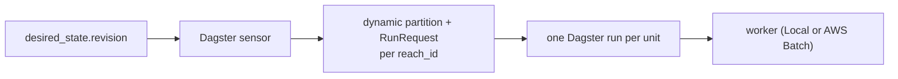
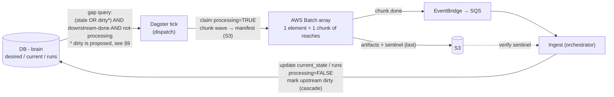

# Execution and Scaling

Reconciliation loop, triggers, and propagation in [`triggers-and-propagation.md`](triggers-and-propagation.md). DB schema and current Dagster fit in [`orchestrator-design.md`](orchestrator-design.md). S3 layout and design principles in [`guide.md`](guide.md).

This doc proposes changing **how the orchestrator runs work at scale**.
Today, Dagster creates one process per reach.
At 2-3 million reaches, that breaks.
This doc proposes grouping reaches into chunks and handing them to AWS Batch instead.
The DB-as-brain reconciliation model does not change - only how work is submitted and tracked.

---

## 1. Problem

The documented design makes each schedulable reach unit a Dagster **partition + run**:

This works at demo scale (~20 reaches), but does not survive national rollout.

## 2. Why it breaks at scale

A reach is a chain, not one unit, and ND/KWSE are per-scenario:

`build_model` (1) → `run_nd_scenarios` (N_q) → `plan_scenarios` (in-process) → `run_kwse_scenarios` (N_kwse)

So units = **reach × stage × scenario**, not reach. (Today only `build_model` is partitioned per-reach; extending the same pattern to ND/KWSE scenarios is what explodes.)

| Scale (illustrative) | Count |
|---|---|
| Reaches | ~2–3M |
| Executions per reach | ~10–50 (1 build + N_q ND + N_kwse KWSE) |
| **Total units, one bulk pass** | **tens of millions** (before cascade re-runs) |

The hard limits are about **throughput**:

| Failure | Cause |
|---|---|
| **Launch throughput** | Every reach launches its own process. At millions of reaches, process startup takes longer than the actual modeling work. The bottleneck is how many processes Dagster can launch at once (`max_concurrent_runs`). |
| **Sensor emission** | Every 30 seconds, the sensor checks for work and emits one `RunRequest` per eligible reach. It has about 60 seconds by default to finish ([sensor timeouts](https://docs.dagster.io/deployment/troubleshooting/sensor-timeouts)). When hundreds of thousands of reaches are eligible at once, the sensor cannot list them all in 60 seconds and times out. |
| **Storage / query latency** | Partition keys + run rows + ~10⁸–10⁹ event-log rows in Postgres. Postgres can *hold* this, but the sensor/UI queries against the event log degrade sharply past Dagster's ≤100K partitions/asset [guidance](https://docs.dagster.io/guides/build/partitions-and-backfills/partitioning-assets) - a soft limit, not a hard cap. |

So the problem is not Dagster itself - it is running one Dagster process per reach.
The fix is the chunk design in [§4](#4-proposed-design) - change the unit of work.

## 3. What stays the same

No change to the brain or its logic - all per [`guide.md`](guide.md) / [`triggers-and-propagation.md`](triggers-and-propagation.md):

- DB-as-brain; orchestrator = reconciliation loop; orchestrator is sole DB writer
- Workers stay stateless - artifacts + JSON to S3, never touch the DB (the *invocation* contract changes; [§9](#9-implications))
- A reach needs work when `applied_revision < revision` (or no `current_state` row)
- Reaches are processed downstream-first - upstream neighbors only run after their downstream is complete
- Upstream cascade still uses the topology graph and boundary-condition provenance to find affected neighbors, but now marks them with a `dirty` flag instead of processing them inline (see [§9](#9-implications))
- Triggers / cases A–D; trigger consolidation
- Content-addressed paths → skip what already exists; the stage sentinel written last (`model.json` for build, `run.json` for scenarios)

## 4. Proposed design

- **Unit of orchestration = a chunk** - a batch/*wave* of independent reaches that are all ready at the same time (none waiting on another), not a single reach.
- The wide fan-out moves to **AWS Batch array jobs**; per-reach state stays in the DB (the brain).
- The orchestrator splits into two halves that meet only at the DB:
  1) **dispatch** - a thin Dagster tick that runs on a timer, reads the DB for a *bounded* batch of work (not the whole eligible set), claims it, and submits Batch,
  2) **ingest**, which handles completions and writes the DB. Dagster is the dispatch driver and operations layer ([§7](#7-why-dagster-not-a-custom-orchestrator)), no longer the per-unit tracker.

Key mechanics:

- **In-flight guard moves to the DB.** Today, Dagster prevents duplicate work by tracking a unique key per run (called `run_key`). In the chunked model there are no per-reach Dagster runs, so that guard disappears. Instead, the DB's `processing` flag does the same job: dispatch marks a reach as in-progress, ingest clears it when done, and the gap query skips anything still in progress.
- **Dispatch also covers cascade work.** When a downstream reach finishes, its upstream neighbors may need to re-run. This is not an external change, so we do not bump the revision number. Instead, ingest marks those upstream reaches as `dirty` ([§9](#9-implications)). Dispatch picks up work when a reach is either stale (revision gap) or dirty. See [`triggers-and-propagation.md` §1.2](triggers-and-propagation.md#12-internal-triggers-cascade).
- **Chunks are not atomic.** A chunk packages independent reaches for efficiency. Completion is **per-reach, by its stage sentinel** (`model.json` for build, `run.json` for scenarios). Reach with its sentinel → ingest writes its state; reach without one (failed) → clear its claim (`processing=FALSE`) so the next tick re-attempts it. Skip-if-exists makes retries cheap.
- **Self-scaling.** Bulk = a large array (up to 10,000 chunks); a small update = one normal Batch job (arrays need ≥2). Same code path; chunk size is a tunable.
- **Dagster run count drops from ~tens of millions (one per unit) to ~one run per wave.** No per-reach partitions and no per-reach runs (Batch does the executing), so the [§2](#2-why-it-breaks-at-scale) limits (launch throughput, sensor emission, storage) all fall away. The millions of executions still happen, but inside Batch, which handles this scale.

## 5. Options considered

| Option | Verdict | Why |
|---|---|---|
| Per-reach (× q × kwse) partitions + runs (today) | ✗ | Tens of millions of run launches; one tick can't emit a wave (default 60s timeout); storage/queries degrade - see [§2](#2-why-it-breaks-at-scale) |
| Spatial (HUC) partitions | ✗ | A HUC spans many topological waves → "region ready" rarely true; fights downstream-first |
| **DB-as-brain + chunked Batch fan-out** | ✓ | Unit = chunk; self-scales; removes the [§2](#2-why-it-breaks-at-scale) limits; matches existing principles |
| Replace Dagster (custom / Step Functions) | ~ | Viable later - clean contracts make it swappable - but not required to fix scaling (see [§7](#7-why-dagster-not-a-custom-orchestrator)) |

## 6. Fan-in: how completion reaches the DB

A single mechanism in two layers - **events (primary) + polling (backstop)** (polling as a general pattern follows [`triggers-and-propagation.md` §2.2](triggers-and-propagation.md#22-db-listening)):

- **Events (primary):** When a Batch chunk finishes, AWS automatically sends an event through EventBridge into an SQS queue.
The ingest handler reads the message, checks that each reach wrote its sentinel file, and updates the DB.
Duplicate or out-of-order messages are safe - ingest uses the combination of `claim_id`, `reach_id`, and `stage` to detect and skip duplicates ([§9](#9-implications)).
Messages that repeatedly fail go to a dead-letter queue for investigation.
Low latency; scales to long GPU ND/KWSE jobs where polling would idle for hours.
- **Polling (backstop):** Each claimed reach has a time limit (a "lease").
If a worker does not finish before the lease expires, the backstop tick reclaims that reach so it can be retried.
The tick also checks S3 for sentinel files whose completion events were lost - if the sentinel exists but the DB was never updated, the tick writes the result from S3.
These are targeted checks, not full S3 scans.

## 7. Why Dagster, not a custom orchestrator

In this design Dagster is deliberately *not* the per-unit tracker (that's the DB) or the fan-out (that's Batch). Its value here is the **coordination + operations layer**:

- Managed reconciliation driver: interval firing without double-fire, restart recovery, tick history, retries
- Run history, structured logs, alerting hooks, manual re-run / backfill, the Dagster web UI - all now at wave/tick granularity, not per reach
- Headroom as the orchestration grows: the which-stage-to-rebuild logic (cases A–D), the upstream cascade, and more workers (nd / plan / kwse and beyond)

Custom/Step Functions can be a legitimate alternative if minimizing infra footprint is the priority and the orchestrator stays trivially thin. The clean contracts (DB + S3 result files + Batch) make Dagster **swappable without touching workers or schema** - so this is a reversible, low-stakes choice.

**Recommendation**: keep what is built and agreed - Dagster as the coordination layer, not the per-unit tracker; revisit only if its weight isn't worth it. (Extends the Dagster-vs-Custom row in [`orchestrator-design.md` §Dagster Fit](orchestrator-design.md#dagster-fit).)

## 8. Would paginated partitions fix it?

[dagster#33456](https://github.com/dagster-io/dagster/issues/33456) (remove the 100K partition limit by paginating the UI) is **open, unimplemented, and UI-only**.
It renders fewer tiles at once; it does not touch the [§2](#2-why-it-breaks-at-scale) blockers - millions of per-reach run launches, and per-tick sensor emission bounded by the default ~60s [sensor timeout](https://docs.dagster.io/deployment/troubleshooting/sensor-timeouts).
Postgres/S3 can *hold* the rows; the cost is launch throughput, which only coarser units fix.

## 9. Implications

- **Worker invocation contract**: worker entrypoint changes from in-process call to *container reads manifest slice, writes artifacts + per-reach sentinel* (`model.json`/`run.json`). To be specified separately.
- **Compute environments:** `build_model` is CPU → a CPU Batch env, distinct from the GPU SPOT env for the ND/KWSE solver.
- **Preemption** works differently in the chunked model.
For a single reach whose inputs change mid-flight: let the old work finish, then the next dispatch wave picks up the new revision.
For many reaches affected at once (e.g. a hydrofabric update): cancel the Batch job for the whole chunk.
In both cases, old results are harmless because ingest only writes to the DB if the claim is still valid and never overwrites a newer revision.
Dagster run cancellation does not propagate to Batch children - the orchestrator must explicitly call Batch terminate/cancel APIs.
Revises [`triggers-and-propagation.md` §3](triggers-and-propagation.md#3-run-preemption-policy).
- **Controller contract** (dispatch/ingest state machine - specified in a separate controller spec). Two additions worth flagging:
  - **`dirty` flag** - cascade isn't a revision bump, so dispatch can't otherwise see cascade work; ingest sets `dirty` on affected upstream when a reach completes (eligibility = gap OR `dirty`).
  - **`claim_id` (fencing)** - a slow worker wrongly reclaimed as dead can finish late and overwrite newer state (a *zombie*); ingest writes only if the result's `claim_id` matches the row's current claim, so the zombie write is rejected.
  - **`claim_id` scope** - one `claim_id` per stage per reach. Steps that dispatch to Batch (build_model, run_nd_scenarios, run_kwse_scenarios) each get their own claim_id
  - Plus `lease_expires_at`, stage-completion state, bounded claim query.
- **Dagster modeling:** per-reach dynamic partitions and partitioned assets (current code) are replaced by ops/jobs at wave granularity. Dagster tracks waves, not reaches. Per-reach status moves to DB views.

## 10. Open questions

- **Chunk size** - larger = less overhead and coarser completion signal, but one container crash disrupts more reaches; smaller = the reverse.
- **Completion granularity** - the sentinel is always written per-reach; this is about the completion *event*: one event per chunk (**recommended**; but a reach that finishes early waits for the chunk's slowest before its upstream is released) vs one signal per reach from the worker (finer, but adds worker code).
- **Stuck-`processing` timeout** - `lease_expires_at` ([§9](#9-implications)): how long before the backstop reclaims a reach whose event never arrived.
- **Cascade-release latency** - release upstream on the next tick (simplest; **recommended**) vs ingest dispatches upstream immediately (lower latency, more coupling).
- **Preemption threshold** - on a mid-flight revision bump, when to terminate the affected chunk(s) vs let them finish and re-run next wave (depends on how many reaches in the chunk are superseded). Note: termination must be explicit via `batch.terminate_job()` - Dagster does not propagate cancellation to Batch children.
