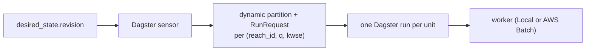
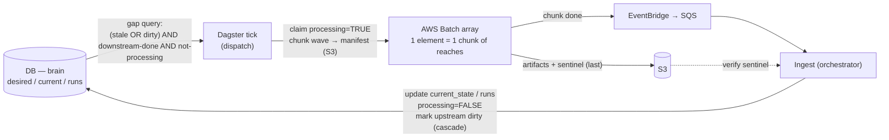

# Execution and Scaling

Reconciliation loop, triggers, and propagation in [`triggers-and-propagation.md`](triggers-and-propagation.md). DB schema and current Dagster fit in [`orchestrator-design.md`](orchestrator-design.md). S3 layout and design principles in [`guide.md`](guide.md).

This doc revises the **unit of orchestration** in [`orchestrator-design.md`](orchestrator-design.md), particularly for national-scale execution (~2–3M reaches). It is an **execution-layer change only** — the DB-as-brain reconciliation model is unchanged.

---

## 1. Problem

The documented design makes each schedulable reach unit a Dagster **partition + run**:

This works at demo scale (~20 reaches), but does not survive national rollout.

## 2. Why it breaks at scale

A reach is a chain, not one unit, and ND/KWSE are per-scenario:

`build_model` (1) → `run_nd_scenarios` (N_q) → `plan_scenarios` (in-process) → `run_kwse_scenarios` (N_kwse)

So units = **reach × stage × scenario**, not reach. (Today only `build_model` is partitioned per-reach; extending the same pattern to ND/KWSE scenarios is what explodes.)

| Scale (illustrative) | Count |
|---|---|
| Reaches | ~2–3M |
| Executions per reach | ~10–50 (1 build + N_q ND + N_kwse KWSE) |
| **Total units, one bulk pass** | **tens of millions** (before cascade re-runs) |

The hard limits are about **throughput**, not storage:

| Failure | Cause |
|---|---|
| **Launch throughput** (primary) | One run per unit = one launched run-worker process per unit → ~tens of millions of process launches, gated by `max_concurrent_runs`. Each reach starts a whole new process instead of being a quick call inside a running one; at millions of reaches that startup time, not the modeling work, sets the total runtime, and a bigger database doesn't help. |
| **Sensor emission** (primary) | One tick must emit the whole eligible set as `RunRequest`s, but a tick has a ~60s budget ([sensor timeouts](https://docs.dagster.io/deployment/troubleshooting/sensor-timeouts)). A bulk pass (10⁵–10⁶ eligible reaches at once) times out the tick — and a longer interval doesn't help: the limit is per-tick, not per-frequency. |
| Storage / query latency (secondary) | Partition keys + run rows + ~10⁸–10⁹ event-log rows in Postgres. Postgres can *hold* this, but the sensor/UI queries against the event log degrade sharply past Dagster's ≤100K partitions/asset [guidance](https://docs.dagster.io/guides/build/partitions-and-backfills/partitioning-assets) — a soft limit, not a hard cap. |

Thus the problem is the **granularity** (per-unit orchestration of tiny tasks), not Dagster. Pushing per-reach to work would force paced sensor emission *and* processing many reaches in one run, so a single process-start is spread over thousands of reaches — which is the chunk design ([§4](#4-proposed-design)) rebuilt inside Dagster.

## 3. What stays the same

No change to the brain or its logic — all per [`guide.md`](guide.md) / [`triggers-and-propagation.md`](triggers-and-propagation.md):

- DB-as-brain; orchestrator = reconciliation loop; orchestrator is sole DB writer
- Workers stay stateless — artifacts + JSON to S3, never touch the DB (the *invocation* contract changes; [§9](#9-implications))
- Gap = `applied_revision < revision` (or no `current_state` row)
- Downstream-first ordering; upstream cascade *logic* (topology walk + BC provenance) — now dispatched via the `dirty` flag ([§9](#9-implications))
- Triggers / cases A–D; trigger consolidation
- Content-addressed paths → skip what already exists; the stage sentinel written last (`model.json` for build, `run.json` for scenarios)

## 4. Proposed design

- **Unit of orchestration = a chunk** — a batch/*wave* of independent reaches that are all ready at the same time (none waiting on another), not a single reach.
- The wide fan-out moves to **AWS Batch array jobs**; per-reach state stays in the DB (still the brain).
- The orchestrator splits into two halves that meet only at the DB:
  1) **dispatch** — a thin Dagster tick that runs on a timer, reads the DB for a *bounded* batch of work (not the whole eligible set), claims it, and submits Batch,
  2) **ingest**, which handles completions and writes the DB. Dagster is the dispatch driver and operations layer ([§7](#7-why-dagster-not-a-custom-orchestrator)), no longer the per-unit tracker.

Key mechanics:

- **In-flight guard moves to the DB.** With no per-reach Dagster run, `run_key` dedup is gone. `current_state.processing` becomes central: dispatch sets `TRUE` on claim, ingest sets `FALSE` on completion. The gap query already skips anything still processing.
- **Dispatch also covers cascade work.** Upstream cascade is *not* a revision bump ([`triggers-and-propagation.md` §1.2](triggers-and-propagation.md#12-internal-triggers-cascade)), so on completing a reach, ingest marks affected upstream as needing work via a **`dirty`** flag ([§9](#9-implications)) — no revision bump; dispatch eligibility = revision-gap OR `dirty`.
- **Stage-aware.** A reach is a chain (build → ND → plan → KWSE); "complete" = the full chain, and dispatch advances it stage-by-stage (CPU build vs GPU ND/KWSE). Only `build_model` exists today.
- **Chunks are not atomic.** A chunk packages independent reaches for efficiency. Completion is **per-reach, by its stage sentinel** (`model.json` for build, `run.json` for scenarios). Reach with its sentinel → ingest writes its state; reach without one (failed) → clear its claim (`processing=FALSE`) so the next tick re-attempts it. Skip-if-exists makes retries cheap.
- **Self-scaling.** Bulk = a large array (up to 10,000 chunks); a small update = one normal Batch job (arrays need ≥2). Same code path; chunk size is a tunable.
- **Dagster run count drops from ~tens of millions (one per unit) to ~one run per wave.** No per-reach partitions and no per-reach runs (Batch does the executing), so the [§2](#2-why-it-breaks-at-scale) limits (launch throughput, sensor emission, storage) all fall away. The millions of executions still happen, but inside Batch, which handles this scale.

## 5. Options considered

| Option | Verdict | Why |
|---|---|---|
| Per-reach (× q × kwse) partitions + runs (today) | ✗ | Tens of millions of run launches; one tick can't emit a wave (60s timeout); storage/queries degrade — see [§2](#2-why-it-breaks-at-scale) |
| Spatial (HUC) partitions | ✗ | A HUC spans many topological waves → "region ready" rarely true; fights downstream-first |
| **DB-as-brain + chunked Batch fan-out** | ✓ | Unit = chunk; self-scales; removes the [§2](#2-why-it-breaks-at-scale) limits; matches existing principles |
| Replace Dagster (custom / Step Functions) | ~ | Viable later — clean contracts make it swappable — but not required to fix scaling (see [§7](#7-why-dagster-not-a-custom-orchestrator)) |

## 6. Fan-in: how completion reaches the DB

A single mechanism in two layers — **events (primary) + polling (backstop)** (the backstop is already recommended by [`triggers-and-propagation.md` §2.2](triggers-and-propagation.md#22-db-listening)):

- **Events (primary):** Batch chunk completes → EventBridge → SQS → ingest handler verifies the sentinel and writes the DB; ingest is idempotent and out-of-order tolerant (dedupe key `(claim_id, reach_id, stage)` — `claim_id` is a per-claim fencing token, [§9](#9-implications); DLQ for poison messages). Low latency; scales to long GPU ND/KWSE jobs where polling would idle for hours.
- **Polling (backstop):** the DB claim/lease state (a *lease* = a claim with an expiry) is the primary reconciliation index — the tick reclaims expired-lease (stuck after timeout) claims and runs *targeted* S3 audits (not a routine full scan) to recover dropped events (sentinel exists but the DB wasn't updated → write from S3). It also catches external revision bumps (e.g. an operator edits `q_set`, or a hydrofabric update bumps revisions), which fire no Batch event, so only polling sees them. Guarantees progress if events drop.

**Rollout Plan:** `build_model` can run on the backstop alone first (no EventBridge/SQS needed, unblocked from in-progress IaC, testable locally). Once the IaC is deployed, Batch completions get wired to EventBridge→SQS and the same ingest code also runs on events — no rewrite.

## 7. Why Dagster, not a custom orchestrator

In this design Dagster is deliberately *not* the per-unit tracker (that's the DB) or the fan-out (that's Batch). Its value here is the **coordination + operations layer**:

- Managed reconciliation driver: interval firing without double-fire, restart recovery, tick history, retries
- Run history, structured logs, alerting hooks, manual re-run / backfill, the Dagster web UI — all now at wave/tick granularity, not per reach
- Headroom as the orchestration grows: the which-stage-to-rebuild logic (cases A–D), the upstream cascade, and more workers (nd / plan / kwse and beyond)

Custom/Step Functions can be a legitimate alternative if minimizing infra footprint is the priority and the orchestrator stays trivially thin. The clean contracts (DB + S3 result files + Batch) make Dagster **swappable without touching workers or schema** — so this is a reversible, low-stakes choice.

**Recommendation**: keep what is built and agreed — Dagster as the coordination layer, not the per-unit tracker; revisit only if its weight isn't worth it. (Extends the Dagster-vs-Custom row in [`orchestrator-design.md` §Dagster Fit](orchestrator-design.md#dagster-fit).)

## 8. Would paginated partitions fix it?

[dagster#33456](https://github.com/dagster-io/dagster/issues/33456) (paginate the partition UI) is **open, unimplemented, and UI-only**. It renders fewer tiles at once; it does not touch the [§2](#2-why-it-breaks-at-scale) blockers — millions of per-reach run launches, and per-tick sensor emission bounded by the ~60s [sensor timeout](https://docs.dagster.io/deployment/troubleshooting/sensor-timeouts). Postgres/S3 can *hold* the rows; the cost is launch throughput, which only coarser units fix.

## 9. Implications

- **Worker invocation contract**: worker entrypoint changes from in-process call to *container reads manifest slice → writes artifacts + per-reach sentinel* (`model.json`/`run.json`). To be specified separately.
- **Compute environments:** `build_model` is CPU → a CPU Batch env, distinct from the GPU SPOT env for the ND/KWSE solver.
- **Preemption** changes from per-reach run-cancel to reconcile-after-completion (single bumps) + chunk-level Batch termination (mass bumps); content-addressing + revision tracking + a **guarded ingest** (writes only if the claim still matches; never regresses `applied_revision`) make superseded results harmless. Revises [`triggers-and-propagation.md` §3](triggers-and-propagation.md#3-run-preemption-policy).
- **Controller contract** (dispatch/ingest state machine — specified in a separate controller spec). Two additions worth flagging:
  - **`dirty` flag** — cascade isn't a revision bump, so dispatch can't otherwise see cascade work; ingest sets `dirty` on affected upstream when a reach completes (eligibility = gap OR `dirty`).
  - **`claim_id` (fencing)** — a slow worker wrongly reclaimed as dead can finish late and overwrite newer state (a *zombie*); ingest writes only if the result's `claim_id` matches the row's current claim, so the zombie write is rejected.
  - Plus `lease_expires_at`, stage-completion state, bounded claim query, sentinel/result schemas, capacity math.

## 10. Open questions

- **Chunk size** — larger = less overhead and coarser completion signal, but one container crash disrupts more reaches; smaller = the reverse.
- **Completion granularity** — the sentinel is always written per-reach; this is about the completion *event*: one event per chunk (**recommended**; free, but a reach that finishes early waits for the chunk's slowest before its upstream is released) vs one signal per reach from the worker (finer, but adds worker code).
- **Stuck-`processing` timeout** — the `lease_expires_at` duration ([§9](#9-implications)): how long before the backstop reclaims a reach whose event never arrived.
- **Cascade-release latency** — release upstream on the next tick (simplest; **recommended**) vs ingest dispatches upstream immediately (lower latency, more coupling).
- **Preemption threshold** — on a mid-flight revision bump, when to terminate the affected chunk(s) vs let them finish and re-run next wave (depends on how many reaches in the chunk are superseded).
