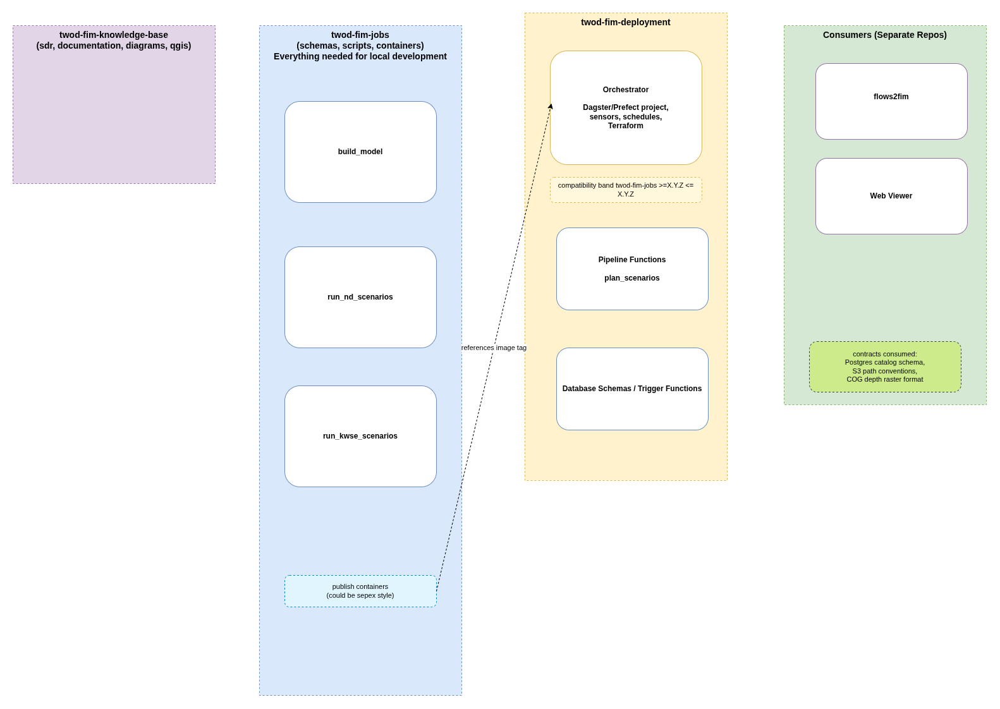
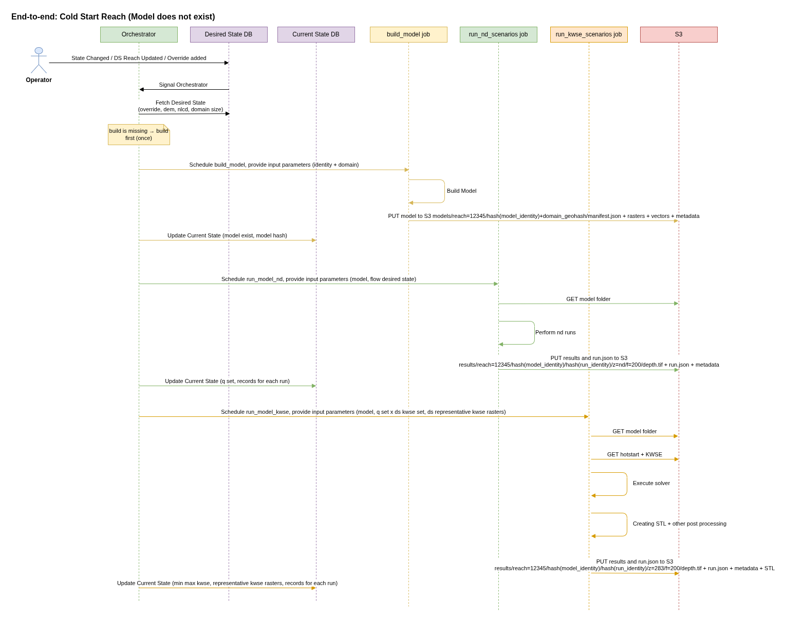

## Guiding Requirements

- Run any single reach end-to-end on a developer laptop
- Mix and match minor updates
- Flexibility to add scenarios
- Flexibility to update model domain
- Flexibility to alternate between different solvers per reach

## Key Design Principles

- The System is designed with database as the brain plus orchestrator as a reconciliation loop
- Orchestrator has main goal of reconciling current state towards desired state
- The reconciliation loop is borrowed from Kubernetes; it makes the system self-healing. A controller watches S3 and forms the current state; when it sees a difference between current_state and desired_state it acts, then writes what it observed back into current_state, then watches again. The loop never stops.
- Jobs are stateless, they intake JSON, output JSON. They write to S3
- Jobs do not interact with Database
- Orchestrator is the sole writer/editor to deployed system, no external updates are allowed
- User updates come through override system
- Deployed system does not entertain testing, testing should be carried out separately and desired state must be updated via overrides or updates to desired state table
- Inputs are versioned
- Outputs are immutable and stored at addressed paths (A rerun with same inputs will overwrite the old content)
- As orchestrator try to bridge gap between current state and desired state it skips what already exist and runs only the gap between two states. This is done through addressed paths.
- If the desired state changed and existing outputs become stale, they are handled by S3 lifecycle policies
- Self documenting paths
- Operational Unit is per reach folder. Someone can `aws s3 sync` one reach to a laptop and have everything to inspect or rerun
- Stateless code i.e. function shaped, no load-mutate-save lifecycle
- What can be derived, will not be stored beyond some days on S3
- Desired state should be preserved at all cost as it will update as system would self update as well as updates from external users

## Key Design Decisions

- STL is not part of model definition, but STL will inform model_domain desired state
- Model = model_identity (reach + methodology + overrides) + realization (domain)
- Run = run_identity (engine + engine version) + realization (scenario: q, kwse)
- Identity and realization are always separate component in hashes and separate DB columns so that group / roll back / delete by either is possible
- Runs with same model_identity stay valid even if a domain change updates the model hash
- The database has three main tables
- Desired state = input to system = authored intent
- Current state = what's actually been achieved = current state of the system
- Runs = the per-run record (ledger)
- Some desired_state fields are nullable — NULL means "use the default source", a value means it is authored. current_state always holds the effective value. This separation makes it clear that there is one place to author anything, one place place to read what's live.
- Rollback = revert desired state; content-addressing reuses prior outputs if not yet aged out, else will be recomputed


## Versioning Model

- When we store in S3 we store by repo version, (minor updates can live together, but major can not)
- Each version is pinned to a commit in SDR

## Conceptual Modeling Objects

This is conceptual model of different objects in modeling, this is not a working database schema, neither these are Python data classes.

### Reach (id: reach_id)
- reach_to_id
- is_terminal
- is_lake ??
- is_headwater ??
- geom

### Model (id: model_identity_hash+domain_tag)
- model_identity_hash
- domain_tag ??
- domain bbox geom

#### Model Identity (id: hash of content)
- override_id
- `build_model` job version
- dem_source (unique hash of source of date. ex usgs url + version)
- roughness_source (unique hash of source of date. ex nld url + version)
- reach_id
- reach_geom

### Run (id: )
- scenario
- model_id
- execution time
- `runner` job version
- solver
- hotstart raster  (optional)
- STL (optional)
- KWSE transfer raster (optional)

#### Scenario (id:)
- q
- bc_type
- bc_value


## Storage Layout

Schemas:
model.manifest.json (where do you want to store metadata about your artifacts..)
metrics.parquet for qc analytics
run.manifes.json

```bash
s3://twod-fim/
└── version=v1/                             major repo/storage version only (minors coexist)
    ├── overrides/
    │   └── reach=12345/2026-05-01_levee-fix/{patch.tif, manifest.yaml}
    │
    ├── models/                             one physical build = one DEM clip
    │   └── reach=12345/
    │       └── <hash(model_identity)+<domain_geohash>/             # identity — group/rollback by this
    │              ├── manifest.json           input + output
    │              ├── metadata.csv / parquet  metadata on artifacts
    │              ├── {dem,roughness}.tif      derived; deletable after N days
    │              └── {centerline,inflow,outflow,domain,stl}.geojson
    │
    └── results/                            
        └── reach=12345/
            └── <hash(model_identity)>/  # runs file under identity, not under domain
                └──	<hash(run_identity)>/    # solver; group/rollback by this
                    └── z=283/f=200/      or .../z=nd/f=200/   # run realization: scenario point
                    	├── depth.tif           COG, EPSG:5070; also the hot-start seed
                    	├── stl.geojson           Stage Transfer Line
                    	├── metadata.csv / parquet  metadata on artifacts
                    	└── run.json            self-describing run record (records domain used)
```

## Repo Layout



## Basic Sequence



## Open Questions

- How does worker wait for last scenario of downstream reach to finish?
  Possibly by waiting for `state_synced=true`
- Do we want more granular control over desired kwse state
- How do we track nominal KWSE rasters
- Does PSQL trigger orchestrator or orchestrator watches PSQL
- How do AWS Batch runs DIND
- Network traversal order
