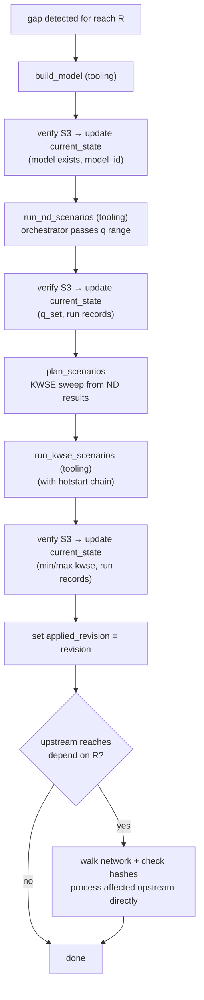
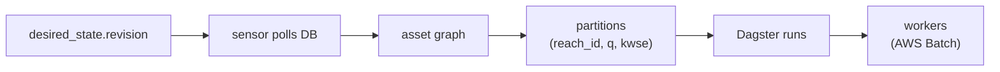

# Orchestrator Design

S3 path conventions and identity/realization separation in [`guide.md`](guide.md). Triggers, reconciliation loop, DB listening, propagation, and preemption in [`triggers-and-propagation.md`](triggers-and-propagation.md).

## Reach Processing (cold start)



Upstream reaches are processed as part of the original trigger's scope — their `desired_state.revision` is not bumped. If the orchestrator crashes mid-cascade, periodic S3 rescan detects completed artifacts and syncs `current_state`.

## Dagster Fit



| Option | Fit | Why |
|---|---|---|
| **Dagster** | Strong | Asset materialization + partition state = desired vs current. Built-in sensors, run cancellation, backfills, UI. |
| Airflow | Weaker | DAG-run oriented. No native asset staleness or partition catalog. |
| Prefect | Weaker | Flexible flows but less opinionated on asset lineage and materialization tracking. |
| Custom | Possible | Closest pattern match but rebuilds scheduling, UI, retries, backfills from scratch. |

*Note:* Dagster POC available at https://github.com/biplovbhandari/dagster-reconciliation-poc

## DB Schema

Six tables (plus `desired_state_log` in production).

### `reach_network`

Static topology table loaded from hydrofabric data.

```sql
CREATE TABLE reach_network (
    reach_id      INTEGER PRIMARY KEY,
    reach_to_id   INTEGER REFERENCES reach_network(reach_id),  -- NULL for terminal reaches
    is_terminal   BOOLEAN NOT NULL DEFAULT FALSE,
    is_headwater  BOOLEAN NOT NULL DEFAULT FALSE,
    is_lake       BOOLEAN NOT NULL DEFAULT FALSE,
    geom          GEOMETRY
);
```

### `desired_state`

Authored intent - what the system should produce. Nullable fields mean "use default source"; a value means it is authored. `revision` bumps on every change.

```sql
CREATE TABLE desired_state (
    reach_id                              INTEGER PRIMARY KEY REFERENCES reach_network(reach_id),
    min_flow                              REAL,
    max_flow                              REAL,
    initial_dq_step_for_nd                REAL,
    solver                                TEXT,
    model_domain                          GEOMETRY,    -- bbox of the model domain
    override_id                           TEXT REFERENCES overrides(override_id),
    sdr_commit                            TEXT,
    library_density_mean_stage_threshold  REAL,
    library_density_max_stage_threshold   REAL,
    library_density_max_stage_interval    REAL,
    q_set                                 TEXT,        -- JSON array [100, 200, ...]
    ds_min_kwse                           REAL,
    ds_max_kwse                           REAL,
    revision                              INTEGER NOT NULL DEFAULT 0,
    updated_at                            TIMESTAMP,
    updated_by                            TEXT
);
```

### `current_state`

What the system has actually achieved. All columns NOT NULL — holds effective values. Reconciliation check: reaches in `desired_state` that have no `current_state` row (cold start) or `applied_revision < revision`.

```sql
CREATE TABLE current_state (
    reach_id            INTEGER PRIMARY KEY REFERENCES reach_network(reach_id),
    model_id          TEXT NOT NULL,
    identity_hash TEXT NOT NULL,
    domain_code         TEXT NOT NULL,
    processing          BOOLEAN NOT NULL DEFAULT FALSE,
    q_set               TEXT NOT NULL,    -- JSON array of completed Q values
    ds_min_kwse         REAL NOT NULL,
    ds_max_kwse         REAL NOT NULL,
    applied_revision    INTEGER NOT NULL DEFAULT 0
);
```

How `current_state` is formed: orchestrator gets job completion signal, verifies S3 artifact exists, then updates DB.

### `runs` (ledger)

Append-only ledger of every run. `transfer_bc_from_*` columns for propagation discovery (mechanism b in the network propagator).

```sql
CREATE TABLE runs (
    reach_id                  INTEGER NOT NULL REFERENCES reach_network(reach_id),
    run_identity_hash         TEXT NOT NULL,
    model_id                TEXT NOT NULL,
    identity_hash       TEXT NOT NULL,
    run_type                  TEXT NOT NULL CHECK (run_type IN ('nd', 'kwse')),
    q_cms                     REAL NOT NULL,
    bc_type                   TEXT NOT NULL,
    kwse_m                    REAL,
    depth_uri                 TEXT NOT NULL,
    stl_nominal_wse           REAL,
    status                    TEXT NOT NULL CHECK (status IN ('completed', 'failed', 'cancelled')),
    started_at                TIMESTAMP,
    completed_at              TIMESTAMP,
    hotstart_from_run_hash    TEXT,
    transfer_bc_from_reach_id INTEGER,
    transfer_bc_from_run_hash TEXT,
    PRIMARY KEY (reach_id, identity_hash, run_identity_hash, q_cms, kwse_m)
);
```

### `overrides`

User-authored patches applied to reach models. A reach can have multiple overrides; `desired_state.override_id` references a single override.

```sql
CREATE TABLE overrides (
    override_id TEXT PRIMARY KEY,
    reach_id    INTEGER NOT NULL REFERENCES reach_network(reach_id),
    created_at  TIMESTAMP NOT NULL,
    created_by  TEXT NOT NULL,
    description TEXT
);
```

### `metadata`

Placeholder — `reach_id` PK. Schema TBD.

### `desired_state_log` (production only)

Append-only audit log. Not in mock.

```sql
CREATE TABLE desired_state_log (
    id           SERIAL PRIMARY KEY,
    reach_id     INTEGER NOT NULL REFERENCES reach_network(reach_id),
    revision     INTEGER NOT NULL,          -- the revision this change produced
    changed_at   TIMESTAMP NOT NULL DEFAULT NOW(),
    changed_by   TEXT NOT NULL,             -- 'system' | 'operator' | user identifier
    change_type  TEXT NOT NULL CHECK (change_type IN ('created', 'updated', 'reverted')),
    old_values   JSONB,                     -- snapshot of changed fields before
    new_values   JSONB                      -- snapshot of changed fields after
);
CREATE INDEX idx_dsl_reach ON desired_state_log(reach_id, revision);
```

## State Store (DB access layer)

Orchestrator's DB access layer. The state store is the module the orchestrator calls to read/write all DB tables. Workers never call this — they are stateless.

```python
class StateStore:
    def get_desired(self, reach_id: int) -> DesiredState: ...
    def get_current(self, reach_id: int) -> CurrentState: ...
    def compute_gap(self, reach_id: int) -> Gap: ...
    def update_current(self, reach_id: int, state: CurrentState) -> None: ...
    def record_run(self, run: RunRecord) -> None: ...
    def bump_revision(self, reach_id: int) -> int: ...
    def get_topology(self) -> list[ReachEdge]: ...
    def get_runs_for_reach(self, reach_id: int) -> list[RunRecord]: ...
```

## Scope: orchestrator vs tooling

| Orchestrator owns | Tooling owns |
|---|---|
| DB schema, state store | Manifest schemas, hash rules |
| S3 path conventions (layout) | Path-builder implementation (`s3_paths.py`) |
| `plan_scenarios` (signature + implementation) | `build_model`, `run_scenarios` (internals opaque) |
| Reconciliation loop, sensors | Supporting dataclasses/pydantic |
| Network propagator, trigger consolidation | Worker function signatures (tooling-defined, orchestrator adapts) |
