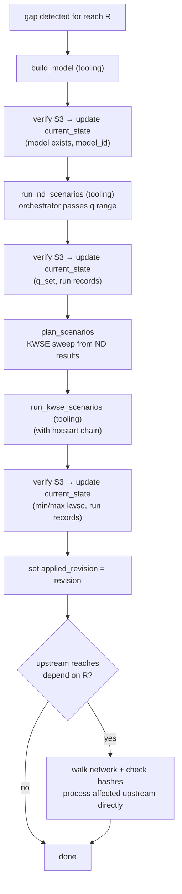
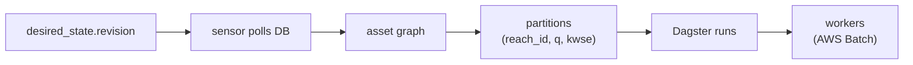

# Orchestrator Design

S3 path conventions and identity/realization separation in [`guide.md`](guide.md). Triggers, reconciliation loop, DB listening, propagation, and preemption in [`triggers-and-propagation.md`](triggers-and-propagation.md).

## Reach Processing (cold start)



Upstream reaches are processed as part of the original trigger's scope — their `desired_state.revision` is not bumped. If the orchestrator crashes mid-cascade, periodic S3 rescan detects completed artifacts and syncs `current_state`.

## Dagster Fit



| Option | Fit | Why |
|---|---|---|
| **Dagster** | Strong | Asset materialization + partition state = desired vs current. Built-in sensors, run cancellation, backfills, UI. |
| Airflow | Weaker | DAG-run oriented. No native asset staleness or partition catalog. |
| Prefect | Weaker | Flexible flows but less opinionated on asset lineage and materialization tracking. |
| Custom | Possible | Closest pattern match but rebuilds scheduling, UI, retries, backfills from scratch. |

## State Store (DB access layer)

Orchestrator's DB access layer. The state store is the module the orchestrator calls to read/write all DB tables. Workers never call this — they are stateless.

```python
class StateStore:
    def get_desired(self, reach_id: int) -> DesiredState: ...
    def get_current(self, reach_id: int) -> CurrentState: ...
    def compute_gap(self, reach_id: int) -> Gap: ...
    def update_current(self, reach_id: int, state: CurrentState) -> None: ...
    def record_run(self, run: RunRecord) -> None: ...
    def bump_revision(self, reach_id: int) -> int: ...
    def get_topology(self) -> list[ReachEdge]: ...
    def get_runs_for_reach(self, reach_id: int) -> list[RunRecord]: ...
```

## Scope: orchestrator vs tooling

| Orchestrator owns | Tooling owns |
|---|---|
| DB schema, state store | Manifest schemas, hash rules |
| S3 path conventions (layout) | Path-builder implementation (`s3_paths.py`) |
| `plan_scenarios` (signature + implementation) | `build_model`, `run_scenarios` (internals opaque) |
| Reconciliation loop, sensors | Supporting dataclasses/pydantic |
| Network propagator, trigger consolidation | Worker function signatures (tooling-defined, orchestrator adapts) |
