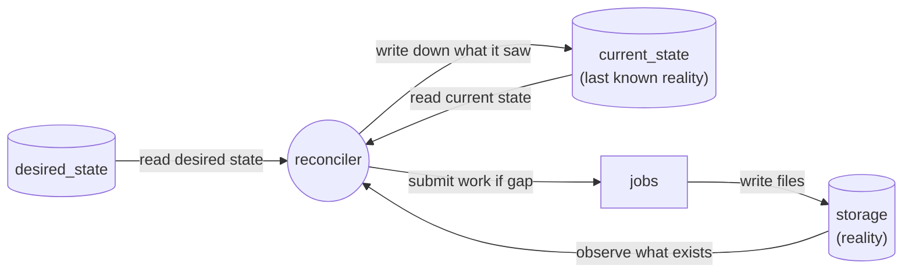
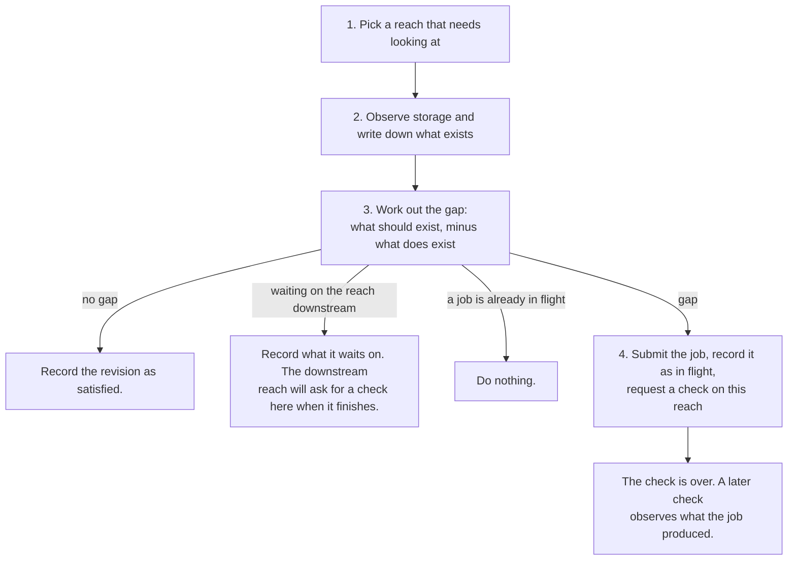
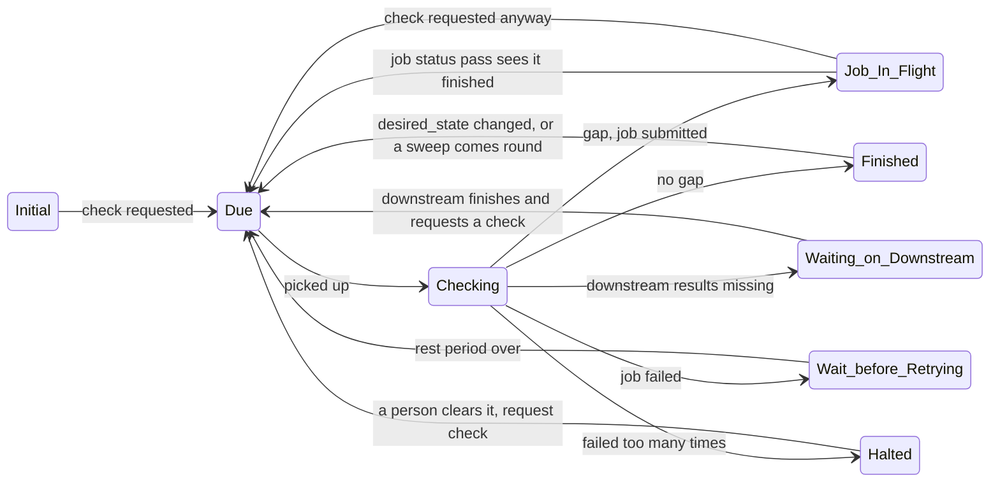

# Reconciliation Loop Design

This document is about non tooling specific rules that will form reconciliation loop. The reconciliation idea is borrowed from Kubernetes, the idea is simple:

We write down what we want to exist ( intent -> `desired_state` table in DB). We look at what actually exists (reality -> `current_state`). Whenever those two disagree, we submit work to close the difference and update reality to reflect newly performed work. This loops runs forever.\
\
There is no pipeline that runs start to finish, and nothing hands work to a next stage (pipeline does not maintain state, database does). Work happens because a difference exists, and stops happening when no difference is left.

Defining vocabulary here for easier brainstorming.

| Word              | Meaning                                                                                              |
| ----------------- | ---------------------------------------------------------------------------------------------------- |
| **reach**         | The unit of work. Everything is scoped to a reach.                                                   |
| **desired_state** | The intent, table holding what should exist for a reach. In most cases written externally.           |
| **current_state** | The table holding what does exist for a reach. It is a snapshot of storage state. The true reality is S3. |
| **storage**       | S3. The real, final answer about what exists.                                                        |
| **gap**           | The difference between authored desired_state and current_state or between emergent desired_state (based on downstream) and current_state. |
| **job**           | One piece of real work: `build_model`, `run_nd_scenarios`, or `run_kwse_scenarios`.                  |
| **check**         | One pass of observe, then gap, then act, over a single reach. Short — it never waits for a job.       |
| **observe**       | Read storage and make `current_state` agree with what is actually there. The first step of every check. |
| **check request** | A note asking for a reach to be checked soon. Carries no instructions.                               |
| **in flight**     | A job has been submitted for this reach and no result has been observed yet.                         |
| **job status pass** | A second sweep that asks the execution system which in-flight jobs have finished.                  |
| **stale**         | Something that exists but is no longer valid, so it must be redone.                                  |

The reconciler never learns what exists from a job's return value. It learns by looking at storage. A job's output becomes real when it is observed there, and that is the same path by which a deletion becomes real.

## What one **check** does

1. Every so often the reconciler asks the database which reaches need looking at. The database coloumns store those information, not the reconciler.
2. Look at storage and make `current_state` say what is actually there. This is the only way anything is ever recorded, so it is the same step that notices a finished job's output and that notices a file someone deleted. A check must be able to work when no event ever arrives, which is why it always looks rather than waiting to be told.
3. Calculate gap by building the list of everything that should exist, subtract everything that does exist, and the remainder is the work. Gaps that can exist
    1. Model should exist but is not
    2. Model exist but ND run does not
    3. KWSE should exist because the ND run exists here and the downstream reach has **finished** — its own ND and KWSE runs all exist and its gap was empty when it was last checked
    4. Desired state is different than current state (First version will not have this feature)

"Finished" is the condition for the third one, and it is deliberately stronger than "nothing is running there right now". A reach with no job in flight may still be due a check, resting before a retry, or waiting on its own downstream — none of those mean its results are settled. A KWSE run reads its boundary condition from the downstream reach's results, so starting one while that set is still growing builds a stage library from numbers that are about to change. The downstream reach requests a check here when it does finish, so nothing has to poll for it.

The gap calculation has four possible answers: **no gap**, **waiting on the downstream reach**, **a job for this reach is already in flight**, or **next job should be executed**. The third exists because a check no longer spans the job it submitted, so a later check has to be able to tell "nothing has happened yet" apart from "nothing has been started".

4. Submit the job and write down that it is in flight, then request another check on this reach. The check does **not** wait for the job. Waiting would put the fact that work is happening inside one process's memory, where a crash loses it; writing it into the database keeps it somewhere that survives. If the job was an nd or kwse job, request a check on the upstream neighbours too, since their KWSE work may now be possible, or may have just gone stale.

Nothing marks the reach as taken while any of this happens. There is one reconciler checking one reach at a time, so there is nothing to exclude. Correctness does not depend on that being true: jobs are idempotent, and the two writes that could be damaged by a race — recording a revision as satisfied, and clearing an in-flight marker — are each conditional on the value they were derived from still being there. What a marker would buy is avoiding duplicated work, which matters only once checks can overlap on one reach. Two things would bring that back: more than one reconciler, or a scheduler that starts a check for a reach while an earlier one is still running. If either happens, this is the section to revisit.

## No In Process Queue - DB is the Queue

There is no in process queue. Asking for a check is just setting `check_requested_at` to now. If multiple different things ask for a check on the same reach before the next look, they all write the same column, and the reach gets one check rather than ten.

`last_checked_at` is stamped when a check **starts**, not when it finishes. This matters for two reasons. A check asks for its own next check before it ends, so stamping at the end would cancel that request and a reach would never get past its first step. And a request that arrives while a check is still running refers to state that was already read, so it has to survive and cause another check rather than be swallowed by the one in progress.

Anything may request a check. One can be liberal about checks as checks don't affect correctness:

| What asks for a check                        | When                                                |
| -------------------------------------------- | --------------------------------------------------- |
| Something changed `desired_state` (implicit) | Found by the query above (to be implemented later)  |
| A job finished                               | The reconciler requests one on that reach           |
| A neighbor nd or kwse finished               | The reconciler requests one on the upstream reaches |
| **A complete sweep**                         | Every reach on a slow priodic schedule              |
| A person                                     | "Look at this one now"                              |

Only the sweep matters. If every other request were lost, the sweep would still find every gap and close it eventually. All other check requests exists purely to make it faster, which means those parts can be built cheaply and are allowed to fail.

## Watching Jobs - the DB is the Queue for Those Too

Because a check submits a job and walks away, something has to notice when that job ends. That is a second sweep, and it needs no more state than the first one: the reaches with a job in flight are just the rows where `current_step` is set. Asking the database that question is the whole queue.

The job status pass takes those rows, asks the execution system what happened to each one, and for any that have finished it clears the in-flight marker and requests a check. It writes nothing about what exists. That stays the check's job, so there is exactly one path by which `current_state` is ever written.

Three things follow, and they are the reason this shape was chosen:

- **A crash costs nothing.** The set of jobs being waited on is in the database, not in a process. A reconciler that dies and restarts asks the same question and gets the same list.
- **It batches.** One call can ask about many jobs at once, where a per-reach timer could only ask about one.
- **It can be lost.** Like every check request, this pass is a speedup. Delete it entirely and the system is still correct, because the sweep will check those reaches anyway and observe whatever storage now holds. It only makes the answer arrive sooner.

The marker is cleared by matching on the job reference that was polled, not just the reach, so a pass that is slow cannot wipe out a marker belonging to a newer job.

If a job cannot be found at all — the execution system has forgotten it, the container was reaped, the reference was lost — the marker is cleared anyway after a grace period and the work is submitted again. This is safe, and the next section says why.

## Running Something Twice Is Always Safe

The whole design leans on this, so it is worth stating on its own rather than leaving it as a happy accident.

Outputs live at content addressed paths, and jobs return early when their output already exists. That means a duplicate submission wastes some compute and changes nothing else. Every approximate part of this design rests on that: the grace period can be wrong, a job status pass can be missed, a check can act on a snapshot that went stale a second later, and the worst case is repeated work rather than a wrong answer.

If jobs ever stop being content addressed, this design breaks quietly, and a great deal else would have to become exact to compensate.

## Retry Mechanism

A job can fail in three ways, and all of them arrive at the same place. The execution system reports it finished badly. Or the job finished, and the next check looks at storage and finds nothing there. Or the job cannot be accounted for at all, and after a grace period it is presumed dead.

Note what is missing from that list: nothing measures how long a job has been running and declares it too slow. The reconciler has no opinion on how long work should take, and it should not — with a real queue, wall time is queue time plus run time, and there is no honest number to guess. If a job should be killed after some duration, the execution system is told that when the job is defined, and the reconciler simply hears that it failed.

The failure is recorded in database `reach_processing` table, at every failure a counter goes up, and the reach is left alone for a while, with wait time increasing each time (exponential backoff) up to a cap. After enough consecutive failures the reach is marked **halted** and stops being picked up at all. A human need to intervene to reattempt this reach.

## Reach Processing States

**Where a reach can be at any time and how will it get in and get out of that state**

Only **Checking** is a state in which the reconciler is doing something. Every other state is the row sitting still, waiting for a reason to be looked at again. Note that a reach with a job in flight is not excluded from being checked — that is how a finished job gets noticed at all.

Only **Halted** is written down. The rest are read off the row: whether a job is in flight, whether a retry time is in the future, whether it is waiting on a downstream reach, whether the satisfied revision matches the desired one. Storing them as well would mean keeping a second answer that is free to disagree with the first.

## Tracking Storage Changes and Staleness

Deleting files from storage is the supported way to undo something. There is no separate scanner to build: the observe step of a check is the scanner, and a full sweep is that step run over every reach. A check notices the files are gone, removes them from `current_state`, and the gap it then calculates rebuilds whatever is still wanted. Nothing needs to be told that a deletion happened.

Recording a finished job uses that same step. Both cases are just "storage and the table disagree" — in one, observe finds an artifact that was not there before and adds a row; in the other it finds one missing and removes a row. This matters because it leaves exactly one place that decides what it means for something to exist. Had a job's result been recorded by one piece of code and deletions noticed by another, the two would each carry their own answer to that question — one counting a model as present because the job exited cleanly, the other because `model.json` is really there — and `current_state` would change depending on which ran last.

The same applies upstream, with no special mechanism. When a reach is rebuilt, its old results are deleted from `current_state`, so any KWSE run upstream that recorded one of those old results as its source is now stale. That upstream reach redoes only the affected work, which makes *its* results new, which makes the reach above it stale, and so on. The chain stops on its own wherever nothing actually changed, and at headwaters. No code walks the network doing this, and nothing needs resuming if the machine dies part-way, every reach reaches the same conclusion on its own the next time it is checked

## Reconciler Owned DB Tables

**`reach_processing`**: one row per reach, holding what job is in flight and since when, what it is waiting on, the retry counters, the last error, and which `desired_state` revision has been fully satisfied. Changes constantly. Cannot be rebuilt from storage. Basically reconciler's notes.

It stores no status beyond **halted**, because halted is the only one that is not derivable and the only one that changes what the loop does. Whether a reach is being checked, has a job in flight, is resting before a retry, is waiting on a downstream reach, or is finished can all be read off the columns above, so storing those as well would be keeping a second answer that is free to disagree with the first. A view assembles them for anyone who wants to look.

**`reach_activity`**: append-only history. One row each time something happens to a reach: a step started, a step finished, results went stale, a reach finished. (for future: we can make a live view /dashboard out of it).

## Rules that must always hold

1. A check works everything out from the tables as they are now. Check requests carry no instructions and may be lost.
2. Running anything twice is safe. Jobs skip work whose output already exists, and checking a finished reach does nothing.
3. Nothing is recorded that was not seen in storage. A job's return value is not evidence that anything exists.
4. A reach is finished when the gap is empty not because a sequence of stages completed.
5. Deleting from storage is a supported action, not damage. (maybe to be implemnted later)
6. No step of the loop waits for a job. Anything that has to survive a crash is written down before the step that would have waited returns.
7. The gap calculation gives the same answer every time for the same inputs.
8. Correctness rests on rule 2 and on conditional writes, not on anything being exclusive. Speedups are allowed to be lost, duplicated, or arrive late.

## Decided

**Holding a claim across a long job**: nothing is held, because nothing waits. A check submits, records the job as in flight, and ends. The job status pass asks the execution system what became of that job, and a later check observes storage and records what it finds.

The reason is where knowledge lives. A check that waits keeps "work is happening" in one process's memory, and a crash loses it — recoverable only with a lease long enough to cover the job, which is a number nobody can pick honestly once jobs sit in a queue before they run. Not waiting puts that fact in the database and asks the execution system about liveness. Both survive a restart.

**Marking a reach as taken while it is checked**: not done. There is one reconciler and one check at a time, so there is nothing to exclude, and `last_checked_at` already stops the same reach being picked up twice in quick succession. See the note under step 4 for what would bring this back.

## Yet to decide

- How much to run at once. Nothing yet limits how many reaches are worked on simultaneously.