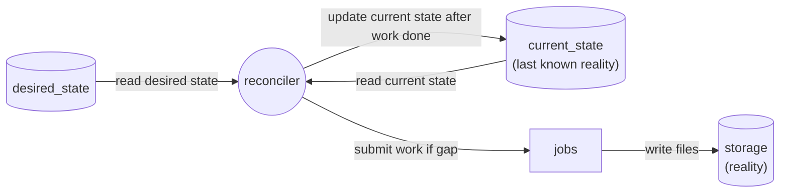
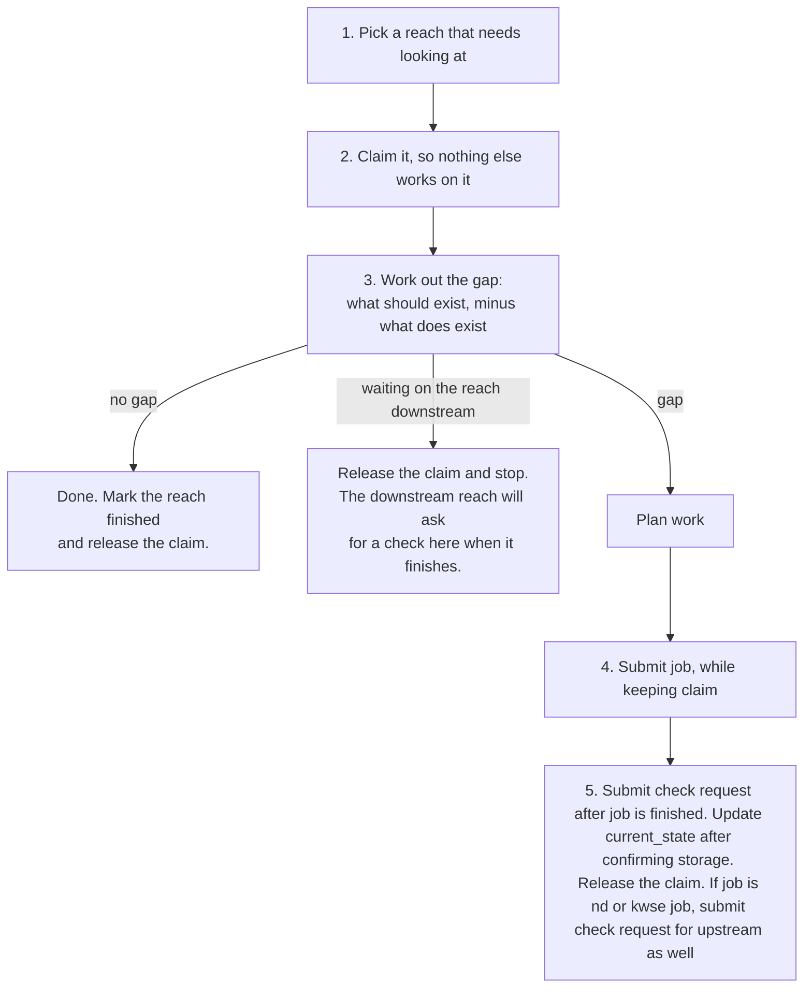
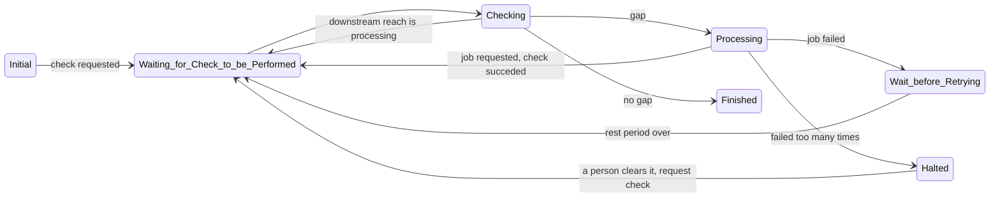

# Reconciliation Loop Design

This document is about non tooling specific rules that will form reconciliation loop. The reconciliation idea is borrowed from Kubernetes, the idea is simple:

We write down what we want to exist ( intent -> `desired_state` table in DB). We look at what actually exists (reality -> `current_state`). Whenever those two disagree, we submit work to close the difference and update reality to reflect newly performed work. This loops runs forever.\
\
There is no pipeline that runs start to finish, and nothing hands work to a next stage (pipeline does not maintain state, database does). Work happens because a difference exists, and stops happening when no difference is left.

Defining vocabulary here for easier brainstorming.

| Word              | Meaning                                                                                              |
| ----------------- | ---------------------------------------------------------------------------------------------------- |
| **reach**         | The unit of work. Everything is scoped to a reach.                                                   |
| **desired_state** | The intent, table holding what should exist for a reach. In most cases written externally.           |
| **current_state** | The table holding what does exist for a reach. It is a snapshot of storage state. The true reality is S3. |
| **storage**       | S3. The real, final answer about what exists.                                                        |
| **gap**           | The difference between authored desired_state and current_state or between emergent desired_state (based on downstream) and current_state. |
| **job**           | One piece of real work: `build_model`, `run_nd_scenarios`, or `run_kwse_scenarios`.                  |
| **check**         | Check if a reach need work.                                                                          |
| **check request** | A note asking for a reach to be checked soon. Carries no instructions.                               |
| **claim**         | A time bound marker saying "this reach is being worked on right now."                                |
| **stale**         | Something that exists but is no longer valid, so it must be redone.                                  |

## What one **check** does

1. Every so often the reconciler asks the database which reaches need looking at. The database coloumns store those information, not the reconciler.
2. A reach is worked on by one thing at a time, so the reconciler writes its name and a deadline onto the reach (in the database). Anything else that tries to pick up the same reach sees the claim and moves on. Different reaches are worked on simultaneously, that is where the parallelism comes from. The claim carries a deadline so that if the reconciler dies while holding it, the claim runs out on its own and restarting reconciler picks the reach up. A plain on/off flag (like we had before with `processing` coloumn) would leave that reach stuck forever.
3. Calculate gap by building the list of everything that should exist, subtract everything that does exist, and the remainder is the work. Gaps that can exist
    1. Model should exist but is not
    2. Model exist but ND run does not
    3. KWSE should exist because ND Run and KWSE for downstream exist and downstream is not processing (not in claim)
    4. Desired state is different than current state (First version will not have this feature)

The gap calculation has three possible answers:** no gap**, **waiting on the downstream reach**, or **next job should be executed**.

4. Request another check on this reach so the next step can start, and request one on the upstream neighbors too, since their KWSE work may now be possible, or may have just gone stale.

## No In Process Queue - DB is the Queue

There is no in process queue. Asking for a check is just setting `check_requested_at` to now. If multiple different things ask for a check on the same reach before the next look, they all write the same column, and the reach gets one check rather than ten.

`last_checked_at` is stamped when a check **starts**, at the moment the reach is claimed not when it finishes. This matters for two reasons. A check asks for its own next check before it releases the claim, so stamping at the end would cancel that request and a reach would never get past its first step. And a request that arrives while a long step is still running refers to state that was already read, so it has to survive and cause another check rather than be swallowed by the one in progress.

Anything may request a check. One can be liberal about checks as checks don't affect correctness:

| What asks for a check                        | When                                                |
| -------------------------------------------- | --------------------------------------------------- |
| Something changed `desired_state` (implicit) | Found by the query above (to be implemented later)  |
| A job finished                               | The reconciler requests one on that reach           |
| A neighbor nd or kwse finished               | The reconciler requests one on the upstream reaches |
| **A complete sweep**                         | Every reach on a slow priodic schedule              |
| A person                                     | "Look at this one now"                              |

Only the sweep matters. If every other request were lost, the sweep would still find every gap and close it eventually. All other check requests exists purely to make it faster, which means those parts can be built cheaply and are allowed to fail.

## Retry Mechanism

The failure is recorded in database `reach_processing` table, at every failure a counter goes up, and the reach is left alone for a while, with wait time increasing each time (exponential backoff) up to a cap. After enough consecutive failures the reach is marked **halted** and stops being picked up at all. A human need to intervene to reattempt this reach.

## Reach Processing States

**Where a reach can be at any time and how will it get in and get out of that state**

## Tracking Storage Changes and Staleness

Deleting files from storage is the supported way to undo something. The storage scanner  (to be implemented later) notices they are gone, removes them from `current_state`, and the next check sees the gap and rebuilds whatever is still wanted. Nothing needs to be told that a deletion happened.

The same applies upstream, with no special mechanism. When a reach is rebuilt, its old results are deleted from `current_state`, so any KWSE run upstream that recorded one of those old results as its source is now stale. That upstream reach redoes only the affected work, which makes *its* results new, which makes the reach above it stale, and so on. The chain stops on its own wherever nothing actually changed, and at headwaters. No code walks the network doing this, and nothing needs resuming if the machine dies part-way, every reach reaches the same conclusion on its own the next time it is checked

## Reconciler Owned DB Tables

**`reach_processing`**: one row per reach, holding everything about the processing, which step the reach is in, what is running right now and since when, what it is waiting on, claim, the retry counters, the last error, and which `desired_state` revision has been fully satisfied. Changes constantly. Cannot be rebuilt from storage. Basically reconciler's notes.

**`reach_activity`**: append-only history. One row each time something happens to a reach: a step started, a step finished, results went stale, a reach finished. (for future: we can make a live view /dashboard out of it).

## Rules that must always hold

1. A check works everything out from the tables as they are now. Check requests carry no instructions and may be lost.
2. Running anything twice is safe. Jobs skip work whose output already exists, and checking a finished reach does nothing.
3. Nothing is recorded that was not confirmed in storage first.
4. A reach is finished when the gap is empty not because a sequence of stages completed.
5. Deleting from storage is a supported action, not damage. (maybe to be implemnted later)
6. One reach is worked on by one thing at a time, and a claim always runs out on its own.
7. The gap calculation gives the same answer every time for the same inputs.

## Yet to decide

- Holding a claim across a long job
- How much to run at once. Nothing yet limits how many reaches are worked on simultaneously.