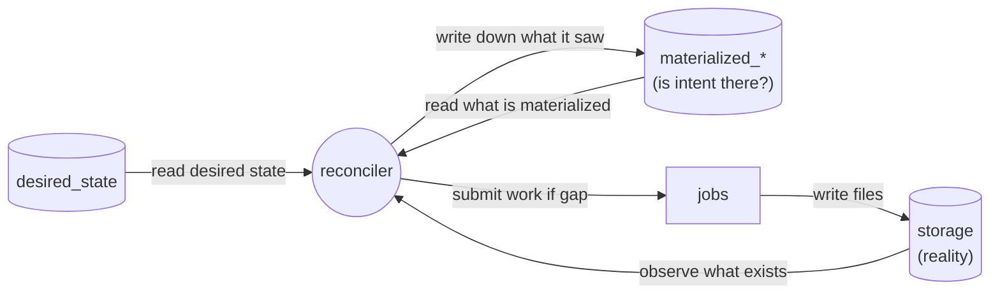
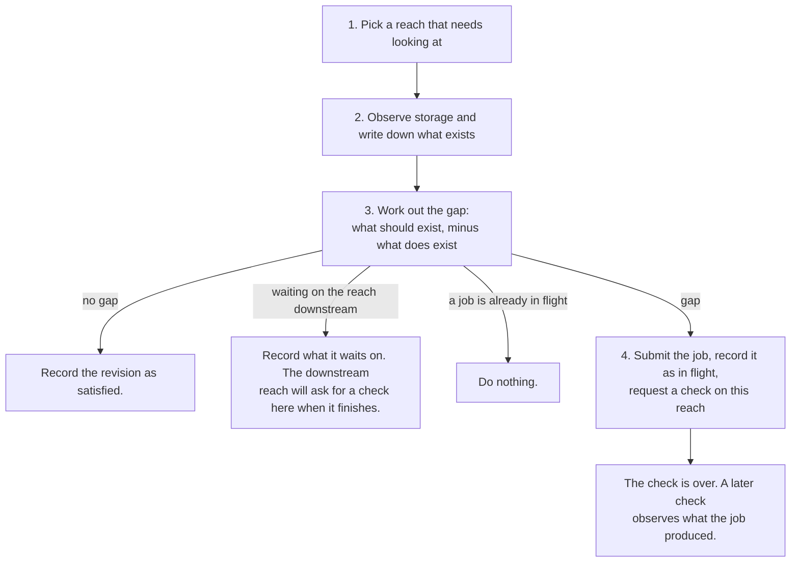
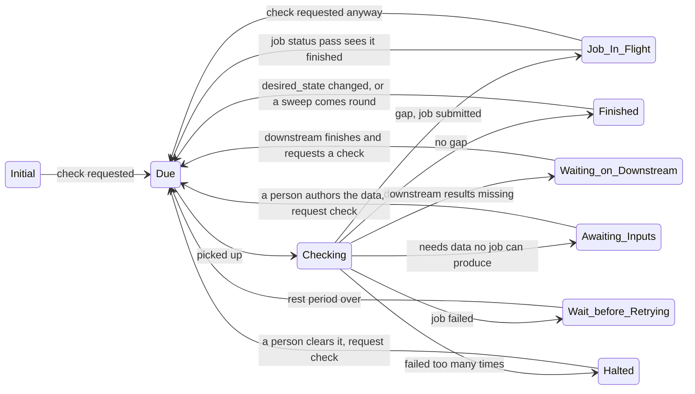

# Reconciliation Loop Design

This document is about non tooling specific rules that will form reconciliation loop. The reconciliation idea is borrowed from Kubernetes, the idea is simple:

We write down what we want to exist (intent -> `desired_state`). We look at whether it exists (-> the `materialized_*` tables). Whenever those two disagree, we submit work to close the difference. This loop runs forever.\
\
There is no pipeline that runs start to finish, and nothing hands work to a next stage (pipeline does not maintain state, database does). Work happens because a difference exists, and stops happening when no difference is left.

Defining vocabulary here for easier brainstorming.

| Word                   | Meaning                                                                                              |
| ---------------------- | ---------------------------------------------------------------------------------------------------- |
| **reach**              | The unit of work. Everything is scoped to a reach.                                                   |
| **desired_state**      | The intent, table holding what should exist for a reach. In most cases written externally.           |
| **materialized state** | For each thing intent asks for, whether it is there. Held in the `materialized_*` tables. One per step, because model, ND and KWSE intent are satisfied independently. |
| **inventory**          | Everything that happens to be in storage. S3 is the inventory and is queried when someone wants one; it is deliberately not mirrored into a table. |
| **storage**            | S3. The real, final answer about what exists.                                                        |
| **gap**                | Intent minus materialization. Intent may be authored, or emergent from the downstream reach.         |
| **job**                | One piece of real work: `build_model`, `run_nd_scenarios`, or `run_kwse_scenarios`.                  |
| **check**              | One pass of observe, then gap, then act, over a single reach. It does not waits for a job completion. |
| **observe**            | Look at the address intent implies and record whether something is there. The first step of every check. |
| **check request**      | A note asking for a reach to be checked soon. Carries no instructions.                               |
| **in flight**          | A job has been submitted for this reach and no result has been observed yet.                         |
| **job status routine** | A somewhat isolated routine that asks the execution system (SEPEX probably) which in-flight jobs have finished and update database. |
| **stale**              | Something that exists but is no longer valid, so it must be redone.                                  |

The reconciler never learns what exists from a job's return value. It learns by looking at storage. A job's output becomes real when it is observed there and passes materialization check, and that is the same path by which a deletion becomes real.

## What one **check** does

1. Every so often the reconciler asks the database which reaches need looking at (check request). The database columns store those information, not the reconciler process.
2. Work out where this reach's artifacts *should* be per the desired state, and look there (materialization check), if they are there, they are recorded. This is the only way anything is ever recorded, it is the same step that notices a finished job's output and that notices a file someone deleted. If this changes the reach's nd or kwse proof, request a check on the upstream neighbours: that proof is their boundary condition, so a proof appearing unblocks them and a proof being retracted invalidates work they may already have started.
3. Calculate gap by building the list of everything that should exist per desired state, subtract what is proved (in previous step), and the remainder is the work. Walk the steps in dependency order and stop at the first one that is unmet (see *Work Flows Downstream to Upstream* for what each step waits on):
    1. Downstream model and nd runs do not exist.
    2. Model does not exist
    3. ND runs do not exist
    4. Downstream KWSE runs do not exist
    5. KWSE does not exist

The prerequisite at every rung is that the downstream reach's corresponding steps are **proved**, which is stronger than "nothing is running there right now". A reach with no job in flight may still be due a check, resting before a retry, or waiting on its own downstream, none of which means its results are settled and safe to propagate processing upstream.

The gap calculation has five possible answers: **no gap**, **waiting on the downstream reach**, **a job for this reach is already in flight**, **awaiting inputs**, or **next job should be executed**. The third exists because a check no longer spans the job it submitted, so a later check has to be able to tell "nothing has happened yet" apart from "nothing has been started".

**Awaiting inputs** means the work is needed and no job can produce it, because something it requires has not been authored. It is deliberately kept apart from waiting on the downstream reach, and the difference is who resolves it: a reach waiting on its downstream resolves itself as the wave arrives, whereas one awaiting inputs resolves only when a person supplies the missing data.

4. Submit the job and write down that it is in flight, then request another check on this reach. The check does **not** wait for the job. Waiting would put the fact that work is happening inside one process's memory, where a crash will be detrimental. Writing it into the database keeps it crash proof and easier to code.

## What Counts as Proof

Observing (to do: rename to Verification) is two separate questions, each of
which is independent.

**Is this artifact trustworthy?** the manifest names this reach, its identity object hashes to what it claims, and its realization code matches the folder it sits in. This is about the artifact being what it says it is, in the place it says it is. An artifact that fails is treated as absent.

**Does what exists satisfy intent?** Per-step, and it is judged over the whole SET of artifacts, not one at a time. A library is proof when it **covers the range intent asks for**, at the density intent asks for — not when some scenarios happen to be present. This is the same rule whether it is read forwards (an ND library proves its own step by spanning `q_lower_bound..q_upper_bound`) or upstream (a downstream library is reachable when it covers the range the reach above needs, `q_set, kwse_*_bounds, ld_ds_z_delta`).

A consequence worth stating, because the two halves of an address are not alike:

- Where intent says nothing, the loop **discovers**. The normal-depth slope is derived by the job from the reach's own terrain; there is no authored slope to hold it to, so the loop finds where it landed and takes it.
- Where intent says something, the loop **judges**. The discharges are chosen by the adaptive step algorithm, but intent authors the range, so the loop reads the set back and asks whether it covers what was asked for.

Both are emergent in value. Only first is emergent in whether it is acceptable.

## When Observations are Performed

Observation happens at two rates, and they answer different questions:

|               | when                                        | cost        | catches                               |
| ------------- | ------------------------------------------- | ----------- | ------------------------------------- |
| **targeted**  | a job finished, intent moved, someone asked | one reach   | everything the system itself did      |
| **full pass** | occasionally, deliberately                  | every reach | deletions, drift, missed events, bugs |

Routine operation is proportional to **changes**, not to the size of the network. Nothing touches a reach to which nothing has happened. The full pass is proportional to the network, and it is the completeness guarantee, but a well written reconciler will rarely need this completeness check.

One consequence of this is that **deleting from storage is still a supported undo, but it is noticed at the next full pass** unless someone also requests a check on that reach. This also means that self-healing guarentee is eventual.

## Work Flows Downstream to Upstream

Results transfer upstream along the network, so work has to be done from terminal reaches to headwater. Each step waits on the reach below it:

| step at a reach | needs at this reach | needs at the downstream reach                                                         |
| --------------- | ------------------- | ------------------------------------------------------------------------------------- |
| **model**       | —                   | model **and** nd, this reach's geometry uses the downstream max-q stage transfer line |
| **nd**          | model               | nd, the outflow polygon is the downstream max-q polygon                               |
| **kwse**        | model, nd           | model, nd **and** kwse                                                                |

Terminal reaches have no downstream, so nothing blocks them from that perspective, a fresh network starts building at its outlets and the wave moves upstream. Terminal reaches also get no KWSE at all, there is no downstream reach to bound a stage library with (this will change in future with water body stages).

Some important points to list here to have the picture correct:

1. A model that already exists at the address intent implies is adopted regardless of what the downstream reach looks like. Dependencies decide when next step should be performed; they do not decide when a materialized row is added to the DB. This is what lets a wiped database re-adopt from a populated bucket in any order in one pass.
2. A blocked reach stays a check candidate. When it is checked, the gap says it is waiting, and it records which reach it waits for, so a viewer can draw the wait graph without recomputing anything.
3. The upstream reach does not poll downstream. The downstream reach requests a check here when it finishes, and the periodic sweep would find it eventually if that event is missed.

## No In Process Queue - DB is the Queue

There is no in process queue. Asking for a check is just setting `check_requested_at` to now. If multiple different things ask for a check on the same reach before the next look, they all write the same column, and the reach gets one check rather than ten.

`last_checked_at` is stamped when a check **starts**, not when it finishes. This matters for two reasons. A check asks for its own next check before it ends, so stamping at the end would cancel that request and a reach would never get past its first step. And a request that arrives while a check is still running refers to state that was already read, so it has to survive and cause another check rather than be swallowed by the one in progress.

Anything may request a check. One can be liberal about checks as checks don't affect correctness:

| What asks for a check                                         | and how                                                                     |
| ------------------------------------------------------------- | --------------------------------------------------------------------------- |
| Any thing that change desired_state or desired_state_defaults | Immidiately through revision bump, which will be found by due reaches query |
| A job finished                                                | The reconciler requests one on that reach                                   |
| A neighbor nd or kwse finished                                | The reconciler requests one on the upstream reaches                         |
| **A complete sweep**                                          | Every reach on a slow periodic schedule                                     |
| A person                                                      | "Look at this one now"                                                      |

Only the sweep matters here. If every other request were lost, the sweep would still find every gap and close it eventually. All other check requests exists purely to make it faster, which means those parts can be built cheaply and are allowed to fail.

## Watching Jobs - the DB is the Queue for Those Too

Because a check submits a job and walks away, something has to notice when that job ends. That is a second sweep, and it needs no more state than the first one: the reaches with a job in flight are just the rows where `current_step` is set. Asking the database that question is the whole queue.

The job status routine takes those rows, asks the execution system what happened to each one, and for any that have finished it clears the in-flight marker and requests a check. It writes nothing about what exists. That stays the check's job, so there is exactly one path by which materialization is ever recorded.

Reasons for adopting this pattern:

1. **A crash costs nothing.** The set of jobs being waited on is in the database, not in a process. A reconciler that dies and restarts asks the same question and gets the same list.
2. **It batches.** One call can ask about many jobs at once, where a per-reach timer could only ask about one.
3. **It can be lost.** Like every check request, this pass is a speedup. Losing any event here will only delay things, because the periodic complete check sweep will check those reaches anyway and observe whatever storage now holds.

If a job cannot be found at all (the execution system has forgotten it, the container was reaped, the reference was lost) the marker is cleared anyway after a grace period and the work is submitted again because a job is idempotent.

On similar note, the reconciler or database does not limit how many reaches are worked on simultaneously, this is the scope of execution system.

## Reconciler Design is Based on Job Idempotency

The outputs of a job live at content addressed paths, and jobs return early when their output already exists. That means a duplicate submission wastes some compute and changes nothing else. Every approximate part of the reconciler design is based on this assumption. The grace period can be wrong, a job status routine update can be missed, a check can act on a snapshot that went stale a second later, and the worst case is repeated work rather than a wrong answer.

## Retry Mechanism

A job can fail in three ways, and all of them arrive at the same place. The execution system reports it failed, or the job finished, and the next check looks at storage and finds nothing there, or the job cannot be accounted for at all, and after a grace period it is presumed dead.

The failure is recorded in database `reach_processing` table, at every failure a counter goes up, and the reach is left alone for a while, with wait time increasing each time (exponential backoff) up to a cap. After enough consecutive failures the reach is marked **halted** and stops being picked up at all. A human need to intervene to reattempt this reach.

On similar note, the reconciler has no opinion on how long work should take (timeouts). With a real queue (AWS Batch or SEPEX), wall time is queue time plus run time, and there is no honest number to guess. If a job should be killed after some duration after its start, the execution system is told that when the job is defined (timeout lives in execution system).

## Reach Processing States

**Where a reach can be at any time and how will it get in and get out of that state**

Only **Checking** is a state in which the reconciler is doing something, every other state is doing nothing, waiting for a reason to be looked at that reach again. Note that a reach with a job in flight is not excluded from being checked, that is how a finished job gets noticed at all.

Only **Halted** is written down, all other states are read off the db row; whether a job is in flight, whether a retry time is in the future, whether it is waiting on a downstream reach, whether the inputs a step needs have been authored, whether the satisfied revision matches the desired one. Storing them as well would mean keeping a second answer that is free to disagree with the first.

## Tracking Storage Changes and Staleness

Deleting files from storage is the supported way to undo something. The periodic complete sweep of all reaches will submit check on each reach, which will look at the address intent implies, it will find nothing there, and will delete the materialized row, and the gap it then calculates rebuilds whatever is still wanted. Nothing needs to be told that a deletion happened, but doing a check request immediately on a reach will speed up the gap reconciling. This is basically same step as finding a model at the intent path and recording a row in materialized tables but just the opposite. This is important to note because it makes it clear that there is exactly one way that decides what it means for something to exist in materialized tables / reconciled.

**Upstream staleness needs no stored provenance.** A KWSE library's bounds come from the downstream reach. Those bounds are recomputed on every check from what the downstream reach currently materializes. If the downstream reach changes, the bounds move, the span check fails, the row is deleted and the work is requested. A pointer from an upstream run to the particular downstream run it consumed would only report what the recomputation already can answer, and the dependency is not on particular runs anyway, but on the *range* being covered with the density we desire (`q_set, kwse_*_bounds, ld_ds_z_delta`) — which is the same thing proof means anywhere else in the loop (see *What Counts as Proof*), applied across a reach boundary.

## Reconciler Owned DB Tables

**`materialized_models`, `materialized_nd_runs`, `materialized_kwse_runs`**: whether each step's intent is satisfied, at which revision, as last confirmed. This is basically a cache of a storage lookup for desired state, so it is rebuildable by looking again. The applied_revision lives here on purpose because it is a claim that desired state was achieved for this revision, by deleting a materialization row we also deletes the claim, that this revision is reconciled, at the same time.

**`reach_processing`**: one row per reach, holding what job is in flight and since when, what it is waiting on, the retry counters and the last error. Work related information only, nothing about whether intent is satisfied or not. This table changes constantly and cannot be rebuilt from storage. These are basically reconciler's notes.

It stores no status beyond **halted**, because halted is the only one that is not derivable and the only one that changes what the loop does. Whether a reach has a job in flight, is resting before a retry, is waiting on a downstream reach, or is finished can all be read off the other columns and the materialized tables. A view `reach_status` assembles them for something like a web UI (not implemented) or a person with DB access.

**`reach_activity`**: append-only history of reconciler activity. One row each time something happens to a reach: a step started, a step finished, results went stale, a reach finished. (This will also be use for web UI in the future).

## Rules that must always hold

1. A check works everything out from the tables as they are now. Check requests carry no instructions and may be lost.
2. Running anything twice is safe. Jobs skip work whose output already exists, and checking a finished reach does nothing.
3. Nothing is recorded that was not seen in storage. A job's return value is not evidence that anything exists.
4. Being at an address is not the same as belonging there. Before a manifest is adopted it is checked against the place it was found: it names this reach, its identity object hashes to the identity hash it claims, and its **realization code** — `domain_code` for a model, `scenario_code` for a run — matches the folder it sits in. Anything unverifiable is refused to be trusted, including a realization code the loop cannot interpret. Both halves of an address are checked.
5. A reach is finished when the gap is empty not because a sequence of stages completed.
6. Deleting from storage is a supported action, not damage. It is noticed at the next full pass, or sooner if someone requests a check.
7. No step of the loop waits for a job. Anything that has to survive a crash is written down before the step that would have waited returns.
8. The gap calculation gives the same answer every time for the same inputs.
9. Correctness rests on rule 2 and on conditional writes, not on anything being exclusive. Speedups are allowed to be lost, duplicated, or arrive late.
10. Nothing is stored that a check could derive. Store provenance only when the check cannot be recomputed from current state.
11. A claim lives with the thing it is a claim about, so removing the thing removes the claim in the same statement.

## Open Questions

- What will happen when a job successfully complete but does not create data at the addressed path. The reconciler will keep submitting work, there should be a halt mechanism here.

  (Caution: AI content, for future work.)
  **Possible solution.** The signal that is missing is not "there is a gap" — the loop sees that correctly. It is "there is still a gap immediately after work that claimed to close it". Those are different facts, and the loop already holds both halves: the in-flight marker says which step was submitted, and the observation that follows the job says whether anything was adopted. A step that completed and adopted nothing is a distinct event from a step that has not run yet.

  Treating that event as a failure needs no new machinery. It feeds the same counter, backoff, and halt that a job reporting failure already feeds. The reach is looked at less and less often, and after enough consecutive rounds it parks for a person — which is the wanted behaviour, because a job that keeps succeeding while producing nothing usable will not fix itself.

  This covers both shapes of the problem: nothing written at the address, and something written that observation refuses (belongs to another reach, identity does not hash to what it claims, discharge not in the folder it sits in). From the loop's side they are the same event — a step ran and no proof followed.

  It does not weaken rule 3. The job's success is still not evidence that anything exists. It is only evidence that this reach should not be asked to do the identical thing again immediately. Adoption stays the only thing that ends a failure streak, so a reach that starts producing usable output clears itself without intervention.

  The cost of leaving it open is measured in whole job runs rather than wasted checks. A normal-depth library is one hydraulic simulation per discharge, so each round that ends in refusal is minutes to hours of compute, and without a brake it repeats for as long as the loop is running.

## Important Revisions in Design

- `current_state` was previously not defined tightly. It could mean many things, for example everything that is there in storage, only job outputs etc. Replaced by the `materialized_*` tables, which answer the narrower and answerable question: "Is the thing intent asks for at the address intent implies?".
- Writing results of a job via callback through in process memory was dropped because it is not crash proof.

