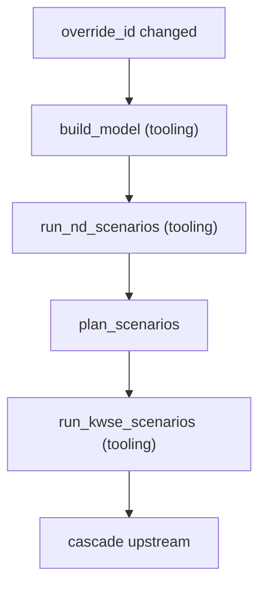
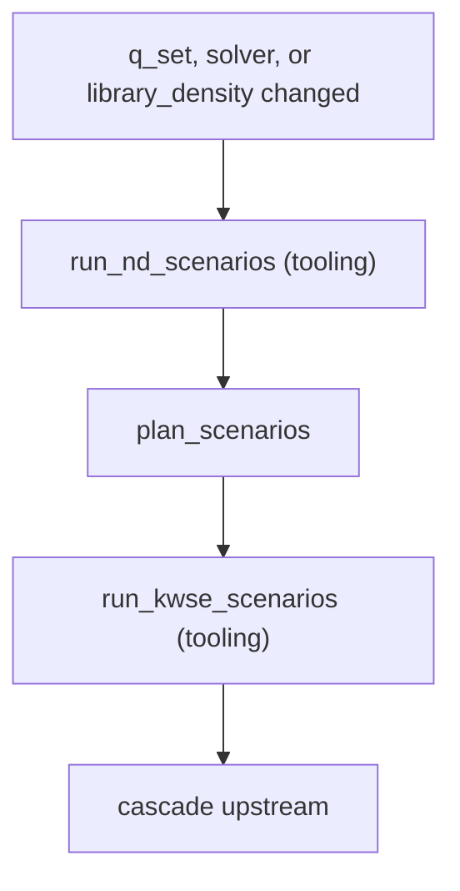
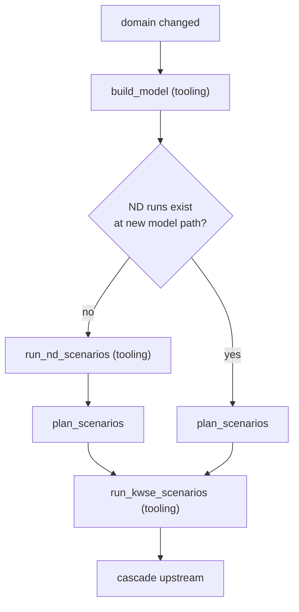
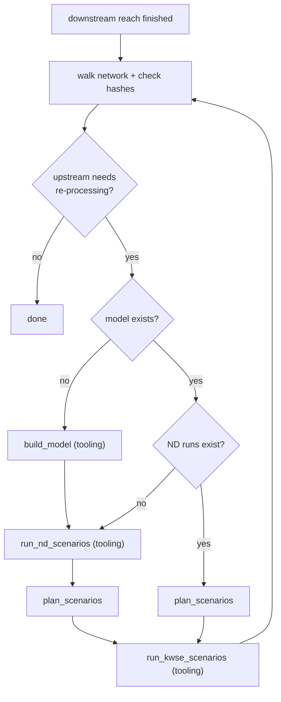
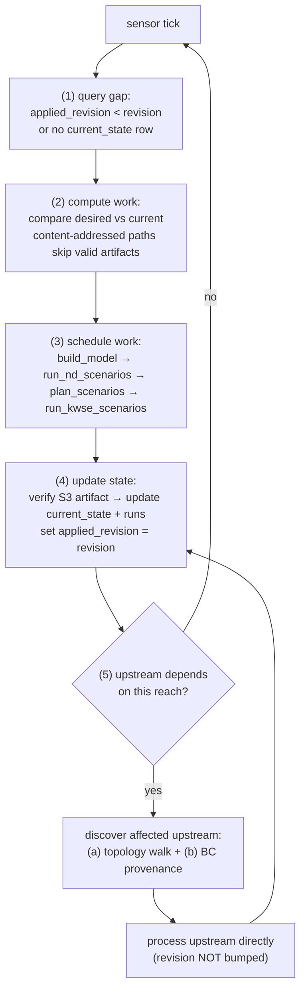
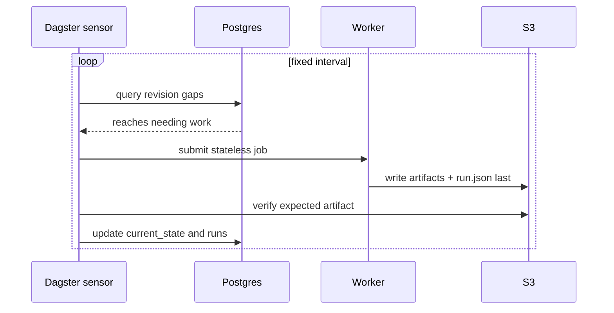

# Triggers, reconciliation, propagation

Reach processing chain and DB schema in [`orchestrator-design.md`](orchestrator-design.md). This file specifies:

1. Trigger sources (changes to `desired_state`).
2. Reconciliation loop — how the orchestrator detects gaps and schedules work.
3. Run preemption policy — what happens to in-flight work when a newer revision supersedes it.
4. Trigger consolidation — how multiple triggers arriving close in time or during in-flight work are coalesced.

---

## Open design questions

**Propagation algorithm.** Two complementary discovery mechanisms — (a) topology graph walk via `reach_network` table bounds candidate upstream reaches; (b) BC provenance lookup via `runs.kwse_transfer_run_identity` confirms which candidates actually need re-running. See §2.1 step 5.

**Trigger consolidation.** Simplified by the reconciliation loop — multiple changes between ticks coalesce into one gap computation. See §4.

---

## 1. Triggers

`desired_state.revision` only changes from external events. The reconciliation loop (§2) detects the gap and schedules work.

### 1.1 External triggers

| ID | Trigger | Mechanism | Invalidate Model | Rebuild Model | New ND Runs | New KWSE Runs | Propagate Upstream |
|---|---|---|---|---|---|---|---|
| 1 | override added | Row inserted in `overrides` table. Inert until revision is bumped. | — | — | — | — | — |
| 2 | revision_bumped → override_id updated | External update to `desired_state.override_id` + revision bump | Yes | Yes | (cascade) | (cascade) | (cascade) |
| 3 | revision_bumped → q_set updated | External update to `desired_state.q_set` + revision bump | No | No | Yes | (cascade) | (cascade) |
| 4 | revision_bumped → solver updated | External update to `desired_state.solver` + revision bump | No | No | Yes | (cascade) | (cascade) |
| 5 | revision_bumped → library_density updated | External update to library_density fields + revision bump | No | No | Yes | (cascade) | (cascade) |
| 6 | revision_bumped → domain updated | External update to `desired_state.model_domain` + revision bump | No | Yes | Yes (if don't exist) | Yes | (cascade) |

### 1.2 Internal triggers (cascade)

Not revision bumps. Follow-on work after a reach finishes processing (see §2.1 step 5).

| ID | Trigger | Mechanism | Rebuild Model | New ND Runs | New KWSE Runs |
|---|---|---|---|---|---|
| 9 | reach finished → process upstream | Walk network + check hashes. For each affected upstream reach: | If doesn't exist | If don't exist | Yes (updated TRANSFER BC and/or KWSE range) |
| 10 | reach finished → STLs updated | STL output informs upstream model_domain. | — | — | — |

### 1.3 Trigger flows

Sequence diagram versions showing component interactions in [`trigger-sequence-diagrams.drawio`](trigger-sequence-diagrams.drawio).

**A. Full chain (row 2)** — model invalidated, rebuild everything.

**B. New ND runs (rows 3, 4, 5)** — model unchanged, re-run from ND.

**C. Domain change (row 6)** — always rebuild model (new domain = new path), skip ND if they already exist at the new model path.

**D. Upstream cascade (row 9)** — after downstream completes, process each affected upstream reach.

## 2. Reconciliation loop

The core scheduling mechanism, borrowed from the Kubernetes controller pattern ([guide.md](guide.md)): the orchestrator watches for differences between `desired_state` and `current_state`, acts to close the gap, writes what it observed back into `current_state`, then watches again.

### 2.1 Loop mechanism

**Step (5) — upstream discovery** uses two complementary mechanisms:

| Mechanism | What it does | Why |
|---|---|---|
| **(a) Topology graph walk** | From R, look up immediate upstream neighbors (U₁, U₂, ...) in `reach_network` | Bounds the search — typically 1-3 neighbors per reach |
| **(b) BC provenance lookup** | For each candidate U, check `runs.kwse_transfer_run_identity`: does U reference R's prior output? | Avoids re-running U if its BC source was sampled from a different downstream version (still current) |

If U references R's now-superseded output, the orchestrator processes U directly (same scope as R's trigger). When U completes, the same logic fires for U's upstream neighbors. Recursion terminates at headwaters or when a candidate's run already points at the new downstream output. If the orchestrator crashes mid-cascade, periodic S3 rescan detects completed artifacts and syncs `current_state`.

### 2.2 DB listening

How the orchestrator detects when to run a tick. Polling is primary — simple, observable, guaranteed progress.

| Approach | How it works | Trade-offs |
|---|---|---|
| **Polling (recommended)** | Orchestrator queries `WHERE applied_revision < revision` on a fixed interval (e.g., every 30s) | Simple, debuggable, guaranteed progress. Latency = up to one tick interval. |
| **LISTEN/NOTIFY (optimization)** | PSQL trigger on `desired_state` fires `NOTIFY revision_changed`; orchestrator wakes immediately | Lower latency. Adds complexity: missed notifications, reconnection. Layer on top of polling, never replace it. |

**Recommendation:** start with polling. Add LISTEN/NOTIFY as a latency optimization if tick interval becomes a bottleneck.

## 3. Run preemption policy

When `desired_state.revision` bumps while a worker for the prior revision is still running, the in-flight run is **superseded** and the orchestrator **kills** it.

| Situation | Behavior |
|---|---|
| Revision bumps while worker executing | Dagster cancels the run; cancel signal propagated to container |
| Partial outputs (e.g. `depth.tif` without `run.json`) | Left on disk; next run writes to a different content-addressed path |
| Revision bumps while worker is queued for a now-superseded version | Run never starts; replaced by new run with current inputs |

**PUT `run.json` LAST:** partial outputs without their manifest never reach the orchestrator's state.

**Orphan `depth.tif`:** kill-mid-write can leave orphans. Mitigated by periodic scrub (delete `depth.tif` lacking sibling `run.json`).

## 4. Trigger consolidation

The reconciliation loop naturally coalesces multiple triggers — no explicit consolidation logic is needed.

1. **Bursty inputs** — multiple overrides landing in a short window each bump `desired_state.revision`. The reconciliation loop sees the resulting state at the next tick and computes one gap against the latest revision. Multiple changes between ticks = one work unit.
2. **Revision during processing** — kill in-flight, re-read latest `desired_state`, compute new gap. Content-addressed paths reuse completed work from killed run. See §3.
3. **Manual + automatic colliding** — an operator rerun request and a system trigger fire for the same reach concurrently. Both bump `desired_state.revision`; the loop sees the final resulting state and computes one gap.
